# PP-StructureV3

## 1、介绍

- 版面解析是一种从文档图像中提取结构化信息的技术，主要用于将复杂的文档版面转换为机器可读的数据格式。

- 用到的算法涉及到：

  - OCR
  - CV
  - ML

- 主要目的是想不仅仅对所给的file做OCR，还需要能够提取file中结构化的信息（文本块、标题、段落、图片、表格等），主要指版面元素，所以框架流程是：

  - 版面分析
  - 元素分析
  - 数据格式化

  完成这些步骤后，我们才能生成结构化的文档数据，提升数据处理的效率和准确性。

- PP-StructureV3包括以下7个模块：

  - 版面区域检测模块
  - 通用OCR子产线
  - 文档图像预处理子产线（optional）
  - 表格识别子产线（optional）
  - 印章文本识别子产线（optional）
  - 公式识别子产线（optional）
  - 图表解析模块（optional）

## 2、7个模块的介绍

### 2.1、版面区域检测模块

#### 2.1.1、功能概述

版面区域检测任务的核心是对输入的文档图像进行内容解析和区域划分。通过识别图像中的不同元素（如文字、图表、图像、公式、段落、摘要、参考文献等），将其归类为预定义的类别，并确定这些区域在文档中的位置。

#### 2.1.2、支持模型列表

- 版面检测模型，包含20个常见的类别：文档标题、段落标题、文本、页码、摘要、目录、参考文献、脚注、页眉、页脚、算法、公式、公式编号、图像、表格、图和表标题（图标题、表格标题和图表标题）、印章、图表、侧栏文本和参考文献内容：

  | 模型                | 模型下载链接                                                 | mAP(0.5)（%） | GPU推理耗时（ms） [常规模式 / 高性能模式] | CPU推理耗时（ms） [常规模式 / 高性能模式] | 模型存储大小（MB） | 介绍                                                         |
  | ------------------- | ------------------------------------------------------------ | ------------- | ----------------------------------------- | ----------------------------------------- | ------------------ | ------------------------------------------------------------ |
  | PP-DocLayout_plus-L | [推理模型](https://paddle-model-ecology.bj.bcebos.com/paddlex/official_inference_model/paddle3.0.0/PP-DocLayout_plus-L_infer.tar) / [训练模型](https://paddle-model-ecology.bj.bcebos.com/paddlex/official_pretrained_model/PP-DocLayout_plus-L_pretrained.pdparams) | 83.2          | 53.03 / 17.23                             | 634.62 / 378.32                           | 126.01             | 基于RT-DETR-L在包含中英文论文、多栏杂志、报纸、PPT、合同、书本、试卷、研报、古籍、日文文档、竖版文字文档等场景的自建数据集训练的更高精度版面区域定位模型。 |

  以上精度指标的评估集是自建的版面区域检测数据集，包含中英文论文、杂志、报纸、研报、PPT、试卷、课本等 1300 张文档类型图片。

- 文档图像版面子模块检测，包含1个版面区域 类别，能检测多栏的报纸、杂志的每个子文章的文本区域：

  | 模型              | 模型下载链接                                                 | mAP(0.5)（%） | GPU推理耗时（ms） [常规模式 / 高性能模式] | CPU推理耗时（ms） [常规模式 / 高性能模式] | 模型存储大小（MB） | 介绍                                                         |
  | ----------------- | ------------------------------------------------------------ | ------------- | ----------------------------------------- | ----------------------------------------- | ------------------ | ------------------------------------------------------------ |
  | PP-DocBlockLayout | [推理模型](https://paddle-model-ecology.bj.bcebos.com/paddlex/official_inference_model/paddle3.0.0/PP-DocBlockLayout_infer.tar) / [训练模型](https://paddle-model-ecology.bj.bcebos.com/paddlex/official_pretrained_model/PP-DocBlockLayout_pretrained.pdparams) | 95.9          | 34.60 / 28.54                             | 506.43 / 256.83                           | 123.92             | 基于RT-DETR-L在包含中英文论文、多栏杂志、报纸、PPT、合同、书本、试卷、研报、古籍、日文文档、竖版文字文档等场景的自建数据集训练的文档图像版面子模块检测模型。 |

  以上精度指标的评估集是自建的版面子区域检测数据集，包含中英文论文、杂志、报纸、研报、PPT、试卷、课本等 1000 张文档类型图片。

- 版面检测模型，包含23个常见的类别：文档标题、段落标题、文本、页码、摘要、目录、参考文献、脚注、页眉、页脚、算法、公式、公式编号、图像、图表标题、表格、表格标题、印章、图表标题、图表、页眉图像、页脚图像、侧栏文本：

  | 模型           | 模型下载链接                                                 | mAP(0.5)（%） | GPU推理耗时（ms） [常规模式 / 高性能模式] | CPU推理耗时（ms） [常规模式 / 高性能模式] | 模型存储大小（MB） | 介绍                                                         |
  | -------------- | ------------------------------------------------------------ | ------------- | ----------------------------------------- | ----------------------------------------- | ------------------ | ------------------------------------------------------------ |
  | PP-DocLayout-L | [推理模型](https://paddle-model-ecology.bj.bcebos.com/paddlex/official_inference_model/paddle3.0.0/PP-DocLayout-L_infer.tar) / [训练模型](https://paddle-model-ecology.bj.bcebos.com/paddlex/official_pretrained_model/PP-DocLayout-L_pretrained.pdparams) | 90.4          | 33.59 / 33.59                             | 503.01 / 251.08                           | 123.76             | 基于RT-DETR-L在包含中英文论文、杂志、合同、书本、试卷和研报等场景的自建数据集训练的高精度版面区域定位模型 |
  | PP-DocLayout-M | [推理模型](https://paddle-model-ecology.bj.bcebos.com/paddlex/official_inference_model/paddle3.0.0/PP-DocLayout-M_infer.tar) / [训练模型](https://paddle-model-ecology.bj.bcebos.com/paddlex/official_pretrained_model/PP-DocLayout-M_pretrained.pdparams) | 75.2          | 13.03 / 4.72                              | 43.39 / 24.44                             | 22.578             | 基于PicoDet-L在包含中英文论文、杂志、合同、书本、试卷和研报等场景的自建数据集训练的精度效率平衡的版面区域定位模型 |
  | PP-DocLayout-S | [推理模型](https://paddle-model-ecology.bj.bcebos.com/paddlex/official_inference_model/paddle3.0.0/PP-DocLayout-S_infer.tar) / [训练模型](https://paddle-model-ecology.bj.bcebos.com/paddlex/official_pretrained_model/PP-DocLayout-S_pretrained.pdparams) | 70.9          | 11.54 / 3.86                              | 18.53 / 6.29                              | 4.834              | 基于PicoDet-S在中英文论文、杂志、合同、书本、试卷和研报等场景上自建数据集训练的高效率版面区域定位模型 |

  以上精度指标的评估集是自建的版面区域检测数据集，包含中英文论文、报纸、研报和试卷等 500 张文档类型图片。

- 更多模型请参考：[版面区域检测模块 - PaddleOCR 文档](https://www.paddleocr.ai/latest/version3.x/module_usage/layout_detection.html#_3)

#### 2.1.3、方法、参数解析

- `LayoutDetection`实例化目标检测模型（此处以`PP-DocLayout_plus-L`为例），具体说明如下：

  | 参数                       | 参数说明                                                     | 参数类型               | 默认值   |
  | -------------------------- | ------------------------------------------------------------ | ---------------------- | -------- |
  | `model_name`               | 模型名称。如果设置为`None`，则使用`PP-DocLayout-L`           | `str|None`             | `None`   |
  | `model_dir`                | 模型存储路径。                                               | `str|None`             | `None`   |
  | `device`                   | 用于推理的设备。 **例如：**`"cpu"`、`"gpu"`、`"npu"`、`"gpu:0"`、`"gpu:0,1"`。 如指定多个设备，将进行并行推理。 默认情况下，优先使用 GPU 0；若不可用则使用 CPU。 | `str|None`             | `None`   |
  | `enable_hpi`               | 是否启用高性能推理。                                         | `bool`                 | `False`  |
  | `use_tensorrt`             | 是否启用 Paddle Inference 的 TensorRT 子图引擎。如果模型不支持通过 TensorRT 加速，即使设置了此标志，也不会使用加速。 对于 CUDA 11.8 版本的飞桨，兼容的 TensorRT 版本为 8.x（x>=6），建议安装 TensorRT 8.6.1.6。 | `bool`                 | `False`  |
  | `precision`                | 当使用 Paddle Inference 的 TensorRT 子图引擎时设置的计算精度。 **可选项：**`"fp32"`、`"fp16"`。 | `str`                  | `"fp32"` |
  | `enable_mkldnn`            | 是否启用 MKL-DNN 加速推理。如果 MKL-DNN 不可用或模型不支持通过 MKL-DNN 加速，即使设置了此标志，也不会使用加速（主要是CPU，确切来说是Intel卡加速）。 | `bool`                 | `True`   |
  | `mkldnn_cache_capacity`    | MKL-DNN 缓存容量。                                           | `int`                  | `10`     |
  | `cpu_threads`              | 在 CPU 上推理时使用的线程数量。                              | `int`                  | `10`     |
  | `img_size`                 | 输入图像大小。<br />- **int**：如`640`，表示将输入图像resize到640x640大小。<br />- **list**：如`[640, 512]`，表示将输入图像resize到宽为640、高为512。 | `int|list|None`        | `None`   |
  | `threshold`                | 用于过滤掉低置信度预测结果的阈值。<br />- **float**：如`0.2`，表示过滤掉所有阈值小于0.2的目标框。<br />- **dict**：字典的键为`int`类型，代表类别ID；值为`float`类型阈值。如`{0: 0.45, 2: 0.48, 7: 0.4}`，表示对ID为0的类别应用阈值0.45、ID为1的类别应用阈值0.48、ID为7的类别应用阈值0.4。<br />- **None**：使用模型默认的配置。 | `float|dict|None`      | `None`   |
  | `layout_nms`               | 是否使用NMS后处理，过滤重叠框。<br />- **bool**表示使用/不使用NMS进行检测框的后处理过滤重叠框。<br />- **None**使用模型默认的配置。 | `bool|None`            | None     |
  | `layout_unclip_ratio`      | 检测框的边长缩放倍数。<br />- **float**：大于0的浮点数，如`1.1`，表示将模型输出的检测框中心不变，宽和高都扩张1.1倍。<br />- **list**：如`[1.2, 1.5]`，表示将模型输出的检测框中心不变，宽度扩张1.2倍，高度扩张1.5倍。<br />- **dict**：字典的键为`int`类型，代表类别ID；值为`tuple`类型，如`{0: (1.1, 2.0)}`，表示将模型输出的第0类别检测框中心不变，宽度扩张1.1倍，高度扩张2.0倍。<br />- **None**：使用模型默认的配置。 | `float|list|dict|None` | None     |
  | `layout_merge_bboxes_mode` | 模型输出的检测框的合并处理模式。<br />- **"large"**：设置为`"large"`，表示在模型输出的检测框中，对于互相重叠包含的检测框，只保留外部最大的框，删除重叠的内部框。<br />- **"small"**：设置为`"small"`，表示在模型输出的检测框中，对于互相重叠包含的检测框，只保留内部被包含的小框，删除重叠的外部框。<br />- **"union"**：不进行框的过滤处理，内外框都保留。<br />- **dict**：字典的键为`int`类型，代表类别ID；值为`str`类型, 如`{0: "large", 2: "small"}`, 表示对第0类别检测框使用`large`模式，对第2类别检测框使用`small`。<br />- **None**：使用模型默认的配置。 | `str|dict|None`        | None     |

- 调用目标检测模型的 `predict()` 方法进行推理预测，该方法会返回一个结果列表。另外，本模块还提供了 `predict_iter()` 方法。两者在参数接受和结果返回方面是完全一致的，区别在于 `predict_iter()` 返回的是一个 `generator`，能够逐步处理和获取预测结果，适合处理大型数据集或希望节省内存的场景。可以根据实际需求选择使用这两种方法中的任意一种。`predict()` 方法参数有 `input`、`batch_size`和`threshold`，具体说明如下：

  | 参数                       | 参数说明                                                     | 参数类型               | 默认值 |
  | -------------------------- | ------------------------------------------------------------ | ---------------------- | ------ |
  | `input`                    | 待预测数据，支持多种输入类型，必填。<br />- **Python Var**：如 `numpy.ndarray` 表示的图像数据<br />- **str**：如图像文件或者PDF文件的本地路径：`/root/data/img.jpg`；**如URL链接**，如图像文件或PDF文件的网络URL：[示例](https://paddle-model-ecology.bj.bcebos.com/paddlex/imgs/demo_image/img_rot180_demo.jpg)；**如本地目录**，该目录下需包含待预测图像，如本地路径：`/root/data/`(当前不支持目录中包含PDF文件的预测，PDF文件需要指定到具体文件路径)<br />- **list**：列表元素需为上述类型数据，如`[numpy.ndarray, numpy.ndarray]`，`["/root/data/img1.jpg", "/root/data/img2.jpg"]`，`["/root/data1", "/root/data2"]` | `Python Var|str|list`  |        |
  | `batch_size`               | 批大小，可设置为任意正整数。                                 | `int`                  | 1      |
  | `threshold`                | 参数含义与实例化参数基本相同。设置为`None`表示使用实例化参数，否则该参数优先级更高。 | `float|dict|None`      | None   |
  | `layout_nms`               | 参数含义与实例化参数基本相同。设置为`None`表示使用实例化参数，否则该参数优先级更高。 | `bool|None`            | None   |
  | `layout_unclip_ratio`      | 参数含义与实例化参数基本相同。设置为`None`表示使用实例化参数，否则该参数优先级更高。 | `float|list|dict|None` | None   |
  | `layout_merge_bboxes_mode` | 参数含义与实例化参数基本相同。设置为`None`表示使用实例化参数，否则该参数优先级更高。 | `str|dict|None`        | None   |

- 对预测结果进行处理，每个样本的预测结果均为对应的Result对象，且支持打印、保存为图片、保存为`json`文件的操作:

  | 方法             | 方法说明                   | 参数                                            | 参数类型                      | 参数说明                                                     | 默认值                     |
  | ---------------- | -------------------------- | ----------------------------------------------- | ----------------------------- | ------------------------------------------------------------ | -------------------------- |
  | `print()`        | 打印结果到终端             | `format_json`<br />`indent`<br />`ensure_ascii` | `bool`<br />`int`<br />`bool` | 是否对输出内容进行使用 `JSON` 缩进格式化<br />指定缩进级别，以美化输出的 `JSON` 数据，使其更具可读性，仅当 `format_json` 为 `True` 时有效<br />控制是否将非 `ASCII` 字符转义为 `Unicode`。设置为 `True` 时，所有非 `ASCII` 字符将被转义；`False` 则保留原始字符，仅当`format_json`为`True`时有效 | `True`<br />4<br />`False` |
  | `save_to_json()` | 将结果保存为json格式的文件 | `save_path`<br />`indent`<br />`ensure_ascii`   | `str`<br />`int`<br />`bool`  | 保存的文件路径，当为目录时，保存文件命名与输入文件类型命名一致<br />指定缩进级别，以美化输出的 `JSON` 数据，使其更具可读性，仅当 `format_json` 为 `True` 时有效<br />控制是否将非 `ASCII` 字符转义为 `Unicode`。设置为 `True` 时，所有非 `ASCII` 字符将被转义；`False` 则保留原始字符，仅当`format_json`为`True`时有效 | 无<br />4<br />`False`     |
  | `save_to_img()`  | 将结果保存为图像格式的文件 | `save_path`                                     | `str`                         | 保存的文件路径，当为目录时，保存文件命名与输入文件类型命名一致 | 无                         |

- 此外，也支持通过属性获取带结果的可视化图像和预测结果，具体如下：

  | 属性   | 属性说明                     |
  | ------ | ---------------------------- |
  | `json` | 获取预测的`json`格式的结果   |
  | `img`  | 获取格式为`dict`的可视化图像 |

#### 2.1.4、代码

调用代码如下：

```python
from paddleocr import LayoutDetection
import os

os.makedirs("./output_layout", exist_ok=True)

model = LayoutDetection(
    model_name="PP-DocLayout_plus-L",
    model_dir="/mnt/2/hc/PaddleOCR/pretrained_models/layout/PP-DocLayout_plus-L_infer",
    device="gpu:0",
    enable_hpi=False,
    use_tensorrt=False,
    precision="fp32",
    enable_mkldnn=True,
    mkldnn_cache_capacity=10,
    cpu_threads=8,
    threshold=0.5,  # 置信度阈值
    layout_nms=True,  # 启用NMS过滤重叠框
    layout_unclip_ratio=1.0,  # 检测框缩放倍数
    layout_merge_bboxes_mode="large",  # 框合并模式
)

print("开始版面分析...")
output = model.predict("/mnt/2/hc/PaddleOCR/datasets/hc_test/layout.jpg", batch_size=1)

for res in output:
    res.print()

    res.save_to_img(save_path="./output_layout/")
    res.save_to_json(save_path="./output_layout/res.json")

    json_result = res.json
    
    print("\n" + "="*80)
    print("版面分析结果详情：")
    print(f"输入路径: {json_result['res'].get('input_path', 'N/A')}")
    print(f"页面索引: {json_result['res'].get('page_index', 'N/A')}")
    
    boxes = json_result['res'].get('boxes', [])
    print(f"\n检测到 {len(boxes)} 个版面元素：")
    print("-" * 80)
    
    # 统计各类别数量
    from collections import Counter
    label_counts = Counter([box['label'] for box in boxes])
    
    for label, count in label_counts.items():
        print(f"  {label}: {count} 个")
    
    print("-" * 80)
    
    # 显示每个检测框的详细信息
    print("\n详细信息：")
    for i, box in enumerate(boxes, 1):
        print(f"{i:2d}. [{box['label']:15s}] 置信度: {box['score']:.4f}, "
              f"坐标: [{box['coordinate'][0]:.1f}, {box['coordinate'][1]:.1f}, "
              f"{box['coordinate'][2]:.1f}, {box['coordinate'][3]:.1f}]")
    
    print("="*80)

print("\n结果已保存到 ./output_layout/ 目录")
```

输出结果如下：

| img输入                                                      | img输出                                                      |
| ------------------------------------------------------------ | ------------------------------------------------------------ |
|  | 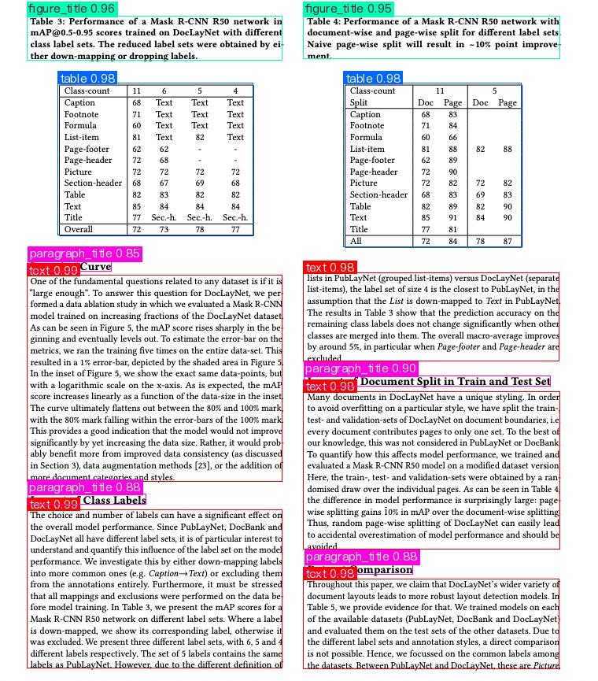 |

```shell
版面分析结果详情：
输入路径: /mnt/2/hc/PaddleOCR/datasets/hc_test/layout.jpg
页面索引: None

检测到 13 个版面元素：
--------------------------------------------------------------------------------
  text: 5 个
  table: 2 个
  figure_title: 2 个
  paragraph_title: 4 个
--------------------------------------------------------------------------------

详细信息：
 1. [text           ] 置信度: 0.9870, 坐标: [34.1, 349.9, 358.6, 611.1]
 2. [text           ] 置信度: 0.9866, 坐标: [34.5, 647.2, 358.3, 848.7]
 3. [text           ] 置信度: 0.9847, 坐标: [385.7, 497.4, 711.2, 697.8]
 4. [table          ] 置信度: 0.9841, 坐标: [73.8, 105.9, 322.0, 298.9]
 5. [table          ] 置信度: 0.9834, 坐标: [437.0, 105.8, 662.7, 313.5]
 6. [text           ] 置信度: 0.9832, 坐标: [385.6, 346.2, 710.1, 458.8]
 7. [text           ] 置信度: 0.9816, 坐标: [385.8, 735.2, 710.6, 850.0]
 8. [figure_title   ] 置信度: 0.9577, 坐标: [34.4, 20.1, 358.7, 76.5]
 9. [figure_title   ] 置信度: 0.9506, 坐标: [385.7, 20.1, 711.3, 74.9]
10. [paragraph_title] 置信度: 0.9002, 坐标: [386.5, 477.0, 699.4, 490.1]
11. [paragraph_title] 置信度: 0.8846, 坐标: [35.4, 627.7, 185.6, 640.5]
12. [paragraph_title] 置信度: 0.8838, 坐标: [387.2, 716.3, 524.8, 729.3]
13. [paragraph_title] 置信度: 0.8509, 坐标: [35.5, 331.2, 141.6, 344.8]
================================================================================
```

#### 2.1.5、微调

由于 PaddleOCR 并不直接提供版面区域检测模块的训练，因此，如果需要训练版面区域测模型，可以参考 [PaddleX 版面区域检测模块二次开发](https://paddlepaddle.github.io/PaddleX/latest/module_usage/tutorials/ocr_modules/layout_detection.html#_5)部分进行训练。训练后的模型可以无缝集成到 PaddleOCR 的 API 中进行推理。


### 2.2、通用OCR子产线

#### 2.2.1、功能概述

这个其实就是我们之前用过的PaddleOCR，只不过在新版本里添加了一些模型：

- 文档图像方向分类模块（optional）
- 文本图像矫正模块（optional）
- 文本行方向分类模块（optional）
- 文本检测模块
- 文本识别模块

#### 2.2.2、支持模型列表

- 文档图像方向分类模块（optional）：

  | 模型                  | 模型下载链接                                                 | Top-1 Acc（%） | GPU推理耗时（ms） [常规模式 / 高性能模式] | CPU推理耗时（ms） [常规模式 / 高性能模式] | 模型存储大小（MB） | 介绍                                                         |
  | --------------------- | ------------------------------------------------------------ | -------------- | ----------------------------------------- | ----------------------------------------- | ------------------ | ------------------------------------------------------------ |
  | PP-LCNet_x1_0_doc_ori | [推理模型](https://paddle-model-ecology.bj.bcebos.com/paddlex/official_inference_model/paddle3.0.0/PP-LCNet_x1_0_doc_ori_infer.tar) / [训练模型](https://paddle-model-ecology.bj.bcebos.com/paddlex/official_pretrained_model/PP-LCNet_x1_0_doc_ori_pretrained.pdparams) | 99.06          | 2.62 / 0.59                               | 3.24 / 1.19                               | 7                  | 基于PP-LCNet_x1_0的文档图像分类模型，含有四个类别，即0度，90度，180度，270度 |

- 文本图像矫正模块（optional）：

  | 模型  | 模型下载链接                                                 | CER   | GPU推理耗时（ms） [常规模式 / 高性能模式] | CPU推理耗时（ms） [常规模式 / 高性能模式] | 模型存储大小（MB） | 介绍                   |
  | ----- | ------------------------------------------------------------ | ----- | ----------------------------------------- | ----------------------------------------- | ------------------ | ---------------------- |
  | UVDoc | [推理模型](https://paddle-model-ecology.bj.bcebos.com/paddlex/official_inference_model/paddle3.0.0/UVDoc_infer.tar) / [训练模型](https://paddle-model-ecology.bj.bcebos.com/paddlex/official_pretrained_model/UVDoc_pretrained.pdparams) | 0.179 | 19.05 / 19.05                             | - / 869.82                                | 30.3               | 高精度文本图像矫正模型 |

- 文本行方向分类模块（optional）：

  | 模型                        | 模型下载链接                                                 | Top-1 Acc（%） | GPU推理耗时（ms） | CPU推理耗时 (ms) | 模型存储大小（MB） | 介绍                                                         |
  | --------------------------- | ------------------------------------------------------------ | -------------- | ----------------- | ---------------- | ------------------ | ------------------------------------------------------------ |
  | PP-LCNet_x0_25_textline_ori | [推理模型](https://paddle-model-ecology.bj.bcebos.com/paddlex/official_inference_model/paddle3.0.0/PP-LCNet_x0_25_textline_ori_infer.tar) / [训练模型](https://paddle-model-ecology.bj.bcebos.com/paddlex/official_pretrained_model/PP-LCNet_x0_25_textline_ori_pretrained.pdparams) | 98.85          | 2.16 / 0.41       | 2.37 / 0.73      | 0.96               | 基于PP-LCNet_x0_25的文本行分类模型，含有两个类别，即0度，180度 |
  | PP-LCNet_x1_0_textline_ori  | [推理模型](https://paddle-model-ecology.bj.bcebos.com/paddlex/official_inference_model/paddle3.0.0/PP-LCNet_x1_0_textline_ori_infer.tar) / [训练模型](https://paddle-model-ecology.bj.bcebos.com/paddlex/official_pretrained_model/PP-LCNet_x1_0_textline_ori_pretrained.pdparams) | 99.42          | - / -             | 2.98 / 2.98      | 6.5                | 基于PP-LCNet_x1_0的文本行分类模型，含有两个类别，即0度，180度 |

- 文本检测模块：

  | 模型                | 模型下载链接                                                 | 检测Hmean（%） | GPU推理耗时（ms） [常规模式 / 高性能模式] | CPU推理耗时（ms） [常规模式 / 高性能模式] | 模型存储大小（MB） | 介绍                                                         |
  | ------------------- | ------------------------------------------------------------ | -------------- | ----------------------------------------- | ----------------------------------------- | ------------------ | ------------------------------------------------------------ |
  | PP-OCRv5_server_det | [推理模型](https://paddle-model-ecology.bj.bcebos.com/paddlex/official_inference_model/paddle3.0.0/PP-OCRv5_server_det_infer.tar) / [训练模型](https://paddle-model-ecology.bj.bcebos.com/paddlex/official_pretrained_model/PP-OCRv5_server_det_pretrained.pdparams) | 83.8           | 89.55 / 70.19                             | 383.15 / 383.15                           | 84.3               | PP-OCRv5 的服务端文本检测模型，精度更高，适合在性能较好的服务器上部署 |
  | PP-OCRv5_mobile_det | [推理模型](https://paddle-model-ecology.bj.bcebos.com/paddlex/official_inference_model/paddle3.0.0/PP-OCRv5_mobile_det_infer.tar) / [训练模型](https://paddle-model-ecology.bj.bcebos.com/paddlex/official_pretrained_model/PP-OCRv5_mobile_det_pretrained.pdparams) | 79.0           | 10.67 / 6.36                              | 57.77 / 28.15                             | 4.7                | PP-OCRv5 的移动端文本检测模型，效率更高，适合在端侧设备部署  |
  | PP-OCRv4_server_det | [推理模型](https://paddle-model-ecology.bj.bcebos.com/paddlex/official_inference_model/paddle3.0.0/PP-OCRv4_server_det_infer.tar) / [训练模型](https://paddle-model-ecology.bj.bcebos.com/paddlex/official_pretrained_model/PP-OCRv4_server_det_pretrained.pdparams) | 69.2           | 127.82 / 98.87                            | 585.95 / 489.77                           | 109                | PP-OCRv4 的服务端文本检测模型，精度更高，适合在性能较好的服务器上部署 |
  | PP-OCRv4_mobile_det | [推理模型](https://paddle-model-ecology.bj.bcebos.com/paddlex/official_inference_model/paddle3.0.0/PP-OCRv4_mobile_det_infer.tar) / [训练模型](https://paddle-model-ecology.bj.bcebos.com/paddlex/official_pretrained_model/PP-OCRv4_mobile_det_pretrained.pdparams) | 63.8           | 9.87 / 4.17                               | 56.60 / 20.79                             | 4.7                | PP-OCRv4 的移动端文本检测模型，效率更高，适合在端侧设备部署  |

- （核心使用到的）文本识别模块：

  | 模型                    | 模型下载链接                                                 | 识别 Avg Accuracy(%) | GPU推理耗时（ms） [常规模式 / 高性能模式] | CPU推理耗时（ms） [常规模式 / 高性能模式] | 模型存储大小（MB） | 介绍                                                         |
  | ----------------------- | ------------------------------------------------------------ | -------------------- | ----------------------------------------- | ----------------------------------------- | ------------------ | ------------------------------------------------------------ |
  | PP-OCRv5_server_rec     | [推理模型](https://paddle-model-ecology.bj.bcebos.com/paddlex/official_inference_model/paddle3.0.0//PP-OCRv5_server_rec_infer.tar) / [训练模型](https://paddle-model-ecology.bj.bcebos.com/paddlex/official_pretrained_model/PP-OCRv5_server_rec_pretrained.pdparams) | 86.38                | 8.46 / 2.36                               | 31.21 / 31.21                             | 81                 | PP-OCRv5_rec 是新一代文本识别模型。该模型致力于以单一模型高效、精准地支持简体中文、繁体中文、英文、日文四种主要语言，以及手写、竖版、拼音、生僻字等复杂文本场景的识别。在保持识别效果的同时，兼顾推理速度和模型鲁棒性，为各种场景下的文档理解提供高效、精准的技术支撑。 |
  | PP-OCRv5_mobile_rec     | [推理模型](https://paddle-model-ecology.bj.bcebos.com/paddlex/official_inference_model/paddle3.0.0//PP-OCRv5_mobile_rec_infer.tar) / [训练模型](https://paddle-model-ecology.bj.bcebos.com/paddlex/official_pretrained_model/PP-OCRv5_mobile_rec_pretrained.pdparams) | 81.29                | 5.43 / 1.46                               | 21.20 / 5.32                              | 16                 | 同上。                                                       |
  | PP-OCRv4_server_rec_doc | [推理模型](https://paddle-model-ecology.bj.bcebos.com/paddlex/official_inference_model/paddle3.0.0//PP-OCRv4_server_rec_doc_infer.tar) / [训练模型](https://paddle-model-ecology.bj.bcebos.com/paddlex/official_pretrained_model/PP-OCRv4_server_rec_doc_pretrained.pdparams) | 86.58                | 8.69 / 2.78                               | 37.93 / 37.93                             | 182                | PP-OCRv4_server_rec_doc是在PP-OCRv4_server_rec的基础上，在更多中文文档数据和PP-OCR训练数据的混合数据训练而成，增加了部分繁体字、日文、特殊字符的识别能力，可支持识别的字符为1.5万+，除文档相关的文字识别能力提升外，也同时提升了通用文字的识别能力。 |
  | PP-OCRv4_mobile_rec     | [推理模型](https://paddle-model-ecology.bj.bcebos.com/paddlex/official_inference_model/paddle3.0.0/PP-OCRv4_mobile_rec_infer.tar) / [训练模型](https://paddle-model-ecology.bj.bcebos.com/paddlex/official_pretrained_model/PP-OCRv4_mobile_rec_pretrained.pdparams) | 78.74                | 5.26 / 1.12                               | 17.48 / 3.61                              | 10.5               | PP-OCRv4的轻量级识别模型，推理效率高，可以部署在包含端侧设备的多种硬件设备中。 |
  | PP-OCRv4_server_rec     | [推理模型](https://paddle-model-ecology.bj.bcebos.com/paddlex/official_inference_model/paddle3.0.0/PP-OCRv4_server_rec_infer.tar) / [训练模型](https://paddle-model-ecology.bj.bcebos.com/paddlex/official_pretrained_model/PP-OCRv4_server_rec_pretrained.pdparams) | 85.19                | 8.75 / 2.49                               | 36.93 / 36.93                             | 173                | PP-OCRv4的服务器端模型，推理精度高，可以部署在多种不同的服务器上。 |
  | en_PP-OCRv4_mobile_rec  | [推理模型](https://paddle-model-ecology.bj.bcebos.com/paddlex/official_inference_model/paddle3.0.0//en_PP-OCRv4_mobile_rec_infer.tar) / [训练模型](https://paddle-model-ecology.bj.bcebos.com/paddlex/official_pretrained_model/en_PP-OCRv4_mobile_rec_pretrained.pdparams) | 70.39                | 4.81 / 1.23                               | 17.20 / 4.18                              | 7.5                | 基于PP-OCRv4识别模型训练得到的超轻量英文识别模型，支持英文、数字识别。 |

  详细可以参考：[识别模型文档](https://www.paddleocr.ai/latest/version3.x/pipeline_usage/OCR.html#1-ocr)。

  如果更注重模型的精度，就选择精度高的；更注重模型的推理速度，就选择推理速度快的；如果关心模型存储大小，就选择体积小的。

#### 2.2.3、方法、参数解析

- 通过 `PaddleOCR()` 实例化 OCR 产线对象，具体参数说明如下：

  | 参数                                  | 参数说明                                                     | 参数类型     | 默认值   |
  | ------------------------------------- | ------------------------------------------------------------ | ------------ | -------- |
  | `doc_orientation_classify_model_name` | 文档方向分类模型的名称。如果设置为`None`，将会使用产线默认模型。 | `str|None`   | `None`   |
  | `doc_orientation_classify_model_dir`  | 文档方向分类模型的目录路径。如果设置为`None`，将会下载官方模型。 | `str|None`   | `None`   |
  | `doc_unwarping_model_name`            | 文本图像矫正模型的名称。如果设置为`None`，将会使用产线默认模型。 | `str|None`   | `None`   |
  | `doc_unwarping_model_dir`             | 文本图像矫正模型的目录路径。如果设置为`None`，将会下载官方模型。 | `str|None`   | `None`   |
  | `text_detection_model_name`           | 文本检测模型的名称。如果设置为`None`，将会使用产线默认模型。 | `str|None`   | `None`   |
  | `text_detection_model_dir`            | 文本检测模型的目录路径。如果设置为`None`，将会下载官方模型。 | `str|None`   | `None`   |
  | `textline_orientation_model_name`     | 文本行方向模型的名称。如果设置为`None`，将会使用产线默认模型。 | `str|None`   | `None`   |
  | `textline_orientation_model_dir`      | 文本行方向模型的目录路径。如果设置为`None`，将会下载官方模型。 | `str|None`   | `None`   |
  | `textline_orientation_batch_size`     | 文本行方向模型的batch size。如果设置为`None`，将默认设置batch size为`1`。 | `int|None`   | `None`   |
  | `text_recognition_model_name`         | 文本识别模型的名称。如果设置为`None`，将会使用产线默认模型。 | `str|None`   | `None`   |
  | `text_recognition_model_dir`          | 文本识别模型的目录路径。如果设置为`None`，将会下载官方模型。 | `str|None`   | `None`   |
  | `text_recognition_batch_size`         | 文本识别模型的batch size。如果设置为`None`，将默认设置batch size为`1`。 | `int|None`   | `None`   |
  | `use_doc_orientation_classify`        | 是否加载并使用文档方向分类模块。如果设置为`None`，将使用产线初始化的该参数值，默认初始化为`True`。 | `bool|None`  | `None`   |
  | `use_doc_unwarping`                   | 是否加载并使用文本图像矫正模块。如果设置为`None`，将使用产线初始化的该参数值，默认初始化为`True`。 | `bool|None`  | `None`   |
  | `use_textline_orientation`            | 是否加载并使用文本行方向模块。如果设置为`None`，将使用产线初始化的该参数值，默认初始化为`True`。 | `bool|None`  | `None`   |
  | `text_det_limit_side_len`             | 文本检测的图像边长限制。**int**：大于 `0` 的任意整数；**None**：如果设置为`None`，将使用产线初始化的该参数值，默认初始化为 `64`。 | `int|None`   | `None`   |
  | `text_det_limit_type`                 | 文本检测的边长度限制类型。**str**：支持 `min` 和 `max`，`min` 表示保证图像最短边不小于 `det_limit_side_len`，`max` 表示保证图像最长边不大于 `limit_side_len`；**None**：如果设置为`None`，将使用产线初始化的该参数值，默认初始化为 `min`。 | `str|None`   | `None`   |
  | `text_det_thresh`                     | 文本检测像素阈值，输出的概率图中，得分大于该阈值的像素点才会被认为是文字像素点。**float**：大于`0`的任意浮点数；**None**：如果设置为`None`，将使用产线初始化的该参数值（默认为`0.3`）。 | `float|None` | `None`   |
  | `text_det_box_thresh`                 | 文本检测框阈值，检测结果边框内，所有像素点的平均得分大于该阈值时，该结果会被认为是文字区域。**float**：大于`0`的任意浮点数；**None**：如果设置为`None`，将使用产线初始化的该参数值（默认为`0.6`）。 | `float|None` | `None`   |
  | `text_det_unclip_ratio`               | 文本检测扩张系数，使用该方法对文字区域进行扩张，该值越大，扩张的面积越大。**float**：大于`0`的任意浮点数；**None**：如果设置为`None`，将使用产线初始化的该参数值（默认为`2.0`）。 | `float|None` | `None`   |
  | `text_det_input_shape`                | 文本检测的输入形状。                                         | `tuple|None` | `None`   |
  | `text_rec_score_thresh`               | 文本识别阈值，得分大于该阈值的文本结果会被保留。**float**：大于`0`的任意浮点数；**None**：如果设置为`None`，将使用产线初始化的该参数值（默认为`0.0`，即不设阈值）。 | `float|None` | `None`   |
  | `text_rec_input_shape`                | 文本识别的输入形状。                                         | `tuple|None` | `None`   |
  | `lang`                                | 使用指定语言的 OCR 模型。 附录中的表格中列举了全部支持的语言。 | `str|None`   | `None`   |
  | `ocr_version`                         | OCR 模型版本。**PP-OCRv5**：使用PP-OCRv5系列模型；**PP-OCRv4**：使用PP-OCRv4系列模型；**PP-OCRv3**：使用PP-OCRv3系列模型。注意不是每个`ocr_version`都支持所有的`lang`，请查看附录中的对应关系表。 | `str|None`   | `None`   |
  | `device`                              | 用于推理的设备。支持指定具体卡号：<br />- **CPU**：如 `cpu` 表示使用 CPU 进行推理；<br />- **GPU**：如 `gpu:0` 表示使用第 1 块 GPU 进行推理；<br />- **NPU**：如 `npu:0` 表示使用第 1 块 NPU 进行推理；<br />- **XPU**：如 `xpu:0` 表示使用第 1 块 XPU 进行推理；<br />- **MLU**：如 `mlu:0` 表示使用第 1 块 MLU 进行推理；<br />- **DCU**：如 `dcu:0` 表示使用第 1 块 DCU 进行推理；<br />- **None**：如果设置为`None`，将默认使用产线初始化的该参数值，初始化时，会优先使用本地的 GPU 0号设备，如果没有，则使用 CPU 设备。 | `str|None`   | `None`   |
  | `enable_hpi`                          | 是否启用高性能推理。                                         | `bool`       | `False`  |
  | `use_tensorrt`                        | 是否启用 Paddle Inference 的 TensorRT 子图引擎。如果模型不支持通过 TensorRT 加速，即使设置了此标志，也不会使用加速。 对于 CUDA 11.8 版本的飞桨，兼容的 TensorRT 版本为 8.x（x>=6），建议安装 TensorRT 8.6.1.6。 | `bool`       | `False`  |
  | `precision`                           | 计算精度，如 fp32、fp16。                                    | `str`        | `"fp32"` |
  | `enable_mkldnn`                       | 是否启用 MKL-DNN 加速推理。如果 MKL-DNN 不可用或模型不支持通过 MKL-DNN 加速，即使设置了此标志，也不会使用加速。 | `bool`       | `True`   |
  | `mkldnn_cache_capacity`               | MKL-DNN 缓存容量。                                           | `int`        | `10`     |
  | `cpu_threads`                         | 在 CPU 上进行推理时使用的线程数。                            | `int`        | `8`      |
  | `paddlex_config`                      | PaddleX产线配置文件路径。                                    | `str|None`   | `None`   |

- 调用 OCR 产线对象的 `predict()` 方法进行推理预测，该方法会返回一个结果列表。另外，产线还提供了 `predict_iter()` 方法。两者在参数接受和结果返回方面是完全一致的，区别在于 `predict_iter()` 返回的是一个 `generator`，能够逐步处理和获取预测结果，适合处理大型数据集或希望节省内存的场景。可以根据实际需求选择使用这两种方法中的任意一种。以下是 `predict()` 方法的参数及其说明：

  | 参数                           | 参数说明                                                     | 参数类型              | 默认值 |
  | ------------------------------ | ------------------------------------------------------------ | --------------------- | ------ |
  | `input`                        | 待预测数据，支持多种输入类型，必填。<br />- **Python Var**：如 `numpy.ndarray` 表示的图像数据；<br />- **str**：如图像文件或者PDF文件的本地路径：`/root/data/img.jpg`；**如URL链接**，如图像文件或PDF文件的网络URL：[示例](https://paddle-model-ecology.bj.bcebos.com/paddlex/imgs/demo_image/general_ocr_002.png)；**如本地目录**，该目录下需包含待预测图像，如本地路径：`/root/data/`(当前不支持目录中包含PDF文件的预测，PDF文件需要指定到具体文件路径)；<br />- **list**：列表元素需为上述类型数据，如`[numpy.ndarray, numpy.ndarray]`，`["/root/data/img1.jpg", "/root/data/img2.jpg"]`，`["/root/data1", "/root/data2"]。` | `Python Var|str|list` |        |
  | `use_doc_orientation_classify` | 是否在推理时使用文档方向分类模块。                           | `bool|None`           | `None` |
  | `use_doc_unwarping`            | 是否在推理时使用文本图像矫正模块。                           | `bool|None`           | `None` |
  | `use_textline_orientation`     | 是否在推理时使用文本行方向分类模块。                         | `bool|None`           | `None` |
  | `text_det_limit_side_len`      | 参数含义与实例化参数基本相同。设置为`None`表示使用实例化参数，否则该参数优先级更高。 | `int|None`            | `None` |
  | `text_det_limit_type`          | 参数含义与实例化参数基本相同。设置为`None`表示使用实例化参数，否则该参数优先级更高。 | `str|None`            | `None` |
  | `text_det_thresh`              | 参数含义与实例化参数基本相同。设置为`None`表示使用实例化参数，否则该参数优先级更高。 | `float|None`          | `None` |
  | `text_det_box_thresh`          | 参数含义与实例化参数基本相同。设置为`None`表示使用实例化参数，否则该参数优先级更高。 | `float|None`          | `None` |
  | `text_det_unclip_ratio`        | 参数含义与实例化参数基本相同。设置为`None`表示使用实例化参数，否则该参数优先级更高。 | `float|None`          | `None` |
  | `text_rec_score_thresh`        | 参数含义与实例化参数基本相同。设置为`None`表示使用实例化参数，否则该参数优先级更高。 | `float|None`          | `None` |

- 对预测结果进行处理，每个样本的预测结果均为对应的Result对象，且支持打印、保存为图片、保存为`json`文件的操作：

  | 方法             | 方法说明                   | 参数                                            | 参数类型                      | 参数说明                                                     | 默认值                     |
  | ---------------- | -------------------------- | ----------------------------------------------- | ----------------------------- | ------------------------------------------------------------ | -------------------------- |
  | `print()`        | 打印结果到终端             | `format_json`<br />`indent`<br />`ensure_ascii` | `bool`<br />`int`<br />`bool` | 是否对输出内容进行使用 `JSON` 缩进格式化。<br />指定缩进级别，以美化输出的 `JSON` 数据，使其更具可读性，仅当 `format_json` 为 `True` 时有效。<br />控制是否将非 `ASCII` 字符转义为 `Unicode`。设置为 `True` 时，所有非 `ASCII` 字符将被转义；`False` 则保留原始字符，仅当`format_json`为`True`时有效。 | `True`<br />4<br />`False` |
  | `save_to_json()` | 将结果保存为json格式的文件 | `save_path`<br />`indent`<br />`ensure_ascii`   | `str`<br />`int`<br />`bool`  | 保存的文件路径，当为目录时，保存文件命名与输入文件类型命名一致。<br />指定缩进级别，以美化输出的 `JSON` 数据，使其更具可读性，仅当 `format_json` 为 `True` 时有效。<br />控制是否将非 `ASCII` 字符转义为 `Unicode`。设置为 `True` 时，所有非 `ASCII` 字符将被转义；`False` 则保留原始字符，仅当`format_json`为`True`时有效。 | 无<br />4<br />`False`     |
  | `save_to_img()`  | 将结果保存为图像格式的文件 | `save_path`                                     | `str`                         | 保存的文件路径，支持目录或文件路径。                         | 无                         |

- 此外，也支持通过属性获取带结果的可视化图像和预测结果，具体如下：

  | 属性   | 属性说明                       |
  | ------ | ------------------------------ |
  | `json` | 获取预测的 `json` 格式的结果   |
  | `img`  | 获取格式为 `dict` 的可视化图像 |

#### 2.2.4、代码

- 代码可以按照之前的方式，以python格式调用：

  ```python
  from paddleocr import PaddleOCR
  import json
  
  ocr = PaddleOCR(
      # ========== 模型路径配置 ==========
      # 文档方向分类
      doc_orientation_classify_model_name="PP-LCNet_x1_0_doc_ori",
      doc_orientation_classify_model_dir="/mnt/2/hc/PaddleOCR/pretrained_models/doc_ori/PP-LCNet_x1_0_doc_ori_infer",
      
      # 文本图像矫正
      doc_unwarping_model_name="UVDoc",
      doc_unwarping_model_dir="/mnt/2/hc/PaddleOCR/pretrained_models/doc_unwarping/UVDoc_infer",
      
      # 文本检测
      text_detection_model_name="PP-OCRv5_server_det",
      text_detection_model_dir="/mnt/2/hc/PaddleOCR/pretrained_models/text_detection/PP-OCRv5_server_det_infer",
      
      # 文本行方向分类
      textline_orientation_model_name="PP-LCNet_x0_25_textline_ori",
      textline_orientation_model_dir="/mnt/2/hc/PaddleOCR/pretrained_models/textline_orientation/PP-LCNet_x0_25_textline_ori_infer",
      textline_orientation_batch_size=1,
      
      # 文本识别
      text_recognition_model_name="PP-OCRv5_server_rec",
      text_recognition_model_dir="/mnt/2/hc/PaddleOCR/pretrained_models/text_recognition/PP-OCRv5_server_rec_infer",
      text_recognition_batch_size=1,
      
      # ========== 模块开关 ==========
      use_doc_orientation_classify=False,   # 是否使用文档方向分类
      use_doc_unwarping=False,             # 是否使用文本图像矫正
      use_textline_orientation=False,      # 是否使用文本行方向分类
      
      # ========== 文本检测参数 ==========
      text_det_limit_side_len=960,         # 图像边长限制
      text_det_limit_type="max",           # 边长限制类型: "min" 或 "max"
      text_det_thresh=0.3,                 # 文本检测像素阈值
      text_det_box_thresh=0.6,             # 文本检测框阈值
      text_det_unclip_ratio=1.5,           # 文本检测扩张系数
      
      # ========== 文本识别参数 ==========
      text_rec_score_thresh=0.5,           # 文本识别阈值
      
      # ========== 设备配置 ==========
      device="gpu:0",                      # 推理设备: "cpu", "gpu:0", "npu:0" 等
      enable_hpi=False,                    # 是否启用高性能推理
      use_tensorrt=False,                  # 是否使用TensorRT
      precision="fp32",                    # 计算精度: "fp32" 或 "fp16"
      enable_mkldnn=True,                  # 是否使用MKL-DNN加速(CPU)
      mkldnn_cache_capacity=10,            # MKL-DNN缓存容量
      cpu_threads=8,                       # CPU线程数
  )
  
  # 预测单张图片
  result = ocr.predict("/mnt/2/hc/PaddleOCR/datasets/pdf_images/page_5.png")
  
  # 或者预测多张图片
  # result = ocr.predict([
  #     "img1.jpg",
  #     "img2.jpg",
  #     "img3.jpg"
  # ])
  
  # 或者预测整个目录
  # result = ocr.predict("/path/to/image/directory")
  
  for res in result:
      # 打印结果
      res.print()
      
      # 保存结果
      res.save_to_img("./output_ocr")
      res.save_to_json("./output_ocr")
      
      # 获取 JSON 结果
      json_result = res.json
      
      print("\n" + "="*80)
      print("JSON 结果的所有键:")
      print(json_result.keys())
      
      # 访问 res 键
      ocr_res = json_result['res']
      print("\nocr_res 的类型:", type(ocr_res))
      
      if isinstance(ocr_res, dict):
          print("ocr_res 的键:", ocr_res.keys())
          print("\n完整的 OCR 结果:")
          print(json.dumps(ocr_res, indent=4, ensure_ascii=False, default=str))
      elif isinstance(ocr_res, list):
          print(f"\nocr_res 是列表，长度: {len(ocr_res)}")
          print("\n前几个结果:")
          for i, item in enumerate(ocr_res[:5]):  # 只打印前5个
              print(f"{i+1}. {item}")
      else:
          print("\nocr_res 内容:")
          print(ocr_res)
      
      print("="*80)
  ```

  结果如下：

  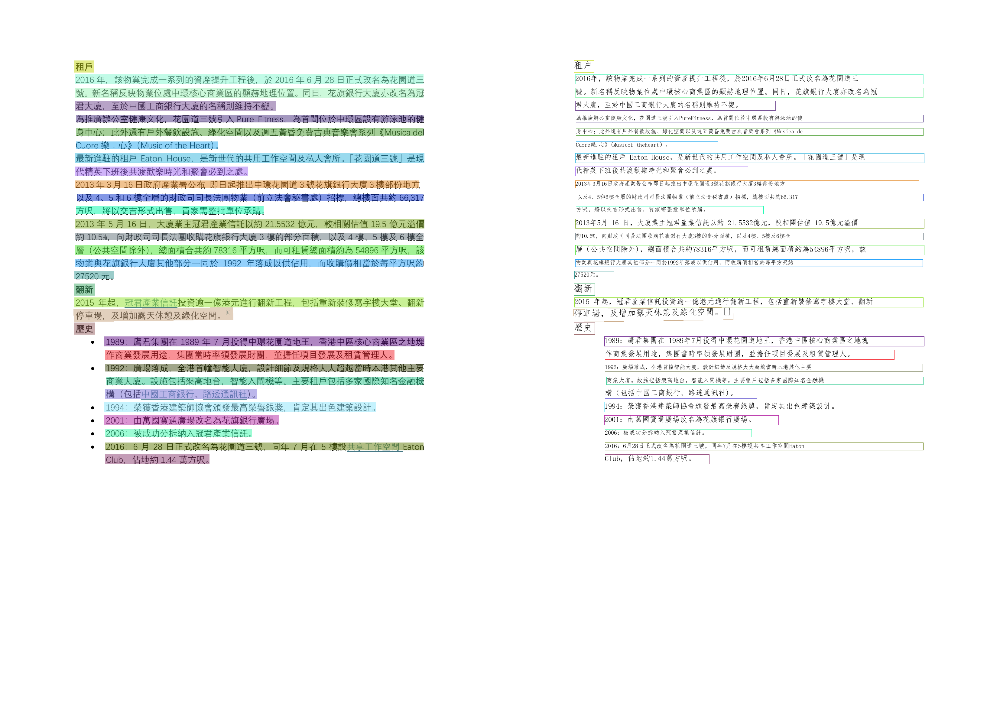

- 也可以通过配置文件指定本地模型路径：

  - 获取产线配置文件：

    ```python
    from paddleocr import PaddleOCR
    
    pipeline = PaddleOCR()
    pipeline.export_paddlex_config_to_yaml("PaddleOCR.yaml")
    ```

    得到默认的产线配置文件。

  - 修改配置文件：

    ```yaml
    ......
    SubModules:
      TextDetection:
        box_thresh: 0.6
        limit_side_len: 64
        limit_type: min
        max_side_limit: 4000
        model_dir: null # 替换为微调后的文本测模型权重路径
        model_name: PP-OCRv5_server_det # 如果微调的模型名称与默认模型名称不同，请一并修改此处
        module_name: text_detection
        thresh: 0.3
        unclip_ratio: 1.5
      TextLineOrientation:
        batch_size: 6
        model_dir: null  # 替换为微调后的文本行方向分类模型权重路径
        model_name: PP-LCNet_x1_0_textline_ori # 如果微调的模型名称与默认模型名称不同，请一并修改此处
        module_name: textline_orientation
      TextRecognition:
        batch_size: 6
        model_dir: null # 替换为微调后的文本识模型权重路径
        model_name: PP-OCRv5_server_rec # 如果微调的模型名称与默认模型名称不同，请一并修改此处
        module_name: text_recognition
        score_thresh: 0.0
    ......
    ```

    将微调后模型权重的本地路径替换至产线配置文件中的对应位置即可。

  - Python API服务：

    ```python
    from paddleocr import PaddleOCR
    
    pipeline = PaddleOCR(paddlex_config="PaddleOCR.yaml")
    ```

    初始化产线对象时，可通过 `paddlex_config` 参数传入 PaddleX 产线配置文件路径或配置dict，PaddleOCR 会读取其中的内容作为产线配置。

#### 2.2.5、微调各模块

通用 OCR 产线包含若干模块，模型产线的效果如果不及预期，可能来自于其中任何一个模块。您可以对识别效果差的图片进行分析，进而确定是哪个模块存在问题，并参考以下表格中对应的微调教程链接进行模型微调。

| 情形               | 微调模块             | 微调参考链接                                                 |
| ------------------ | -------------------- | ------------------------------------------------------------ |
| 整图旋转矫正不准   | 文档图像方向分类模块 | [链接](https://paddlepaddle.github.io/PaddleX/latest/module_usage/tutorials/ocr_modules/doc_img_orientation_classification.html#_5) |
| 图像扭曲矫正不准   | 文本图像矫正模块     | 暂不支持微调                                                 |
| 文本行旋转矫正不准 | 文本行方向分类模块   | [链接](https://paddlepaddle.github.io/PaddleX/latest/module_usage/tutorials/ocr_modules/textline_orientation_classification.html#_5) |
| 文本漏检           | 文本检测模块         | [链接](https://paddlepaddle.github.io/PaddleOCR/main/version3.x/module_usage/text_detection.html#_5) |
| 文本内容不准       | 文本识别模块         | [链接](https://paddlepaddle.github.io/PaddleOCR/main/version3.x/module_usage/text_recognition.html#_5) |


### 2.3、文档图像预处理产线（optional）

#### 2.3.1、功能概述

- 文档图像预处理产线集成了文档方向分类和形变矫正两大功能。文档方向分类可自动识别文档的四个方向（0°、90°、180°、270°），确保文档以正确的方向进行后续处理。
- 文本图像矫正模型则用于修正文档拍摄或扫描过程中的几何扭曲，恢复文档的原始形状和比例。适用于数字化文档管理、OCR类任务前处理、以及任何需要提高文档图像质量的场景。
- 通过自动化的方向校正与形变矫正，该模块显著提升了文档处理的准确性和效率，为用户提供更为可靠的图像分析基础。本产线同时提供了灵活的服务化部署方式，支持在多种硬件上使用多种编程语言调用。

#### 2.3.2、包含子模块介绍

通用文档图像预处理产线中包含以下2个模块。每个模块均可独立进行训练和推理，并包含多个模型：

- 文档图像方向分类模块。
- 文本图像矫正模块。

下面会分别讲解。

#### 2.3.3、文档图像方向分类模块

##### 2.3.3.1、功能概述

文档图像方向分类模块主要是将文档图像的方向区分出来，并使用后处理将其矫正。

一般我们用OCR去处理的都是正着的文字，但是我们在收集的时候有的时候是反着的，这样会降低ACC，所以这个模块可以预先判断含文字区域的文档或证件的方向，并将其进行方向调整，从而提高OCR处理的准确性。

##### 2.3.3.2、支持模型列表

| 模型                  | 模型下载链接                                                 | Top-1 Acc（%） | GPU推理耗时（ms） [常规模式 / 高性能模式] | CPU推理耗时（ms） [常规模式 / 高性能模式] | 模型存储大小（MB） | 介绍                                                         | 源码仓库                                                     |
| --------------------- | ------------------------------------------------------------ | -------------- | ----------------------------------------- | ----------------------------------------- | ------------------ | ------------------------------------------------------------ | ------------------------------------------------------------ |
| PP-LCNet_x1_0_doc_ori | [推理模型](https://paddle-model-ecology.bj.bcebos.com/paddlex/official_inference_model/paddle3.0.0/PP-LCNet_x1_0_doc_ori_infer.tar) / [训练模型](https://paddle-model-ecology.bj.bcebos.com/paddlex/official_pretrained_model/PP-LCNet_x1_0_doc_ori_pretrained.pdparams) | 99.06          | 2.62 / 0.59                               | 3.24 / 1.19                               | 7                  | 基于PP-LCNet_x1_0的文档图像分类模型，含有四个类别，即0度，90度，180度，270度 | [config链接](https://github.com/PaddlePaddle/PaddleX/blob/release/3.2/paddlex/configs/modules/doc_text_orientation/PP-LCNet_x1_0_doc_ori.yaml) / [微调参考](https://github.com/BlackCodeJ/DocImgOri_Recognize) |

##### 2.3.3.3、方法、参数解析

- `DocImgOrientationClassification`实例化文档图像方向分类模型（此处以`PP-LCNet_x1_0_doc_ori`为例），具体说明如下：

  | 参数                    | 说明                                                         | 类型       | 默认值   |
  | ----------------------- | ------------------------------------------------------------ | ---------- | -------- |
  | `model_name`            | 模型名称。如果设置为`None`，则使用`PP-LCNet_x1_0_doc_ori`。  | `str|None` | `None`   |
  | `model_dir`             | 模型存储路径。                                               | `str|None` | `None`   |
  | `device`                | 用于推理的设备。 **例如：**`"cpu"`、`"gpu"`、`"npu"`、`"gpu:0"`、`"gpu:0,1"`。 如指定多个设备，将进行并行推理。 默认情况下，优先使用 GPU 0；若不可用则使用 CPU。 | `str|None` | `None`   |
  | `enable_hpi`            | 是否启用高性能推理。                                         | `bool`     | `False`  |
  | `use_tensorrt`          | 是否启用 Paddle Inference 的 TensorRT 子图引擎。如果模型不支持通过 TensorRT 加速，即使设置了此标志，也不会使用加速。 对于 CUDA 11.8 版本的飞桨，兼容的 TensorRT 版本为 8.x（x>=6），建议安装 TensorRT 8.6.1.6。 | `bool`     | `False`  |
  | `precision`             | 当使用 Paddle Inference 的 TensorRT 子图引擎时设置的计算精度。 **可选项：**`"fp32"`、`"fp16"`。 | `str`      | `"fp32"` |
  | `enable_mkldnn`         | 是否启用 MKL-DNN 加速推理。如果 MKL-DNN 不可用或模型不支持通过 MKL-DNN 加速，即使设置了此标志，也不会使用加速。 | `bool`     | `True`   |
  | `mkldnn_cache_capacity` | MKL-DNN 缓存容量。                                           | `int`      | `10`     |
  | `cpu_threads`           | 在 CPU 上推理时使用的线程数量。                              | `int|None` | `10`     |

- 调用文档图像方向分类模型的 `predict()` 方法进行推理预测，该方法会返回一个结果列表。另外，本模块还提供了 `predict_iter()` 方法。两者在参数接受和结果返回方面是完全一致的，区别在于 `predict_iter()` 返回的是一个 `generator`，能够逐步处理和获取预测结果，适合处理大型数据集或希望节省内存的场景。可以根据实际需求选择使用这两种方法中的任意一种。`predict()` 方法参数有 `input` 和 `batch_size`，具体说明如下：

  | 参数         | 参数说明                                                     | 参数类型              | 默认值 |
  | ------------ | ------------------------------------------------------------ | --------------------- | ------ |
  | `input`      | 待预测数据，支持多种输入类型，必填。**Python Var**：如 `numpy.ndarray` 表示的图像数据**str**：如图像文件或者PDF文件的本地路径：`/root/data/img.jpg`；**如URL链接**，如图像文件或PDF文件的网络URL：[示例](https://paddle-model-ecology.bj.bcebos.com/paddlex/imgs/demo_image/img_rot180_demo.jpg)；**如本地目录**，该目录下需包含待预测图像，如本地路径：`/root/data/`(当前不支持目录中包含PDF文件的预测，PDF文件需要指定到具体文件路径)**list**：列表元素需为上述类型数据，如`[numpy.ndarray, numpy.ndarray]`，`["/root/data/img1.jpg", "/root/data/img2.jpg"]`，`["/root/data1", "/root/data2"]` | `Python Var|str|list` |        |
  | `batch_size` | 批大小，可设置为任意正整数。                                 | `int`                 | 1      |

- 对预测结果进行处理，每个样本的预测结果均为对应的Result对象，且支持打印、保存为图片、保存为`json`文件的操作:

  | 方法             | 方法说明                   | 参数                                            | 参数类型                      | 参数说明                                                     | 默认值                     |
  | ---------------- | -------------------------- | ----------------------------------------------- | ----------------------------- | ------------------------------------------------------------ | -------------------------- |
  | `print()`        | 打印结果到终端             | `format_json`<br />`indent`<br />`ensure_ascii` | `bool`<br />`int`<br />`bool` | 是否对输出内容进行使用 `JSON` 缩进格式化<br />指定缩进级别，以美化输出的 `JSON` 数据，使其更具可读性，仅当 `format_json` 为 `True` 时有效<br />控制是否将非 `ASCII` 字符转义为 `Unicode`。设置为 `True` 时，所有非 `ASCII` 字符将被转义；`False` 则保留原始字符，仅当`format_json`为`True`时有效 | `True`<br />4<br />`False` |
  | `save_to_json()` | 将结果保存为json格式的文件 | `save_path`<br />`indent`<br />`ensure_ascii`   | `str`<br />`int`<br />`bool`  | 保存的文件路径，当为目录时，保存文件命名与输入文件类型命名一致<br />指定缩进级别，以美化输出的 `JSON` 数据，使其更具可读性，仅当 `format_json` 为 `True` 时有效<br />控制是否将非 `ASCII` 字符转义为 `Unicode`。设置为 `True` 时，所有非 `ASCII` 字符将被转义；`False` 则保留原始字符，仅当`format_json`为`True`时有效 | 无<br />4<br />`False`     |
  | `save_to_img()`  | 将结果保存为图像格式的文件 | `save_path`                                     | `str`                         | 保存的文件路径，当为目录时，保存文件命名与输入文件类型命名一致 | 无                         |

- 此外，也支持通过属性获取带结果的可视化图像和预测结果，具体如下：

  | 属性   | 属性说明                     |
  | ------ | ---------------------------- |
  | `json` | 获取预测的`json`格式的结果   |
  | `img`  | 获取格式为`dict`的可视化图像 |

##### 2.3.3.4、代码

调用代码如下：

```python
from paddleocr import DocImgOrientationClassification

model = DocImgOrientationClassification(
    # model_name="PP-LCNet_x1_0_doc_ori",
    model_dir="./pretrained_models/doc_ori/PP-LCNet_x1_0_doc_ori_infer",
    device="gpu:0",  # 或 "cpu"
    enable_mkldnn=True,
    cpu_threads=8
)

output = model.predict("./datasets/hc_test/img_rot180_demo.jpg", batch_size=1)

for res in output:
    res.print(json_format=False)

    res.save_to_img("./output/demo.png")
    res.save_to_json("./output/res.json")

    print("JSON结果:", res.json)
```

结果如下：

| img输入                                                      | img输出                                                      |
| ------------------------------------------------------------ | ------------------------------------------------------------ |
| 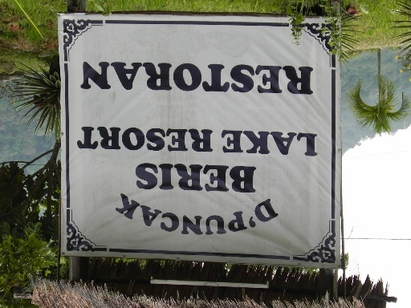 | 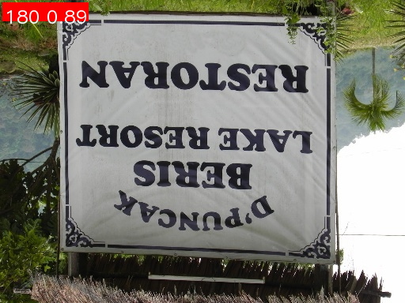 |

| text输出                                                     | text输出解析                                                 |
| ------------------------------------------------------------ | ------------------------------------------------------------ |
| {'res': {'input_path': './datasets/hc_test/img_rot180_demo.jpg', 'page_index': None, 'class_ids': [2], 'scores': [0.8922899961471558], 'label_names': ['180']}} | \- `input_path`：表示输入图片的路径。 <br />- `class_ids`：表示预测结果的类别id，含有四个类别，即0度，90度，180度和270度。 <br />- `scores`：表示预测结果的置信度。 <br />- `label_names`：表示预测结果的类别名。 |

##### 2.3.3.5、微调

由于 PaddleOCR 并不直接提供文档图像方向分类的训练，因此，如果需要训练文档图像方向分类模型，可以参考 [PaddleX 文档图像方向分类二次开发](https://paddlepaddle.github.io/PaddleX/latest/module_usage/tutorials/ocr_modules/doc_img_orientation_classification.html#_5)部分进行训练。训练后的模型可以无缝集成到 PaddleOCR 的 API 中进行推理。

#### 2.3.4、文本图像矫正模块

##### 2.3.4.1、功能概述

文本图像矫正的主要目的是针对图像进行几何变换，以纠正图像中的文档扭曲、倾斜、透视变形等问题，以供后续的文本识别进行更加准确。

##### 2.3.4.2、支持模型列表

| 模型  | 模型下载链接                                                 | CER   | GPU推理耗时（ms） [常规模式 / 高性能模式] | CPU推理耗时（ms） [常规模式 / 高性能模式] | 模型存储大小（MB） | 介绍                   |
| ----- | ------------------------------------------------------------ | ----- | ----------------------------------------- | ----------------------------------------- | ------------------ | ---------------------- |
| UVDoc | [推理模型](https://paddle-model-ecology.bj.bcebos.com/paddlex/official_inference_model/paddle3.0.0/UVDoc_infer.tar) / [训练模型](https://paddle-model-ecology.bj.bcebos.com/paddlex/official_pretrained_model/UVDoc_pretrained.pdparams) | 0.179 | 19.05 / 19.05                             | - / 869.82                                | 30.3               | 高精度文本图像矫正模型 |

##### 2.3.4.3、方法、参数解析

- `TextImageUnwarping`实例化图像矫正模型（此处以`UVDoc`为例），具体说明如下：

  | 参数                    | 参数说明                                                     | 参数类型   | 默认值   |
  | ----------------------- | ------------------------------------------------------------ | ---------- | -------- |
  | `model_name`            | 模型名称。如果设置为`None`，则使用`UVDoc`。                  | `str|None` | `None`   |
  | `model_dir`             | 模型存储路径。                                               | `str|None` | `None`   |
  | `device`                | 用于推理的设备。 **例如：**`"cpu"`、`"gpu"`、`"npu"`、`"gpu:0"`、`"gpu:0,1"`。 如指定多个设备，将进行并行推理。 默认情况下，优先使用 GPU 0；若不可用则使用 CPU。 | `str|None` | `None`   |
  | `enable_hpi`            | 是否启用高性能推理。                                         | `bool`     | `False`  |
  | `use_tensorrt`          | 是否启用 Paddle Inference 的 TensorRT 子图引擎。如果模型不支持通过 TensorRT 加速，即使设置了此标志，也不会使用加速。 对于 CUDA 11.8 版本的飞桨，兼容的 TensorRT 版本为 8.x（x>=6），建议安装 TensorRT 8.6.1.6。 | `bool`     | `False`  |
  | `precision`             | 当使用 Paddle Inference 的 TensorRT 子图引擎时设置的计算精度。 **可选项：**`"fp32"`、`"fp16"`。 | `str`      | `"fp32"` |
  | `enable_mkldnn`         | 是否启用 MKL-DNN 加速推理。如果 MKL-DNN 不可用或模型不支持通过 MKL-DNN 加速，即使设置了此标志，也不会使用加速。 | `bool`     | `True`   |
  | `mkldnn_cache_capacity` | MKL-DNN 缓存容量。                                           | `int`      | `10`     |
  | `cpu_threads`           | 在 CPU 上推理时使用的线程数量。                              | `int`      | `10`     |

- 调用图像矫正模型的 `predict()` 方法进行推理预测，该方法会返回一个结果列表。另外，本模块还提供了 `predict_iter()` 方法。两者在参数接受和结果返回方面是完全一致的，区别在于 `predict_iter()` 返回的是一个 `generator`，能够逐步处理和获取预测结果，适合处理大型数据集或希望节省内存的场景。可以根据实际需求选择使用这两种方法中的任意一种。`predict()` 方法参数有 `input` 和 `batch_size`，具体说明如下：

  | 参数         | 参数说明                                                     | 参数类型              | 默认值 |
  | ------------ | ------------------------------------------------------------ | --------------------- | ------ |
  | `input`      | 待预测数据，支持多种输入类型，必填。**Python Var**：如 `numpy.ndarray` 表示的图像数据**str**：如图像文件或者PDF文件的本地路径：`/root/data/img.jpg`；**如URL链接**，如图像文件或PDF文件的网络URL：[示例](https://paddle-model-ecology.bj.bcebos.com/paddlex/imgs/demo_image/img_rot180_demo.jpg)；**如本地目录**，该目录下需包含待预测图像，如本地路径：`/root/data/`(当前不支持目录中包含PDF文件的预测，PDF文件需要指定到具体文件路径)**list**：列表元素需为上述类型数据，如`[numpy.ndarray, numpy.ndarray]`，`["/root/data/img1.jpg", "/root/data/img2.jpg"]`，`["/root/data1", "/root/data2"]` | `Python Var|str|list` |        |
  | `batch_size` | 批大小，可设置为任意正整数。                                 | `int`                 | 1      |

- 对预测结果进行处理，每个样本的预测结果均为对应的Result对象，且支持打印、保存为图片、保存为`json`文件的操作：

  | 方法             | 方法说明                   | 参数                                            | 参数类型                      | 参数说明                                                     | 默认值                     |
  | ---------------- | -------------------------- | ----------------------------------------------- | ----------------------------- | ------------------------------------------------------------ | -------------------------- |
  | `print()`        | 打印结果到终端             | `format_json`<br />`indent`<br />`ensure_ascii` | `bool`<br />`int`<br />`bool` | 是否对输出内容进行使用 `JSON` 缩进格式化。<br />指定缩进级别，以美化输出的 `JSON` 数据，使其更具可读性，仅当 `format_json` 为 `True` 时有效。<br />控制是否将非 `ASCII` 字符转义为 `Unicode`。设置为 `True` 时，所有非 `ASCII` 字符将被转义；`False` 则保留原始字符，仅当`format_json`为`True`时有效。 | `True`<br />4<br />`False` |
  | `save_to_json()` | 将结果保存为json格式的文件 | `save_path`<br />`indent`<br />`ensure_ascii`   | `str`<br />`int`<br />`bool`  | 保存的文件路径，当为目录时，保存文件命名与输入文件类型命名一致。<br />指定缩进级别，以美化输出的 `JSON` 数据，使其更具可读性，仅当 `format_json` 为 `True` 时有效。<br />控制是否将非 `ASCII` 字符转义为 `Unicode`。设置为 `True` 时，所有非 `ASCII` 字符将被转义；`False` 则保留原始字符，仅当`format_json`为`True`时有效。 | 无<br />4<br />`False`     |
  | `save_to_img()`  | 将结果保存为图像格式的文件 | `save_path`                                     | `str`                         | 保存的文件路径，当为目录时，保存文件命名与输入文件类型命名一致。 | 无                         |

- 此外，也支持通过属性获取带结果的可视化图像和预测结果，具体如下：

  | 属性   | 属性说明                     |
  | ------ | ---------------------------- |
  | `json` | 获取预测的`json`格式的结果   |
  | `img`  | 获取格式为`dict`的可视化图像 |

##### 2.3.4.4、代码

调用代码如下：

```python
from paddleocr import TextImageUnwarping

model = TextImageUnwarping(
    model_name="UVDoc",
    model_dir="/mnt/2/hc/PaddleOCR/pretrained_models/doc_unwarping/UVDoc_infer",
    device="gpu:0",
    enable_hpi=False,
    use_tensorrt=False,
    precision="fp32",
    enable_mkldnn=True,
    mkldnn_cache_capacity=10,
    cpu_threads=8,
)

output = model.predict("/mnt/2/hc/PaddleOCR/datasets/hc_test/doc_test.jpg", batch_size=1)

# 处理结果
for res in output:
    # 打印结果
    res.print()
    
    # 保存矫正后的图像
    res.save_to_img(save_path="./output_unwarp/")
    
    # 保存JSON结果
    res.save_to_json(save_path="./output_unwarp/res.json")
    
    # 获取结果
    json_result = res.json
    print("\n" + "="*80)
    print("矫正结果：")
    print(f"输入路径: {json_result['res']['input_path']}")
    print(f"页面索引: {json_result['res']['page_index']}")
    print("矫正图像已保存")
    print("="*80)
```

结果如下：

| img输入                                                      | img输出                                                      |
| ------------------------------------------------------------ | ------------------------------------------------------------ |
| 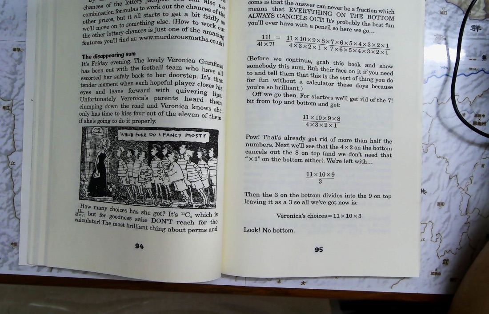 | 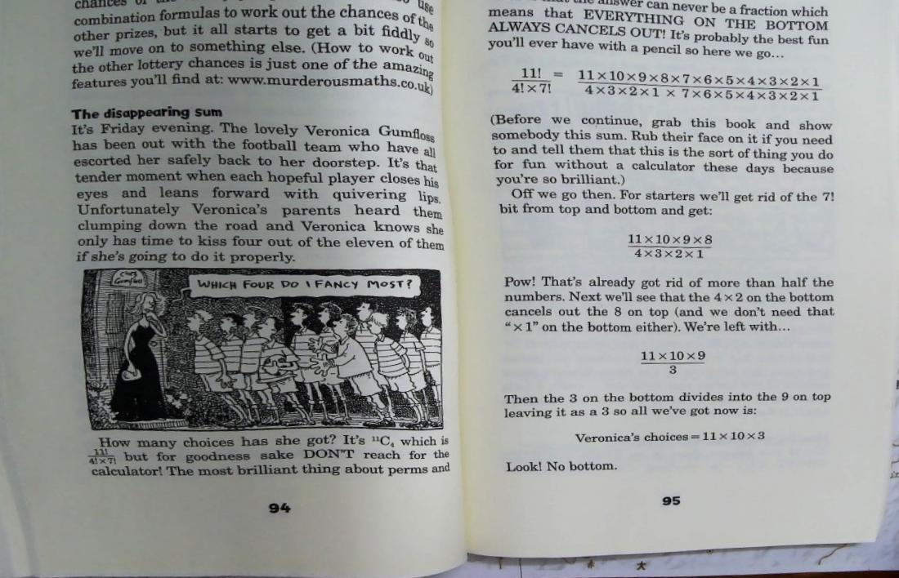 |

##### 2.3.4.5、微调

当前模块暂时不支持微调训练，仅支持推理集成。关于该模块的微调训练，计划在未来支持。

#### 2.3.5、方法、参数解析

具体的方法、参数解析可以查看各子模块。

#### 2.3.6、代码

我们可以将以上两个模型通过pipeline的形式组合使用：

```python
from paddleocr import DocPreprocessor
import os

os.makedirs("./output_docpp", exist_ok=True)

pipeline = DocPreprocessor(
    doc_orientation_classify_model_name="PP-LCNet_x1_0_doc_ori",
    doc_orientation_classify_model_dir="/mnt/2/hc/PaddleOCR/pretrained_models/doc_ori/PP-LCNet_x1_0_doc_ori_infer",
    doc_unwarping_model_name="UVDoc",
    doc_unwarping_model_dir="/mnt/2/hc/PaddleOCR/pretrained_models/doc_unwarping/UVDoc_infer",
    use_doc_orientation_classify=True,  # 启用文档方向分类
    use_doc_unwarping=True,             # 启用文本图像矫正
    device="gpu:0",
    enable_hpi=False,
    use_tensorrt=False,
    precision="fp32",
    enable_mkldnn=True,
    mkldnn_cache_capacity=10,
    cpu_threads=8,
)

print("开始处理图像...")
output = pipeline.predict("/mnt/2/hc/PaddleOCR/datasets/hc_test/doc_test_rot270.jpg")

for res in output:
    res.print()

    res.save_to_img("./output_docpp/")
    res.save_to_json("./output_docpp/")

    json_result = res.json
    
    print("\n" + "="*80)
    print("文档预处理结果详情：")
    print(f"输入路径: {json_result.get('input_path', 'N/A')}")
    print(f"页面索引: {json_result.get('page_index', 'N/A')}")
    print(f"文档方向角度: {json_result.get('angle', 'N/A')}°")
    
    if 'model_settings' in json_result:
        print(f"模型设置:")
        print(f"  - 使用文档方向分类: {json_result['model_settings'].get('use_doc_orientation_classify', False)}")
        print(f"  - 使用文本图像矫正: {json_result['model_settings'].get('use_doc_unwarping', False)}")
    
    print("="*80)

    img_dict = res.img
    print(f"\n可视化图像键: {list(img_dict.keys())}")
    if 'preprocessed_img' in img_dict:
        print("预处理后的图像已生成")
        
    import json
    print("\n完整JSON结果:")
    print(json.dumps(json_result, indent=4, ensure_ascii=False, default=str))

print("\n结果已保存到 ./output_docpp/ 目录")
```

结果如下：

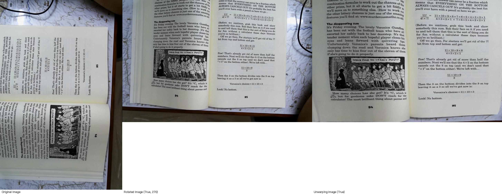

#### 2.3.7、微调各模块

可以参考子模块微调。


### 2.4、表格识别子产线（optional）

#### 2.4.1、功能概述

- 表格识别是一种自动从文档或图像中识别和提取表格内容及其结构的技术，通过使用计算机视觉和机器学习算法，表格识别能够将复杂的表格信息转换为可编辑的格式，方便用户进一步处理和分析数据。
- 通用表格识别v2产线（PP-TableMagic）用于解决表格识别任务，对图片中的表格进行识别，并以HTML格式输出。与通用表格识别产线不同，本产线新引入了表格分类和表格单元格检测两个模块，通过**采用“表格分类 + 表格结构识别 + 单元格检测”多模型串联组网方案**，实现了相比通用表格识别产线更好的端到端表格识别性能。基于此，通用表格识别v2产线**原生支持针对性地模型微调**，各类开发者均能对通用表格识别v2产线进行不同程度的自定义微调，使其在不同应用场景下都能得到令人满意的性能。**除此之外，通用表格识别v2产线同样支持使用端到端表格结构识别模型（例如 SLANet、SLANet_plus 等），并且支持有线表、无线表独立配置表格识别方式，开发者可以自由选取和组合最佳的表格识别方案。**
- 本产线的使用场景覆盖通用、制造、金融、交通等各个领域，也提供了二次开发的能力，您可以基于本产线在您自己的数据集上训练调优，训练后的模型也可以无缝集成。

#### 2.4.2、包含子模块介绍

通用表格识别产线v2中包含以下8个模块。每个模块均可独立进行训练和推理，并包含多个模型：

- 表格结构识别模块
- 表格分类模块
- 表格单元格检测模块
- 文本检测模块 --- 见 2.2
- 文本识别模块 --- 见 2.2
- 版面区域检测模块（optional） --- 见 2.1
- 文档图像方向分类模块（optional） --- 见 2.3.3
- 文本图像矫正模块（optional） --- 见 2.3.4


这里强调一下：

- 表格结构识别模块的功能是：
  - 负责识别表格的**结构信息**（行、列、单元格位置关系）
  - 输出：表格的**HTML代码**（包含结构信息如 `<td>`, `<tr>`, `colspan` 等）
  - 作用：理解"表格是如何组织的"
- 表格单元格检测模块的功能是：
  - 负责**定位和标记**表格中每个单元格的区域
  - 输出：各个单元格区域的**边界框（Bounding Boxes）**
  - 作用：找出"单元格在哪里"
- 一般使用的逻辑是（**单元格检测是"定位"，结构识别是"理解"**）：
  - 先用单元格检测找出所有单元格位置
  - 再用结构识别理解表格的组织方式（合并单元格、跨行跨列等）
  - 最终生成可编辑的表格（如HTML格式）

#### 2.4.3、表格结构识别模块

##### 2.4.3.1、功能概述

- 表格结构识别是表格识别系统中的重要组成部分，能够将不可编辑表格图片转换为可编辑的表格形式（例如html）。
- 表格结构识别的目标是对表格的行、列和单元格位置进行识别，该模块的性能直接影响到整个表格识别系统的准确性和效率。
- 表格结构识别模块会输出表格区域的html代码，这些代码将作为输入传递给表格识别产线进行后续处理。

##### 2.4.3.2、支持模型列表

| 模型             | 模型下载链接                                                 | 精度（%） | GPU推理耗时（ms） [常规模式 / 高性能模式] | CPU推理耗时（ms） [常规模式 / 高性能模式] | 模型存储大小（MB） | 介绍                                                         |
| ---------------- | ------------------------------------------------------------ | --------- | ----------------------------------------- | ----------------------------------------- | ------------------ | ------------------------------------------------------------ |
| SLANet           | [推理模型](https://paddle-model-ecology.bj.bcebos.com/paddlex/official_inference_model/paddle3.0.0/SLANet_infer.tar) / [训练模型](https://paddle-model-ecology.bj.bcebos.com/paddlex/official_pretrained_model/SLANet_pretrained.pdparams) | 59.52     | 23.96 / 21.75                             | - / 43.12                                 | 6.9                | SLANet 是百度飞桨视觉团队自研的表格结构识别模型。该模型通过采用 CPU 友好型轻量级骨干网络 PP-LCNet、高低层特征融合模块 CSP-PAN、结构与位置信息对齐的特征解码模块 SLA Head，大幅提升了表格结构识别的精度和推理速度。 |
| SLANet_plus      | [推理模型](https://paddle-model-ecology.bj.bcebos.com/paddlex/official_inference_model/paddle3.0.0/SLANet_plus_infer.tar) / [训练模型](https://paddle-model-ecology.bj.bcebos.com/paddlex/official_pretrained_model/SLANet_plus_pretrained.pdparams) | 63.69     | 23.43 / 22.16                             | - / 41.80                                 | 6.9                | SLANet_plus 是百度飞桨视觉团队自研的表格结构识别模型 SLANet 的增强版。相较于 SLANet，SLANet_plus 对无线表、复杂表格的识别能力得到了大幅提升，并降低了模型对表格定位准确性的敏感度，即使表格定位出现偏移，也能够较准确地进行识别。 |
| SLANeXt_wired    | [推理模型](https://paddle-model-ecology.bj.bcebos.com/paddlex/official_inference_model/paddle3.0.0/SLANeXt_wired_infer.tar) / [训练模型](https://paddle-model-ecology.bj.bcebos.com/paddlex/official_pretrained_model/SLANeXt_wired_pretrained.pdparams) | 69.65     | 85.92 / 85.92                             | - / 501.66                                | 351                | SLANeXt 系列是百度飞桨视觉团队自研的新一代表格结构识别模型。相较于 SLANet 和 SLANet_plus，SLANeXt 专注于对表格结构进行识别，并且对有线表格(wired)和无线表格(wireless)的识别分别训练了专用的权重，对各类型表格的识别能力都得到了明显提高，特别是对有线表格的识别能力得到了大幅提升。 |
| SLANeXt_wireless | [推理模型](https://paddle-model-ecology.bj.bcebos.com/paddlex/official_inference_model/paddle3.0.0/SLANeXt_wireless_infer.tar) / [训练模型](https://paddle-model-ecology.bj.bcebos.com/paddlex/official_pretrained_model/SLANeXt_wireless_pretrained.pdparams) |           |                                           |                                           |                    |                                                              |

##### 2.4.3.3、方法、参数解析

- `TableStructureRecognition`实例化表格结构识别模型（此处以`SLANet`为例），具体说明如下：

  | 参数                    | 参数说明                                                     | 参数类型   | 默认值   |
  | ----------------------- | ------------------------------------------------------------ | ---------- | -------- |
  | `model_name`            | 模型名称。如果设置为`None`，则使用`PP-LCNet_x1_0_table_cls`。 | `str|None` | `None`   |
  | `model_dir`             | 模型存储路径。                                               | `str|None` | `None`   |
  | `device`                | 用于推理的设备。 **例如：**`"cpu"`、`"gpu"`、`"npu"`、`"gpu:0"`、`"gpu:0,1"`。 如指定多个设备，将进行并行推理。 默认情况下，优先使用 GPU 0；若不可用则使用 CPU。 | `str|None` | `None`   |
  | `enable_hpi`            | 是否启用高性能推理。                                         | `bool`     | `False`  |
  | `use_tensorrt`          | 是否启用 Paddle Inference 的 TensorRT 子图引擎。如果模型不支持通过 TensorRT 加速，即使设置了此标志，也不会使用加速。 对于 CUDA 11.8 版本的飞桨，兼容的 TensorRT 版本为 8.x（x>=6），建议安装 TensorRT 8.6.1.6。 | `bool`     | `False`  |
  | `precision`             | 当使用 Paddle Inference 的 TensorRT 子图引擎时设置的计算精度。 **可选项：**`"fp32"`、`"fp16"`。 | `str`      | `"fp32"` |
  | `enable_mkldnn`         | 是否启用 MKL-DNN 加速推理。如果 MKL-DNN 不可用或模型不支持通过 MKL-DNN 加速，即使设置了此标志，也不会使用加速。 | `bool`     | `True`   |
  | `mkldnn_cache_capacity` | MKL-DNN 缓存容量。                                           | `int`      | `10`     |
  | `cpu_threads`           | 在 CPU 上推理时使用的线程数量。                              | `int`      | `10`     |

- 调用表格结构识别模型的 `predict()` 方法进行推理预测，该方法会返回一个结果列表。另外，本模块还提供了 `predict_iter()` 方法。两者在参数接受和结果返回方面是完全一致的，区别在于 `predict_iter()` 返回的是一个 `generator`，能够逐步处理和获取预测结果，适合处理大型数据集或希望节省内存的场景。可以根据实际需求选择使用这两种方法中的任意一种。`predict()` 方法参数有 `input` 和 `batch_size`，具体说明如下：

  | 参数         | 参数说明                                                     | 参数类型              | 默认值 |
  | ------------ | ------------------------------------------------------------ | --------------------- | ------ |
  | `input`      | 待预测数据，支持多种输入类型，必填。<br />- **Python Var**：如 `numpy.ndarray` 表示的图像数据**str**：如图像文件或者PDF文件的本地路径：`/root/data/img.jpg`；<br />- **如URL链接**，如图像文件或PDF文件的网络URL：[示例](https://paddle-model-ecology.bj.bcebos.com/paddlex/imgs/demo_image/img_rot180_demo.jpg)；<br />- **如本地目录**，该目录下需包含待预测图像，如本地路径：`/root/data/`(当前不支持目录中包含PDF文件的预测，PDF文件需要指定到具体文件路径)**list**：列表元素需为上述类型数据，如`[numpy.ndarray, numpy.ndarray]`，`["/root/data/img1.jpg", "/root/data/img2.jpg"]`，`["/root/data1", "/root/data2"]` | `Python Var|str|list` |        |
  | `batch_size` | 批大小，可设置为任意正整数。                                 | `int`                 | 1      |

- 对预测结果进行处理，每个样本的预测结果均为对应的Result对象，且支持打印、保存为`json`文件的操作：

  | 方法             | 方法说明                   | 参数                                            | 参数类型                      | 参数说明                                                     | 默认值                     |
  | ---------------- | -------------------------- | ----------------------------------------------- | ----------------------------- | ------------------------------------------------------------ | -------------------------- |
  | `print()`        | 打印结果到终端             | `format_json`<br />`indent`<br />`ensure_ascii` | `bool`<br />`int`<br />`bool` | 是否对输出内容进行使用 `JSON` 缩进格式化<br />指定缩进级别，以美化输出的 `JSON` 数据，使其更具可读性，仅当 `format_json` 为 `True` 时有效<br />控制是否将非 `ASCII` 字符转义为 `Unicode`。设置为 `True` 时，所有非 `ASCII` 字符将被转义；`False` 则保留原始字符，仅当`format_json`为`True`时有效 | `True`<br />4<br />`False` |
  | `save_to_json()` | 将结果保存为json格式的文件 | `save_path`<br />`indent`<br />`ensure_ascii`   | `str`<br />`int`<br />`bool`  | 保存的文件路径，当为目录时，保存文件命名与输入文件类型命名一致<br />指定缩进级别，以美化输出的 `JSON` 数据，使其更具可读性，仅当 `format_json` 为 `True` 时有效<br />控制是否将非 `ASCII` 字符转义为 `Unicode`。设置为 `True` 时，所有非 `ASCII` 字符将被转义；`False` 则保留原始字符，仅当`format_json`为`True`时有效 | 无<br />4<br />`False`     |

- 此外，也支持通过属性获取结果，具体如下：

  | 属性   | 属性说明                   |
  | ------ | -------------------------- |
  | `json` | 获取预测的`json`格式的结果 |

##### 2.4.3.4、代码

调用代码如下：

```python
# from paddleocr import TableStructureRecognition
# import os

# os.makedirs("./output_table", exist_ok=True)

# print("初始化表格结构识别模型...")
# model = TableStructureRecognition(
#     model_name="SLANet_plus",
#     model_dir="/mnt/2/hc/PaddleOCR/pretrained_models/table_structure/SLANet_plus_infer",
#     device="gpu:0",
# )

# print("开始表格结构识别...")
# output = model.predict("/mnt/2/hc/PaddleOCR/datasets/hc_test/table_recognition.jpg", batch_size=1)

# for res in output:
#     res.print()

#     res.save_to_json("./output_table/res.json")

#     json_result = res.json
    
#     print("\n" + "="*80)
#     print("表格结构识别结果详情：")
#     print("="*80)
    
#     if 'res' in json_result:
#         result_data = json_result['res']
        
#         print(f"输入路径: {result_data.get('input_path', 'N/A')}")
#         print(f"页面索引: {result_data.get('page_index', 'N/A')}")
        
#         # 表格单元格信息
#         bbox = result_data.get('bbox', [])
#         print(f"\n检测到 {len(bbox)} 个表格单元格")
        
#         # 表格结构信息
#         structure = result_data.get('structure', [])
#         structure_score = result_data.get('structure_score', 0)
        
#         print(f"表格结构置信度: {structure_score:.4f}")
#         print(f"\nHTML结构 (共 {len(structure)} 个标签):")
#         print(''.join(structure))
        
#         # 显示单元格坐标
#         if bbox:
#             print(f"\n单元格坐标信息 (前10个):")
#             print("-" * 80)
#             for i, cell in enumerate(bbox[:10], 1):
#                 print(f"{i:2d}. {cell}")
#             if len(bbox) > 10:
#                 print(f"... 还有 {len(bbox) - 10} 个单元格")
    
#     print("="*80)

# print("\n✓ 结果已保存到 ./output_table/ 目录")


from paddleocr import TableStructureRecognition
import os
import cv2
import numpy as np

os.makedirs("./output_table_viz", exist_ok=True)

model = TableStructureRecognition(
    model_name="SLANet_plus",
    model_dir="/mnt/2/hc/PaddleOCR/pretrained_models/table_structure/SLANet_plus_infer",
    device="gpu:0",
)

input_image = "/mnt/2/hc/PaddleOCR/datasets/hc_test/table_recognition.jpg"
print(f"处理表格图像: {input_image}\n")

output = model.predict(input_image, batch_size=1)

for res in output:
    json_result = res.json
    result_data = json_result['res']
    
    bbox = result_data.get('bbox', [])
    structure = result_data.get('structure', [])
    structure_score = result_data.get('structure_score', 0)
    
    print(f"检测到 {len(bbox)} 个单元格")
    print(f"结构置信度: {structure_score:.4f}\n")

    print("="*80)
    print("单元格坐标详细解释：")
    print("="*80)
    
    for i, cell in enumerate(bbox[:5], 1):  # 只显示前5个
        if len(cell) >= 8:
            x1, y1, x2, y2, x3, y3, x4, y4 = cell
            
            # 计算尺寸
            width = x2 - x1
            height = y3 - y1
            
            print(f"\n单元格 {i}:")
            print(f"  原始坐标: {cell}")
            print(f"  左上角 (Top-Left):     ({x1:6.1f}, {y1:6.1f})")
            print(f"  右上角 (Top-Right):    ({x2:6.1f}, {y2:6.1f})")
            print(f"  右下角 (Bottom-Right): ({x3:6.1f}, {y3:6.1f})")
            print(f"  左下角 (Bottom-Left):  ({x4:6.1f}, {y4:6.1f})")
            print(f"  尺寸: 宽度={width:.1f}px, 高度={height:.1f}px")
            print(f"  中心点: ({(x1+x2)/2:.1f}, {(y1+y3)/2:.1f})")
    
    if len(bbox) > 5:
        print(f"\n... 还有 {len(bbox)-5} 个单元格")
    
    print("\n" + "="*80)
    
    # 读取原图
    img = cv2.imread(input_image)
    
    if img is not None:
        # 创建标注图像
        img_annotated = img.copy()
        
        # 设置颜色
        colors = [
            (0, 255, 0),    # 绿色
            (255, 0, 0),    # 蓝色
            (0, 0, 255),    # 红色
            (255, 255, 0),  # 青色
            (255, 0, 255),  # 品红
            (0, 255, 255),  # 黄色
        ]
        
        for i, cell in enumerate(bbox):
            if len(cell) >= 8:
                # 提取四个顶点
                x1, y1, x2, y2, x3, y3, x4, y4 = cell
                
                # 转换为整数坐标
                pts = np.array([
                    [int(x1), int(y1)],  # 左上
                    [int(x2), int(y2)],  # 右上
                    [int(x3), int(y3)],  # 右下
                    [int(x4), int(y4)]   # 左下
                ], np.int32)
                
                # 选择颜色
                color = colors[i % len(colors)]
                
                # 绘制多边形边框
                cv2.polylines(img_annotated, [pts], True, color, 2)
                
                # 标注四个顶点
                cv2.circle(img_annotated, (int(x1), int(y1)), 5, (0, 255, 0), -1)    # 左上 - 绿色
                cv2.circle(img_annotated, (int(x2), int(y2)), 5, (255, 0, 0), -1)    # 右上 - 蓝色
                cv2.circle(img_annotated, (int(x3), int(y3)), 5, (0, 0, 255), -1)    # 右下 - 红色
                cv2.circle(img_annotated, (int(x4), int(y4)), 5, (255, 255, 0), -1)  # 左下 - 青色
                
                # 添加单元格编号
                center_x = int((x1 + x2) / 2)
                center_y = int((y1 + y3) / 2)
                cv2.putText(img_annotated, f"#{i+1}", 
                           (center_x-15, center_y+5), 
                           cv2.FONT_HERSHEY_SIMPLEX, 0.6, (0, 0, 0), 2)
                cv2.putText(img_annotated, f"#{i+1}", 
                           (center_x-15, center_y+5), 
                           cv2.FONT_HERSHEY_SIMPLEX, 0.6, (255, 255, 255), 1)
        
        # 添加图例
        legend_y = 30
        cv2.putText(img_annotated, "Legend:", (10, legend_y), 
                   cv2.FONT_HERSHEY_SIMPLEX, 0.6, (0, 0, 0), 2)
        cv2.circle(img_annotated, (100, legend_y-5), 5, (0, 255, 0), -1)
        cv2.putText(img_annotated, "Top-Left", (110, legend_y), 
                   cv2.FONT_HERSHEY_SIMPLEX, 0.5, (0, 0, 0), 1)
        
        cv2.circle(img_annotated, (220, legend_y-5), 5, (255, 0, 0), -1)
        cv2.putText(img_annotated, "Top-Right", (230, legend_y), 
                   cv2.FONT_HERSHEY_SIMPLEX, 0.5, (0, 0, 0), 1)
        
        cv2.circle(img_annotated, (350, legend_y-5), 5, (0, 0, 255), -1)
        cv2.putText(img_annotated, "Bottom-Right", (360, legend_y), 
                   cv2.FONT_HERSHEY_SIMPLEX, 0.5, (0, 0, 0), 1)
        
        cv2.circle(img_annotated, (510, legend_y-5), 5, (255, 255, 0), -1)
        cv2.putText(img_annotated, "Bottom-Left", (520, legend_y), 
                   cv2.FONT_HERSHEY_SIMPLEX, 0.5, (0, 0, 0), 1)
        
        # 保存可视化结果
        output_path = "./output_table_viz/table_cells_visualization.jpg"
        cv2.imwrite(output_path, img_annotated)
        print(f"\n✓ 可视化结果已保存到: {output_path}")
    
    # 创建坐标说明文档
    with open("./output_table_viz/coordinates_explanation.txt", 'w', encoding='utf-8') as f:
        f.write("表格单元格坐标说明\n")
        f.write("="*80 + "\n\n")
        f.write("坐标格式: [x1, y1, x2, y2, x3, y3, x4, y4]\n\n")
        f.write("含义:\n")
        f.write("  (x1, y1) - 左上角 (Top-Left)\n")
        f.write("  (x2, y2) - 右上角 (Top-Right)\n")
        f.write("  (x3, y3) - 右下角 (Bottom-Right)\n")
        f.write("  (x4, y4) - 左下角 (Bottom-Left)\n\n")
        f.write("="*80 + "\n\n")
        
        for i, cell in enumerate(bbox, 1):
            if len(cell) >= 8:
                x1, y1, x2, y2, x3, y3, x4, y4 = cell
                width = x2 - x1
                height = y3 - y1
                
                f.write(f"单元格 {i}:\n")
                f.write(f"  原始坐标: {cell}\n")
                f.write(f"  左上角: ({x1:.1f}, {y1:.1f})\n")
                f.write(f"  右上角: ({x2:.1f}, {y2:.1f})\n")
                f.write(f"  右下角: ({x3:.1f}, {y3:.1f})\n")
                f.write(f"  左下角: ({x4:.1f}, {y4:.1f})\n")
                f.write(f"  尺寸: {width:.1f} x {height:.1f} 像素\n")
                f.write(f"  中心: ({(x1+x2)/2:.1f}, {(y1+y3)/2:.1f})\n")
                f.write("\n")
    
    print("✓ 坐标说明已保存到: ./output_table_viz/coordinates_explanation.txt")
    
    # 保存HTML结构
    html_content = ''.join(structure)
    with open("./output_table_viz/table_structure.html", 'w', encoding='utf-8') as f:
        f.write(html_content)
    print("✓ HTML结构已保存到: ./output_table_viz/table_structure.html")

print("\n处理完成！")
```

输出结果如下：

| img输入                            | img输出                            |
| ---------------------------------- | ---------------------------------- |
|  |  |

##### 2.4.3.5、微调

微调参考：[表格结构识别模块 - PaddleOCR 文档](https://www.paddleocr.ai/latest/version3.x/module_usage/table_structure_recognition.html#_4)。

#### 2.4.4、表格分类模块

##### 2.4.4.1、功能概述

- 表格分类模块通常会接收表格图像作为输入，然后通过深度学习算法，根据图像的特性和内容，将其分类到预定义的类别中，例如有线表和无线表。
- 表格分类模块的分类结果将作为输出，供表格识别相关产线使用。

##### 2.4.4.2、支持模型列表

| 模型                    | 模型下载链接                                                 | Top1 Acc(%) | GPU推理耗时（ms） [常规模式 / 高性能模式] | CPU推理耗时（ms） [常规模式 / 高性能模式] | 模型存储大小（MB） |
| ----------------------- | ------------------------------------------------------------ | ----------- | ----------------------------------------- | ----------------------------------------- | ------------------ |
| PP-LCNet_x1_0_table_cls | [推理模型](https://paddle-model-ecology.bj.bcebos.com/paddlex/official_inference_model/paddle3.0.0/PP-LCNet_x1_0_table_cls_infer.tar) / [训练模型](https://paddle-model-ecology.bj.bcebos.com/paddlex/official_pretrained_model/PP-LCNet_x1_0_table_cls_pretrained.pdparams) | 94.2        | 2.62 / 0.60                               | 3.17 / 1.14                               | 6.6                |

##### 2.4.4.3、方法、参数解析

- `TableClassification`实例化表格分类模型（此处以`PP-LCNet_x1_0_table_cls`为例），具体说明如下：

  | 参数                    | 参数说明                                                     | 参数类型   | 默认值   |
  | ----------------------- | ------------------------------------------------------------ | ---------- | -------- |
  | `model_name`            | 模型名称。如果设置为`None`，则使用`PP-LCNet_x1_0_table_cls`。 | `str|None` | `None`   |
  | `model_dir`             | 模型存储路径。                                               | `str|None` | `None`   |
  | `device`                | 用于推理的设备。 **例如：**`"cpu"`、`"gpu"`、`"npu"`、`"gpu:0"`、`"gpu:0,1"`。 如指定多个设备，将进行并行推理。 默认情况下，优先使用 GPU 0；若不可用则使用 CPU。 | `str|None` | `None`   |
  | `enable_hpi`            | 是否启用高性能推理。                                         | `bool`     | `False`  |
  | `use_tensorrt`          | 是否启用 Paddle Inference 的 TensorRT 子图引擎。如果模型不支持通过 TensorRT 加速，即使设置了此标志，也不会使用加速。 对于 CUDA 11.8 版本的飞桨，兼容的 TensorRT 版本为 8.x（x>=6），建议安装 TensorRT 8.6.1.6。 | `bool`     | `False`  |
  | `precision`             | 当使用 Paddle Inference 的 TensorRT 子图引擎时设置的计算精度。 **可选项：**`"fp32"`、`"fp16"`。 | `str`      | `"fp32"` |
  | `enable_mkldnn`         | 是否启用 MKL-DNN 加速推理。如果 MKL-DNN 不可用或模型不支持通过 MKL-DNN 加速，即使设置了此标志，也不会使用加速。 | `bool`     | `True`   |
  | `mkldnn_cache_capacity` | MKL-DNN 缓存容量。                                           | `int`      | `10`     |
  | `cpu_threads`           | 在 CPU 上推理时使用的线程数量。                              | `int`      | `10`     |

- 调用表格分类模型的 `predict()` 方法进行推理预测，该方法会返回一个结果列表。另外，本模块还提供了 `predict_iter()` 方法。两者在参数接受和结果返回方面是完全一致的，区别在于 `predict_iter()` 返回的是一个 `generator`，能够逐步处理和获取预测结果，适合处理大型数据集或希望节省内存的场景。可以根据实际需求选择使用这两种方法中的任意一种。`predict()` 方法参数有 `input` 和 `batch_size`，具体说明如下：

  | 参数         | 参数说明                                                     | 参数类型              | 默认值 |
  | ------------ | ------------------------------------------------------------ | --------------------- | ------ |
  | `input`      | 待预测数据，支持多种输入类型，必填。<br />- **Python Var**：如 `numpy.ndarray` 表示的图像数据<br />- **str**：如图像文件或者PDF文件的本地路径：`/root/data/img.jpg`；**如URL链接**，如图像文件或PDF文件的网络URL：[示例](https://paddle-model-ecology.bj.bcebos.com/paddlex/imgs/demo_image/general_doc_preprocessor_002.png)；**如本地目录**，该目录下需包含待预测图像，如本地路径：`/root/data/`(当前不支持目录中包含PDF文件的预测，PDF文件需要指定到具体文件路径)<br />- **list**：列表元素需为上述类型数据，如`[numpy.ndarray, numpy.ndarray]`，`["/root/data/img1.jpg", "/root/data/img2.jpg"]`，`["/root/data1", "/root/data2"]` | `Python Var|str|list` |        |
  | `batch_size` | 批大小，可设置为任意正整数。                                 | `int`                 | 1      |

- 对预测结果进行处理，每个样本的预测结果均为对应的Result对象，且支持打印、保存为`json`文件的操作：

  | 方法             | 方法说明                   | 参数                                            | 参数类型                      | 参数说明                                                     | 默认值                     |
  | ---------------- | -------------------------- | ----------------------------------------------- | ----------------------------- | ------------------------------------------------------------ | -------------------------- |
  | `print()`        | 打印结果到终端             | `format_json`<br />`indent`<br />`ensure_ascii` | `bool`<br />`int`<br />`bool` | 是否对输出内容进行使用 `JSON` 缩进格式化<br />指定缩进级别，以美化输出的 `JSON` 数据，使其更具可读性，仅当 `format_json` 为 `True` 时有效<br />控制是否将非 `ASCII` 字符转义为 `Unicode`。设置为 `True` 时，所有非 `ASCII` 字符将被转义；`False` 则保留原始字符，仅当`format_json`为`True`时有效 | `True`<br />4<br />`False` |
  | `save_to_json()` | 将结果保存为json格式的文件 | `save_path`<br />`indent`<br />`ensure_ascii`   | `str`<br />`int`<br />`bool`  | 保存的文件路径，当为目录时，保存文件命名与输入文件类型命名一致<br />指定缩进级别，以美化输出的 `JSON` 数据，使其更具可读性，仅当 `format_json` 为 `True` 时有效<br />控制是否将非 `ASCII` 字符转义为 `Unicode`。设置为 `True` 时，所有非 `ASCII` 字符将被转义；`False` 则保留原始字符，仅当`format_json`为`True`时有效 | 无<br />4<br />`False`     |

- 此外，也支持通过属性获取带结果的可视化图像和预测结果，具体如下：

  | 属性   | 属性说明                   |
  | ------ | -------------------------- |
  | `json` | 获取预测的`json`格式的结果 |
  | `img`  | 获取可视化图像             |

##### 2.4.4.4、代码

调用代码如下：

```python
from paddleocr import TableClassification
import os
import cv2

os.makedirs("./output_table_cls", exist_ok=True)

model = TableClassification(
    model_dir="/mnt/2/hc/PaddleOCR/pretrained_models/table_cls/PP-LCNet_x1_0_table_cls_infer",
    device="gpu:0",
)

input_image = "/mnt/2/hc/PaddleOCR/datasets/hc_test/table_recognition.jpg"

output = model.predict(input_image, batch_size=1)

for res in output:
    res.print()
    res.save_to_json("./output_table_cls/res.json")

    result = res.json['res']
    scores = result['scores']
    labels = result['label_names']

    import numpy as np
    if isinstance(scores, list):
        scores = np.array(scores)
    
    max_idx = int(scores.argmax())
    
    print(f"\n类型: {labels[max_idx]}, 置信度: {scores[max_idx]*100:.2f}%")

    img = cv2.imread(input_image)

    text = f"{labels[max_idx]} ({scores[max_idx]*100:.1f}%)"
    font = cv2.FONT_HERSHEY_SIMPLEX
    font_scale = 0.6
    thickness = 2
    
    # 获取文本大小
    (text_width, text_height), baseline = cv2.getTextSize(text, font, font_scale, thickness)
    
    # 设置padding
    padding = 8
    box_width = text_width + padding * 2
    box_height = text_height + baseline + padding * 2
    
    # 绘制更小的框
    cv2.rectangle(img, (10, 10), (10 + box_width, 10 + box_height), (0, 0, 0), -1)
    cv2.putText(img, text, 
               (10 + padding, 10 + text_height + padding), 
               font, font_scale, (0, 255, 0), thickness)
    
    cv2.imwrite("./output_table_cls/result.jpg", img)

print("\n✓ 完成！")
```

输出结果如下：

| img输入                            | img输出                            |
| ---------------------------------- | ---------------------------------- |
|  | 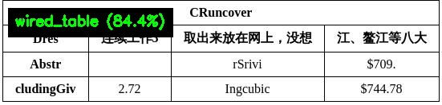 |

##### 2.4.4.5、微调

由于 PaddleOCR 并不直接提供表格分类模块的训练，因此，如果需要训练表格分类模型，可以参考 [PaddleX 表格分类模块二次开发](https://paddlepaddle.github.io/PaddleX/latest/module_usage/tutorials/ocr_modules/table_classification.html#_5)部分进行训练。训练后的模型可以无缝集成到 PaddleOCR 的 API 中进行推理。

#### 2.4.5、表格单元格检测模块

##### 2.4.5.1、功能概述

- 表格单元格检测模块是表格识别任务的关键组成部分，负责在表格图像中定位和标记每个单元格区域，该模块的性能直接影响到整个表格识别过程的准确性和效率。
- 表格单元格检测模块通常会输出各个单元格区域的边界框（Bounding Boxes），这些边界框将作为输入传递给表格识别相关产线进行后续处理。

##### 2.4.5.2、支持模型列表

| 模型                              | 模型下载链接                                                 | mAP(%) | GPU推理耗时（ms） [常规模式 / 高性能模式] | CPU推理耗时（ms） [常规模式 / 高性能模式] | 模型存储大小（MB） | 介绍                                                         |
| --------------------------------- | ------------------------------------------------------------ | ------ | ----------------------------------------- | ----------------------------------------- | ------------------ | ------------------------------------------------------------ |
| RT-DETR-L_wired_table_cell_det    | [推理模型](https://paddle-model-ecology.bj.bcebos.com/paddlex/official_inference_model/paddle3.0.0/RT-DETR-L_wired_table_cell_det_infer.tar) / [训练模型](https://paddle-model-ecology.bj.bcebos.com/paddlex/official_pretrained_model/RT-DETR-L_wired_table_cell_det_pretrained.pdparams) | 82.7   | 33.47 / 27.02                             | 402.55 / 256.56                           | 124                | RT-DETR 是一个实时的端到端目标检测模型。百度飞桨视觉团队基于 RT-DETR-L 作为基础模型，在自建表格单元格检测数据集上完成预训练，实现了对有线表格、无线表格均有较好性能的表格单元格检测。 |
| RT-DETR-L_wireless_table_cell_det | [推理模型](https://paddle-model-ecology.bj.bcebos.com/paddlex/official_inference_model/paddle3.0.0/RT-DETR-L_wireless_table_cell_det_infer.tar) / [训练模型](https://paddle-model-ecology.bj.bcebos.com/paddlex/official_pretrained_model/RT-DETR-L_wireless_table_cell_det_pretrained.pdparams) |        |                                           |                                           |                    |                                                              |

##### 2.4.5.3、方法、参数解析

- `TableCellsDetection`实例化表格单元格检测模型（此处以`RT-DETR-L_wired_table_cell_det`为例），具体说明如下：

  | 参数                    | 参数说明                                                     | 参数类型          | 默认值   |
  | ----------------------- | ------------------------------------------------------------ | ----------------- | -------- |
  | `model_name`            | 模型名称。如果设置为`None`，则使用`RT-DETR-L_wired_table_cell_det`。 | `str|None`        | `None`   |
  | `model_dir`             | 模型存储路径。                                               | `str|None`        | `None`   |
  | `device`                | 用于推理的设备。 <br />**例如：**`"cpu"`、`"gpu"`、`"npu"`、`"gpu:0"`、`"gpu:0,1"`。 如指定多个设备，将进行并行推理。 默认情况下，优先使用 GPU 0；若不可用则使用 CPU。 | `str|None`        | `None`   |
  | `enable_hpi`            | 是否启用高性能推理。                                         | `bool`            | `False`  |
  | `use_tensorrt`          | 是否启用 Paddle Inference 的 TensorRT 子图引擎。如果模型不支持通过 TensorRT 加速，即使设置了此标志，也不会使用加速。 对于 CUDA 11.8 版本的飞桨，兼容的 TensorRT 版本为 8.x（x>=6），建议安装 TensorRT 8.6.1.6。 | `bool`            | `False`  |
  | `precision`             | 当使用 Paddle Inference 的 TensorRT 子图引擎时设置的计算精度。 <br />**可选项：**`"fp32"`、`"fp16"`。 | `str`             | `"fp32"` |
  | `enable_mkldnn`         | 是否启用 MKL-DNN 加速推理。如果 MKL-DNN 不可用或模型不支持通过 MKL-DNN 加速，即使设置了此标志，也不会使用加速。 | `bool`            | `True`   |
  | `mkldnn_cache_capacity` | MKL-DNN 缓存容量。                                           | `int`             | `10`     |
  | `cpu_threads`           | 在 CPU 上推理时使用的线程数量。                              | `int`             | `10`     |
  | `img_size`              | 输入图像大小。<br />**int**：如`640`，表示将输入图像resize到640x640大小。<br />**list**：如`[640, 512]`，表示将输入图像resize到宽为640，高为512大小。 | `int|list|None`   | None     |
  | `threshold`             | 用于过滤掉低置信度预测结果的阈值。<br />- **float**：如 `0.2`，表示过滤掉所有阈值小于0.2的目标框。<br />- **dict**：字典的键为 `int` 类型，代表类别ID；值为 `float` 类型阈值。如 `{0: 0.45, 2: 0.48, 7: 0.4}`，表示对类别ID为0的类别应用阈值0.45、类别ID为1的类别应用阈值0.48、类别ID为7的类别应用阈值0.4。<br />- **None**：使用模型默认配置。 | `float|dict|None` | `None`   |

- 调用表格单元格检测模型的 `predict()` 方法进行推理预测，该方法会返回一个结果列表。另外，本模块还提供了 `predict_iter()` 方法。两者在参数接受和结果返回方面是完全一致的，区别在于 `predict_iter()` 返回的是一个 `generator`，能够逐步处理和获取预测结果，适合处理大型数据集或希望节省内存的场景。可以根据实际需求选择使用这两种方法中的任意一种。`predict()` 方法参数有 `input`、`batch_size`和`threshold`，具体说明如下：

  | 参数         | 参数说明                                                     | 参数类型              | 默认值 |
  | ------------ | ------------------------------------------------------------ | --------------------- | ------ |
  | `input`      | 待预测数据，支持多种输入类型，必填。<br />- **Python Var**：如 `numpy.ndarray` 表示的图像数据<br />- **str**：如图像文件或者PDF文件的本地路径：`/root/data/img.jpg`；**如URL链接**，如图像文件或PDF文件的网络URL：[示例](https://paddle-model-ecology.bj.bcebos.com/paddlex/imgs/demo_image/img_rot180_demo.jpg)；**如本地目录**，该目录下需包含待预测图像，如本地路径：`/root/data/`(当前不支持目录中包含PDF文件的预测，PDF文件需要指定到具体文件路径)<br />- **list**：列表元素需为上述类型数据，如`[numpy.ndarray, numpy.ndarray]`，`["/root/data/img1.jpg", "/root/data/img2.jpg"]`，`["/root/data1", "/root/data2"]` | `Python Var|str|list` |        |
  | `batch_size` | 批大小，可设置为任意正整数。                                 | `int`                 | 1      |
  | `threshold`  | 参数含义与实例化参数基本相同。设置为`None`表示使用实例化参数，否则该参数优先级更高。 | `float|dict|None`     | None   |

- 对预测结果进行处理，每个样本的预测结果均为对应的Result对象，且支持打印、保存为图片、保存为`json`文件的操作：

  | 方法             | 方法说明                   | 参数                                            | 参数类型                      | 参数说明                                                     | 默认值                     |
  | ---------------- | -------------------------- | ----------------------------------------------- | ----------------------------- | ------------------------------------------------------------ | -------------------------- |
  | `print()`        | 打印结果到终端             | `format_json`<br />`indent`<br />`ensure_ascii` | `bool`<br />`int`<br />`bool` | 是否对输出内容进行使用 `JSON` 缩进格式化。<br />指定缩进级别，以美化输出的 `JSON` 数据，使其更具可读性，仅当 `format_json` 为 `True` 时有效。<br />控制是否将非 `ASCII` 字符转义为 `Unicode`。设置为 `True` 时，所有非 `ASCII` 字符将被转义；`False` 则保留原始字符，仅当`format_json`为`True`时有效。 | `True`<br />4<br />`False` |
  | `save_to_json()` | 将结果保存为json格式的文件 | `save_path`<br />`indent`<br />`ensure_ascii`   | `str`<br />`int`<br />`bool`  | 保存的文件路径，当为目录时，保存文件命名与输入文件类型命名一致。<br />指定缩进级别，以美化输出的 `JSON` 数据，使其更具可读性，仅当 `format_json` 为 `True` 时有效。<br />控制是否将非 `ASCII` 字符转义为 `Unicode`。设置为 `True` 时，所有非 `ASCII` 字符将被转义；`False` 则保留原始字符，仅当`format_json`为`True`时有效。 | 无<br />4<br />`False`     |
  | `save_to_img()`  | 将结果保存为图像格式的文件 | `save_path`                                     | `str`                         | 保存的文件路径，当为目录时，保存文件命名与输入文件类型命名一致。 | 无                         |

- 此外，也支持通过属性获取带结果的可视化图像和预测结果，具体如下：

  | 属性   | 属性说明                     |
  | ------ | ---------------------------- |
  | `json` | 获取预测的`json`格式的结果   |
  | `img`  | 获取格式为`dict`的可视化图像 |

##### 2.4.5.4、代码

调用代码如下：

```python
from paddleocr import TableCellsDetection
import os
import cv2
import numpy as np

os.makedirs("./output_table_cells", exist_ok=True)

print("初始化表格单元格检测模型...")
model = TableCellsDetection(
    model_dir="/mnt/2/hc/PaddleOCR/pretrained_models/table_cells_detection/RT-DETR-L_wired_table_cell_det_infer",
    device="gpu:0",
)

input_image = "/mnt/2/hc/PaddleOCR/datasets/hc_test/table_recognition.jpg"
print(f"\n处理图像: {input_image}\n")

output = model.predict(input_image, threshold=0.3, batch_size=1)

for res in output:
    print("="*80)
    print("表格单元格检测结果:")
    print("="*80)
    res.print()

    res.save_to_img("./output_table_cells/")
    res.save_to_json("./output_table_cells/res.json")

    result = res.json['res']
    boxes = result.get('boxes', [])
    
    print(f"\n检测到的单元格数量: {len(boxes)}")
    
    if boxes:
        img = cv2.imread(input_image)
        if img is not None:
            img_annotated = img.copy()

            for i, box in enumerate(boxes, 1):
                coord = box.get('coordinate', [])
                score = box.get('score', 0)

                x1, y1, x2, y2 = int(coord[0]), int(coord[1]), int(coord[2]), int(coord[3])

                if score > 0.95:
                    color = (0, 255, 0)      # 绿色 - 高置信度
                elif score > 0.90:
                    color = (0, 255, 255)    # 黄色 - 中等置信度
                else:
                    color = (0, 128, 255)    # 橙色 - 较低置信度

                cv2.rectangle(img_annotated, (x1, y1), (x2, y2), color, 2)

                text = f"{score:.3f}"

                font = cv2.FONT_HERSHEY_SIMPLEX
                font_scale = 0.5
                font_thickness = 1
                (text_width, text_height), baseline = cv2.getTextSize(
                    text, font, font_scale, font_thickness
                )

                text_x = x1
                text_y = y1 - 5

                if text_y < text_height + 5:
                    text_y = y1 + text_height + 5

                padding = 2
                bg_x1 = text_x - padding
                bg_y1 = text_y - text_height - padding
                bg_x2 = text_x + text_width + padding
                bg_y2 = text_y + baseline + padding

                bg_x1 = max(0, bg_x1)
                bg_y1 = max(0, bg_y1)
                bg_x2 = min(img_annotated.shape[1], bg_x2)
                bg_y2 = min(img_annotated.shape[0], bg_y2)

                overlay = img_annotated.copy()
                cv2.rectangle(overlay, (bg_x1, bg_y1), (bg_x2, bg_y2), (0, 0, 0), -1)
                img_annotated = cv2.addWeighted(overlay, 0.6, img_annotated, 0.4, 0)

                cv2.putText(img_annotated, text, (text_x, text_y),
                           font, font_scale, color, font_thickness, cv2.LINE_AA)

                cell_num_text = str(i)
                cv2.putText(img_annotated, cell_num_text, 
                           (x1 + 5, y1 + 20),
                           font, 0.4, (255, 255, 255), 1, cv2.LINE_AA)

            stats_y = 30
            stats_bg_height = 100
            overlay = img_annotated.copy()
            cv2.rectangle(overlay, (10, 10), (600, stats_bg_height), (0, 0, 0), -1)
            img_annotated = cv2.addWeighted(overlay, 0.7, img_annotated, 0.3, 0)

            scores = [box['score'] for box in boxes]
            avg_score = sum(scores) / len(scores)
            max_score = max(scores)
            min_score = min(scores)
            
            cv2.putText(img_annotated, "Table Cell Detection Result", 
                       (20, stats_y), cv2.FONT_HERSHEY_SIMPLEX, 0.7, (255, 255, 255), 2)
            
            stats_y += 30
            cv2.putText(img_annotated, f"Total Cells: {len(boxes)}", 
                       (20, stats_y), cv2.FONT_HERSHEY_SIMPLEX, 0.6, (0, 255, 255), 2)
            
            stats_y += 25
            cv2.putText(img_annotated, f"Avg Confidence: {avg_score:.4f} | Range: [{min_score:.3f}, {max_score:.3f}]", 
                       (20, stats_y), cv2.FONT_HERSHEY_SIMPLEX, 0.5, (0, 255, 255), 1)

            cv2.imwrite("./output_table_cells/cells_fully_annotated.jpg", img_annotated)
            print(f"\n✓ 完整标注图像已保存到: ./output_table_cells/cells_fully_annotated.jpg")

            img_simple = img.copy()
            
            for box in boxes:
                coord = box.get('coordinate', [])
                score = box.get('score', 0)
                
                x1, y1, x2, y2 = int(coord[0]), int(coord[1]), int(coord[2]), int(coord[3])

                color = (0, 255, 0)

                cv2.rectangle(img_simple, (x1, y1), (x2, y2), color, 2)

                text = f"{score:.3f}"
                font = cv2.FONT_HERSHEY_SIMPLEX
                font_scale = 0.45
                font_thickness = 1

                text_x = x1 + 2
                text_y = y1 - 5
                
                if text_y < 15:
                    text_y = y1 + 15

                (tw, th), _ = cv2.getTextSize(text, font, font_scale, font_thickness)
                cv2.rectangle(img_simple, 
                            (text_x - 1, text_y - th - 1), 
                            (text_x + tw + 1, text_y + 2), 
                            (0, 0, 0), -1)

                cv2.putText(img_simple, text, (text_x, text_y),
                           font, font_scale, (255, 255, 255), font_thickness, cv2.LINE_AA)
            
            cv2.imwrite("./output_table_cells/cells_simple_annotated.jpg", img_simple)
            print(f"✓ 简洁标注图像已保存到: ./output_table_cells/cells_simple_annotated.jpg")

            print("\n" + "="*80)
            print("单元格详情:")
            print("="*80)
            print(f"{'序号':<6}{'置信度':<12}{'坐标':<45}{'宽度':<10}{'高度'}")
            print("-"*80)
            
            for i, box in enumerate(boxes, 1):
                score = box['score']
                coord = box['coordinate']
                
                width = coord[2] - coord[0]
                height = coord[3] - coord[1]
                
                coord_str = f"[{coord[0]:6.1f}, {coord[1]:6.1f}, {coord[2]:6.1f}, {coord[3]:6.1f}]"
                print(f"{i:<6}{score:<12.6f}{coord_str:<45}{width:<10.1f}{height:.1f}")
            
            print("="*80)

            print("\n置信度统计:")
            print(f"  总单元格数: {len(boxes)}")
            print(f"  平均置信度: {avg_score:.6f} ({avg_score*100:.2f}%)")
            print(f"  最高置信度: {max_score:.6f} ({max_score*100:.2f}%)")
            print(f"  最低置信度: {min_score:.6f} ({min_score*100:.2f}%)")

            high_conf = sum(1 for s in scores if s > 0.95)
            mid_conf = sum(1 for s in scores if 0.90 < s <= 0.95)
            low_conf = sum(1 for s in scores if s <= 0.90)
            
            print("\n置信度分布:")
            print(f"  高置信度 (>0.95):        {high_conf} 个 ({high_conf/len(boxes)*100:.1f}%)")
            print(f"  中等置信度 (0.90-0.95):  {mid_conf} 个 ({mid_conf/len(boxes)*100:.1f}%)")
            print(f"  较低置信度 (<=0.90):     {low_conf} 个 ({low_conf/len(boxes)*100:.1f}%)")

print("\n" + "="*80)
print("✓ 处理完成！")
print("="*80)
print("生成的文件:")
print("  1. ./output_table_cells/cells_fully_annotated.jpg  (带序号和详细标注)")
print("  2. ./output_table_cells/cells_simple_annotated.jpg (简洁版本)")
print("  3. ./output_table_cells/res.json                   (JSON结果)")
print("  4. ./output_table_cells/原始可视化图片              (模型自动生成)")
print("="*80)
```

输出结果如下：

| img输入                            | img输出                            |
| ---------------------------------- | ---------------------------------- |
|  | 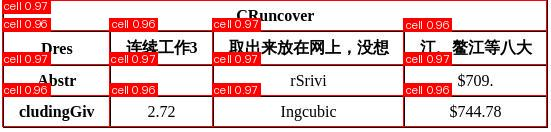 |

##### 2.4.5.5、微调

由于 PaddleOCR 并不直接提供表格单元格检测模块的训练，因此，如果需要训练表格单元格检测模型，可以参考 [PaddleX 表格单元格检测模块二次开发](https://paddlepaddle.github.io/PaddleX/latest/module_usage/tutorials/ocr_modules/table_cells_detection.html#_4)部分进行训练。训练后的模型可以无缝集成到 PaddleOCR 的 API 中进行推理。

#### 2.4.6、方法、参数解析

具体的方法、参数解析可以查看各子模块。

#### 2.4.7、代码

调用代码如下：

```python
from paddleocr import TableRecognitionPipelineV2
import os
import json

os.makedirs("./output_table_v2_full", exist_ok=True)

print("初始化通用表格识别v2产线...")
print("="*80)

# 指定所有模型路径
pipeline = TableRecognitionPipelineV2(
    # 版面检测模型
    layout_detection_model_name="PP-DocLayout_plus-L",
    layout_detection_model_dir="/mnt/2/hc/PaddleOCR/pretrained_models/layout/PP-DocLayout_plus-L_infer",
    
    # 表格分类模型
    table_classification_model_name="PP-LCNet_x1_0_table_cls",
    table_classification_model_dir="/mnt/2/hc/PaddleOCR/pretrained_models/table_cls/PP-LCNet_x1_0_table_cls_infer",
    
    # 有线表格结构识别模型
    wired_table_structure_recognition_model_name="SLANet_plus",
    wired_table_structure_recognition_model_dir="/mnt/2/hc/PaddleOCR/pretrained_models/table_structure/SLANet_plus_infer",
    
    # 无线表格结构识别模型
    # wireless_table_structure_recognition_model_dir="/mnt/2/hc/PaddleOCR/pretrained_models/table_structure_recognition/SLANet_plus_wireless_infer",
    wireless_table_structure_recognition_model_name="SLANet_plus",
    wireless_table_structure_recognition_model_dir="/mnt/2/hc/PaddleOCR/pretrained_models/table_structure/SLANet_plus_infer",
    
    # 有线表格单元格检测模型
    wired_table_cells_detection_model_name="RT-DETR-L_wired_table_cell_det",
    wired_table_cells_detection_model_dir="/mnt/2/hc/PaddleOCR/pretrained_models/table_cells_detection/RT-DETR-L_wired_table_cell_det_infer",
    
    # 无线表格单元格检测模型
    # wireless_table_cells_detection_model_dir="/mnt/2/hc/PaddleOCR/pretrained_models/table_cells_detection/RT-DETR-L_wireless_table_cell_det_infer",
    wireless_table_cells_detection_model_name="RT-DETR-L_wireless_table_cell_det",
    wireless_table_cells_detection_model_dir="/mnt/2/hc/PaddleOCR/pretrained_models/table_cells_detection/RT-DETR-L_wireless_table_cell_det_infer",
    
    # 文本检测模型
    text_detection_model_name="PP-OCRv5_server_det",
    text_detection_model_dir="/mnt/2/hc/PaddleOCR/pretrained_models/text_detection/PP-OCRv5_server_det_infer",
    
    # 文本识别模型
    text_recognition_model_name="PP-OCRv5_server_rec",
    text_recognition_model_dir="/mnt/2/hc/PaddleOCR/pretrained_models/text_recognition/PP-OCRv5_server_rec_infer",
    
    # 文档方向分类模型
    doc_orientation_classify_model_name="PP-LCNet_x1_0_doc_ori",
    doc_orientation_classify_model_dir="/mnt/2/hc/PaddleOCR/pretrained_models/doc_ori/PP-LCNet_x1_0_doc_ori_infer",
    
    # 文本图像矫正模型
    doc_unwarping_model_name="UVDoc",
    doc_unwarping_model_dir="/mnt/2/hc/PaddleOCR/pretrained_models/doc_unwarping/UVDoc_infer",
    
    # 功能开关
    use_doc_orientation_classify=True,  # 启用文档方向分类
    use_doc_unwarping=True,            # 启用文本图像矫正
    use_layout_detection=True,         # 启用版面检测
    use_ocr_model=True,                # 启用OCR
    
    # 设备配置
    device="gpu:0",
    enable_hpi=False,
    use_tensorrt=False,
    precision="fp32",
    
    # 文本检测参数
    text_det_limit_side_len=960,
    text_det_limit_type="max",
    text_det_thresh=0.3,
    text_det_box_thresh=0.6,
    text_det_unclip_ratio=2.0,
    
    # 文本识别参数
    text_recognition_batch_size=6,
    text_rec_score_thresh=0.5,
    
    # CPU参数
    enable_mkldnn=True,
    mkldnn_cache_capacity=10,
    cpu_threads=8,
)

print("✓ 产线初始化完成\n")

input_image = "/mnt/2/hc/PaddleOCR/datasets/hc_test/table_recognition.jpg"
print(f"处理图像: {input_image}")
print("="*80)

try:
    output = pipeline.predict(
        input_image,
        use_doc_orientation_classify=True,
        use_doc_unwarping=True,
        use_layout_detection=True,
        use_ocr_model=True,
        use_table_orientation_classify=True,
        use_ocr_results_with_table_cells=True,
    )
    
    for idx, res in enumerate(output, 1):
        print(f"\n处理结果 {idx}:")
        print("="*80)

        res.print()

        print("\n保存结果...")
        res.save_to_img("./output_table_v2_full/")
        res.save_to_xlsx("./output_table_v2_full/")
        res.save_to_html("./output_table_v2_full/")
        res.save_to_json("./output_table_v2_full/")

        # 获取JSON结果用于详细统计
        result = res.json
        
        print("\n" + "="*80)
        print("详细统计信息:")
        print("="*80)

        # 模型配置
        model_settings = result.get('model_settings', {})
        print("\n模型配置:")
        for key, value in model_settings.items():
            print(f"  {key}: {value}")

        # 文档预处理结果
        if 'doc_preprocessor_res' in result:
            doc_res = result['doc_preprocessor_res']
            print("\n文档预处理:")
            print(f"  文档旋转角度: {doc_res.get('angle', 'N/A')}°")

        # 版面检测结果
        if 'layout_det_res' in result:
            layout_res = result['layout_det_res']
            boxes = layout_res.get('boxes', [])
            print(f"\n版面检测:")
            print(f"  检测到的区域数量: {len(boxes)}")
            
            for i, box in enumerate(boxes, 1):
                print(f"  区域 {i}:")
                print(f"    类别ID: {box.get('cls_id')}")
                print(f"    置信度: {box.get('score', 0):.4f}")
                coord = box.get('coordinate', [])
                print(f"    坐标: [{coord[0]:.1f}, {coord[1]:.1f}, {coord[2]:.1f}, {coord[3]:.1f}]")

        # OCR结果
        if 'ocr_res' in result:
            ocr_res = result['ocr_res']
            
            dt_polys = ocr_res.get('dt_polys', [])
            rec_texts = ocr_res.get('rec_texts', [])
            rec_scores = ocr_res.get('rec_scores', [])
            
            print(f"\nOCR结果:")
            print(f"  检测到的文本框数量: {len(dt_polys)}")
            print(f"  识别出的文本数量: {len(rec_texts)}")
            
            if rec_texts:
                print("\n  识别文本详情:")
                print("  " + "-"*76)
                print(f"  {'序号':<6}{'文本':<40}{'置信度':<15}{'坐标'}")
                print("  " + "-"*76)
                
                for i, (text, score, poly) in enumerate(zip(rec_texts, rec_scores, ocr_res.get('rec_polys', [])), 1):
                    display_text = text[:35] + "..." if len(text) > 35 else text
                    coord_str = f"[{poly[0][0]:.0f},{poly[0][1]:.0f}]"
                    print(f"  {i:<6}{display_text:<40}{score:<15.4f}{coord_str}")
                
                print("  " + "-"*76)

                avg_score = sum(rec_scores) / len(rec_scores)
                print(f"\n  平均识别置信度: {avg_score:.4f}")

        # 表格识别结果
        if 'table_res' in result:
            tables = result['table_res']
            print(f"\n表格识别:")
            print(f"  检测到的表格数量: {len(tables)}")
            
            for i, table in enumerate(tables, 1):
                print(f"\n  表格 {i}:")
                print(f"    表格类型: {table.get('table_type', 'N/A')}")
                
                bbox = table.get('bbox', [])
                if bbox:
                    print(f"    表格位置: [{bbox[0]:.1f}, {bbox[1]:.1f}, {bbox[2]:.1f}, {bbox[3]:.1f}]")

                html = table.get('html', '')
                if html:
                    row_count = html.count('<tr')
                    col_count = html.count('<td')
                    print(f"    表格行数: {row_count}")
                    print(f"    表格单元格数: {col_count}")
        
        print("\n" + "="*80)
        print("文件保存位置:")
        print("="*80)
        print("  可视化图像: ./output_table_v2_full/")
        print("  JSON结果:   ./output_table_v2_full/res.json")
        print("  Excel文件:  ./output_table_v2_full/*.xlsx")
        print("  HTML文件:   ./output_table_v2_full/*.html")
        print("="*80)

        img_dict = res.img
        print("\n可用的可视化图像:")
        for key in img_dict.keys():
            print(f"  - {key}")

        print("\n" + "="*80)
        print("完整JSON结果（格式化）:")
        print("="*80)
        print(json.dumps(result, indent=2, ensure_ascii=False))

except Exception as e:
    print(f"\n处理过程中出错: {e}")
    import traceback
    traceback.print_exc()

print("\n✓ 处理完成！")
```

输出结果如下：

| img输入                        | img输出                        |
| ------------------------------ | ------------------------------ |
|  | 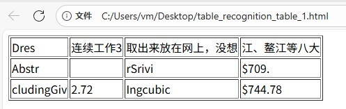 |

### 2.5、印章文本识别子产线（optional）

#### 2.5.1、功能概述

- 印章文本识别是一种自动从文档或图像中提取和识别印章内容的技术，印章文本的识别是文档处理的一部分，在很多场景都有用途，例如合同比对，出入库审核以及发票报销审核等场景。
- 印章文本识别产线用于识别印章的文本内容，提取印章图像中的文字信息以文本形式输出，本产线集成了业界知名的 PP-OCRv4 的端到端 OCR 串联系统，支持弯曲印章文本的检测和识别。同时，本产线集成了可选的版面区域定位模块，可以在整个文档中准确定位印章所在的版面位置。此外也增加可选的文档图像的方向矫正和扭曲矫正功能。
- 本产线也提供了二次开发的能力，您可以基于本产线在您自己的数据集上训练调优，训练后的模型也可以无缝集成。

#### 2.5.2、包含子模块介绍

印章文本识别产线中包含以下5个模块，每个模块均可独立进行训练和推理，并包含多个模型：

- 印章文本检测模块
- 文本识别模块 --- 见 2.2
- 版面区域检测模块（optional） --- 见 2.1
- 文档图像方向分类模块（optional） --- 见 2.3.3
- 文本图像矫正模块（optional） --- 见 2.3.4

#### 2.5.3、印章文本检测模块

这部分其实也就是替换了det模型，没有什么创新的地方。

- 模型参考：

  | 模型                     | 模型下载链接                                                 | 检测Hmean（%） | GPU推理耗时（ms） [常规模式 / 高性能模式] | CPU推理耗时（ms） [常规模式 / 高性能模式] | 模型存储大小（MB） | 介绍                                                         |
  | ------------------------ | ------------------------------------------------------------ | -------------- | ----------------------------------------- | ----------------------------------------- | ------------------ | ------------------------------------------------------------ |
  | PP-OCRv4_server_seal_det | [推理模型 ](https://paddle-model-ecology.bj.bcebos.com/paddlex/official_inference_model/paddle3.0.0/PP-OCRv4_server_seal_det_infer.tar) /[训练模型](https://paddle-model-ecology.bj.bcebos.com/paddlex/official_pretrained_model/PP-OCRv4_server_seal_det_pretrained.pdparams) | 98.40          | 124.64 / 91.57                            | 545.68 / 439.86                           | 109                | PP-OCRv4的服务端印章文本检测模型，精度更高，适合在较好的服务器上部署 |
  | PP-OCRv4_mobile_seal_det | [推理模型 ](https://paddle-model-ecology.bj.bcebos.com/paddlex/official_inference_model/paddle3.0.0/PP-OCRv4_mobile_seal_det_infer.tar) /[训练模型](https://paddle-model-ecology.bj.bcebos.com/paddlex/official_pretrained_model/PP-OCRv4_mobile_seal_det_pretrained.pdparams) | 96.36          | 9.70 / 3.56                               | 50.38 / 19.64                             | 4.7                | PP-OCRv4的移动端印章文本检测模型，效率更高，适合在端侧部署   |

- 微调参考：

  如果以上模型在您的场景上效果仍然不理想，您可以尝试以下步骤进行二次开发，此处以训练 `PP-OCRv4_server_seal_det` 举例，其他模型替换对应配置文件即可。首先，您需要准备文本检测的数据集，可以参考[印章文本检测 Demo 数据](https://paddle-model-ecology.bj.bcebos.com/paddlex/data/ocr_curve_det_dataset_examples.tar)的格式准备，准备好后，即可按照以下步骤进行模型训练和导出，导出后，可以将模型快速集成到上述 API 中。此处以印章文本检测 Demo 数据示例。在训练模型之前，请确保已经按照[安装文档](https://www.paddleocr.ai/latest/version3.x/installation.html)安装了 PaddleOCR 所需要的依赖。

- 方法、参数解析参考：

  参考之前的ocr即可。

#### 2.5.4、方法、参数解析

参考之前的ocr即可。

#### 2.5.5、代码

调用代码如下：

```python
from paddleocr import SealRecognition
import os
import json

os.makedirs("./output_seal", exist_ok=True)

print("初始化印章文本识别产线...")
print("="*80)

pipeline = SealRecognition(

    doc_orientation_classify_model_name="PP-LCNet_x1_0_doc_ori",
    doc_orientation_classify_model_dir="/mnt/2/hc/PaddleOCR/pretrained_models/doc_ori/PP-LCNet_x1_0_doc_ori_infer",
    doc_unwarping_model_name="UVDoc",
    doc_unwarping_model_dir="/mnt/2/hc/PaddleOCR/pretrained_models/doc_unwarping/UVDoc_infer",
    layout_detection_model_name="PP-DocLayout_plus-L",
    layout_detection_model_dir="/mnt/2/hc/PaddleOCR/pretrained_models/layout/PP-DocLayout_plus-L_infer",
    seal_text_detection_model_name="PP-OCRv4_server_seal_det",
    seal_text_detection_model_dir="/mnt/2/hc/PaddleOCR/pretrained_models/seal_det/PP-OCRv4_server_seal_det_infer",
    text_recognition_model_name="PP-OCRv5_server_rec",
    text_recognition_model_dir="/mnt/2/hc/PaddleOCR/pretrained_models/text_recognition/PP-OCRv5_server_rec_infer",
    
    # 功能开关
    use_doc_orientation_classify=True,
    use_doc_unwarping=False,
    use_layout_detection=True,
    
    # 版面检测参数
    layout_threshold=0.5,
    layout_nms=True,
    layout_unclip_ratio=1.0,
    layout_merge_bboxes_mode="large",
    
    # 印章文本检测参数
    seal_det_limit_side_len=736,
    seal_det_limit_type="min",
    seal_det_thresh=0.2,
    seal_det_box_thresh=0.6,
    seal_det_unclip_ratio=0.5,
    
    # 文本识别参数
    text_recognition_batch_size=6,
    seal_rec_score_thresh=0.0,
    
    # 设备配置
    device="gpu:0",
    enable_hpi=False,
    use_tensorrt=False,
    precision="fp32",
    
    # CPU参数
    enable_mkldnn=True,
    mkldnn_cache_capacity=10,
    cpu_threads=8,
)

print("✓ 产线初始化完成\n")

# 输入图像路径
input_image = "/mnt/2/hc/PaddleOCR/datasets/hc_test/seal_text_det.png"
print(f"处理图像: {input_image}")
print("="*80)

try:
    output = pipeline.predict(
        input_image,
        use_doc_orientation_classify=True,
        use_doc_unwarping=False,
        use_layout_detection=True,
        seal_det_limit_side_len=736,
        seal_det_thresh=0.2,
        seal_det_box_thresh=0.6,
    )

    for idx, res in enumerate(output, 1):
        print(f"\n处理结果 {idx}:")
        print("="*80)
        
        # 1. 简单打印（不使用不支持的参数）
        res.print()
        
        # 2. 保存可视化图像
        res.save_to_img("./output_seal/")
        
        # 3. 保存JSON结果
        res.save_to_json("./output_seal/")
        
        # 4. 获取预测结果的JSON数据并手动格式化输出
        result_json = res.json
        
        print("\n" + "="*80)
        print("格式化的完整JSON结果:")
        print("="*80)
        print(json.dumps(result_json, indent=4, ensure_ascii=False))
        
        print("\n" + "="*80)
        print("详细统计信息:")
        print("="*80)
        
        # 输入信息
        print(f"\n输入路径: {result_json.get('input_path')}")
        print(f"页面索引: {result_json.get('page_index', 'N/A')}")
        
        # 模型配置
        model_settings = result_json.get('model_settings', {})
        print("\n模型配置:")
        print(f"  使用文档预处理: {model_settings.get('use_doc_preprocessor', False)}")
        print(f"  使用版面检测: {model_settings.get('use_layout_detection', False)}")
        
        # 版面检测结果
        if 'layout_det_res' in result_json:
            layout_res = result_json['layout_det_res']
            boxes = layout_res.get('boxes', [])
            print(f"\n版面检测:")
            print(f"  检测到的印章区域数量: {len(boxes)}")
            
            for i, box in enumerate(boxes, 1):
                print(f"  区域 {i}:")
                print(f"    类别ID: {box.get('cls_id')}")
                print(f"    置信度: {box.get('score', 0):.4f}")
                coord = box.get('coordinate', [])
                print(f"    坐标: [{coord[0]:.1f}, {coord[1]:.1f}, {coord[2]:.1f}, {coord[3]:.1f}]")
        
        # 印章识别结果
        if 'seal_res_list' in result_json:
            seal_res_list = result_json['seal_res_list']
            print(f"\n印章识别:")
            print(f"  识别到的印章数量: {len(seal_res_list)}")
            
            for i, seal_res in enumerate(seal_res_list, 1):
                print(f"\n  印章 {i}:")
                
                # 文档预处理结果
                if 'doc_preprocessor_res' in seal_res:
                    doc_res = seal_res['doc_preprocessor_res']
                    angle = doc_res.get('angle', -1)
                    angle_map = {0: "0°", 1: "90°", 2: "180°", 3: "270°", -1: "未启用"}
                    print(f"    文档旋转角度: {angle_map.get(angle, str(angle))}")
                
                # 文本检测参数
                text_det_params = seal_res.get('text_det_params', {})
                if text_det_params:
                    print(f"    文本检测参数:")
                    print(f"      边长限制: {text_det_params.get('limit_side_len', 'N/A')}")
                    print(f"      限制类型: {text_det_params.get('limit_type', 'N/A')}")
                    print(f"      像素阈值: {text_det_params.get('thresh', 'N/A')}")
                    print(f"      检测框阈值: {text_det_params.get('box_thresh', 'N/A')}")
                    print(f"      扩张系数: {text_det_params.get('unclip_ratio', 'N/A')}")
                    print(f"      文本类型: {text_det_params.get('text_type', 'N/A')}")
                
                # 文本检测结果
                dt_polys = seal_res.get('dt_polys', [])
                dt_scores = seal_res.get('dt_scores', [])
                print(f"    检测到的文本框数量: {len(dt_polys)}")
                
                if dt_scores:
                    avg_det_score = sum(dt_scores) / len(dt_scores)
                    print(f"    平均检测置信度: {avg_det_score:.4f}")
                
                # 文本识别结果
                rec_texts = seal_res.get('rec_texts', [])
                rec_scores = seal_res.get('rec_scores', [])
                rec_polys = seal_res.get('rec_polys', [])
                
                rec_score_thresh = seal_res.get('text_rec_score_thresh', 0.0)
                print(f"    文本识别阈值: {rec_score_thresh}")
                
                if rec_texts:
                    print(f"    识别出的文本数量: {len(rec_texts)}")
                    print("\n    识别文本详情:")
                    print("    " + "-"*76)
                    print(f"    {'序号':<6}{'文本':<40}{'置信度':<15}{'坐标'}")
                    print("    " + "-"*76)
                    
                    for j, (text, score, poly) in enumerate(zip(rec_texts, rec_scores, rec_polys), 1):
                        display_text = text[:35] + "..." if len(text) > 35 else text
                        coord_str = f"[{poly[0][0]:.0f},{poly[0][1]:.0f}]" if len(poly) > 0 else "N/A"
                        print(f"    {j:<6}{display_text:<40}{score:<15.4f}{coord_str}")
                    
                    print("    " + "-"*76)
                    
                    # 统计信息
                    avg_score = sum(rec_scores) / len(rec_scores)
                    print(f"\n    平均识别置信度: {avg_score:.4f}")
                    print(f"    完整印章文本: {''.join(rec_texts)}")
                    print(f"    文本总长度: {sum(len(text) for text in rec_texts)} 字符")
                else:
                    print("    未识别到文本（可能阈值过高）")
        
        print("\n" + "="*80)
        print("文件保存位置:")
        print("="*80)
        print("  可视化图像目录: ./output_seal/")
        print("  JSON结果文件:   ./output_seal/")
        print("="*80)
        
        # 5. 获取可视化图像
        img_dict = res.img
        print("\n可用的可视化图像:")
        for key in img_dict.keys():
            print(f"  - {key}")
            # 可以单独获取图像对象
            # img = img_dict[key]
            # img.save(f"./output_seal/{key}.jpg")

except Exception as e:
    print(f"\n处理过程中出错: {e}")
    import traceback
    traceback.print_exc()

print("\n✓ 处理完成！")
```

输出结果如下：

| img输入                        | img输出                        |
| ------------------------------ | ------------------------------ |
|  | 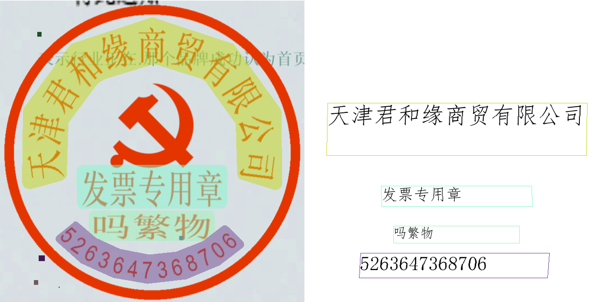 |

#### 2.5.6、微调

由于印章文本识别产线包含若干模块，模型产线的效果如果不及预期，可能来自于其中任何一个模块。您可以对识别效果差的图片进行分析，进而确定是哪个模块存在问题，并参考以下表格中对应的微调教程链接进行模型微调。

| 情形                     | 微调模块             | 微调参考链接                                                 |
| ------------------------ | -------------------- | ------------------------------------------------------------ |
| 印章位置检测不准或未检出 | 版面检测模块         | [链接](https://paddlepaddle.github.io/PaddleX/latest/module_usage/tutorials/ocr_modules/layout_detection.html#_5) |
| 印章文本存在漏检         | 印章文本检测模块     | [链接](https://paddlepaddle.github.io/PaddleOCR/main/version3.x/module_usage/seal_text_detection.html#_5) |
| 文本内容不准             | 文本识别模块         | [链接](https://paddlepaddle.github.io/PaddleOCR/main/version3.x/module_usage/text_recognition.html#_5) |
| 整图旋转矫正不准         | 文档图像方向分类模块 | [链接](https://paddlepaddle.github.io/PaddleX/latest/module_usage/tutorials/ocr_modules/doc_img_orientation_classification.html#_5) |
| 图像扭曲矫正不准         | 文本图像矫正模块     | 暂不支持微调                                                 |

### 2.6、公式识别子模块（optional）

#### 2.6.1、功能概述

- 公式识别是一种自动从文档或图像中识别和提取LaTeX公式内容及其结构的技术，广泛应用于数学、物理、计算机科学等领域的文档编辑和数据分析。通过使用计算机视觉和机器学习算法，公式识别能够将复杂的数学公式信息转换为可编辑的LaTeX格式，方便用户进一步处理和分析数据。
- 公式识别产线用于解决公式识别任务，提取图片中的公式信息以LaTeX源码形式输出，本产线是一个集成了百度飞桨视觉团队自研的先进公式识别模型PP-FormulaNet 和业界知名公式识别模型 UniMERNet的端到端公式识别系统，支持简单印刷公式、复杂印刷公式、手写公式的识别，并在此基础上，增加了对图像的方向矫正和扭曲矫正功能。

#### 2.6.2、包含子模块介绍

公式识别产线中包含以下4个模块。每个模块均可独立进行训练和推理，并包含多个模型：

- 公式识别模块
- 版面区域检测模块（optional） --- 见 2.1
- 文档图像方向分类模块（optional） --- 见 2.3.3
- 文本图像矫正模块（optional） --- 见 2.3.4

#### 2.6.3、公式识别模块

##### 2.6.3.1、功能概述

公式识别模块是OCR（光学字符识别）系统中的关键组成部分，负责将图像中的数学公式转换为可编辑的文本或计算机可识别的格式。该模块的性能直接影响到整个OCR系统的准确性和效率。公式识别模块通常会输出数学公式的 LaTeX 或 MathML 代码，这些代码将作为输入传递给文本理解模块进行后续处理。

##### 2.6.3.2、支持模型列表

| 模型                 | 模型下载链接                                                 | En-BLEU(%) | Zh-BLEU(%) | GPU推理耗时（ms） [常规模式 / 高性能模式] | CPU推理耗时（ms） [常规模式 / 高性能模式] | 模型存储大小（MB） | 介绍                                                         |
| -------------------- | ------------------------------------------------------------ | ---------- | ---------- | ----------------------------------------- | ----------------------------------------- | ------------------ | ------------------------------------------------------------ |
| UniMERNet            | [推理模型](https://paddle-model-ecology.bj.bcebos.com/paddlex/official_inference_model/paddle3.0.0/UniMERNet_infer.tar)/[训练模型](https://paddle-model-ecology.bj.bcebos.com/paddlex/official_pretrained_model/UniMERNet_pretrained.pdparams) | 85.91      | 43.50      | 1311.84 / 1311.84                         | - / 8288.07                               | 1530               | UniMERNet是由上海AI Lab研发的一款公式识别模型。该模型采用Donut Swin作为编码器，MBartDecoder作为解码器，并通过在包含简单公式、复杂公式、扫描捕捉公式和手写公式在内的一百万数据集上进行训练，大幅提升了模型对真实场景公式的识别准确率 |
| PP-FormulaNet-S      | [推理模型](https://paddle-model-ecology.bj.bcebos.com/paddlex/official_inference_model/paddle3.0.0/PP-FormulaNet-S_infer.tar)/[训练模型](https://paddle-model-ecology.bj.bcebos.com/paddlex/official_pretrained_model/PP-FormulaNet-S_pretrained.pdparams) | 87.00      | 45.71      | 182.25 / 182.25                           | - / 254.39                                | 224                | PP-FormulaNet 是由百度飞桨视觉团队开发的一款先进的公式识别模型，支持5万个常见LateX源码词汇的识别。PP-FormulaNet-S 版本采用了 PP-HGNetV2-B4 作为其骨干网络，通过并行掩码和模型蒸馏等技术，大幅提升了模型的推理速度，同时保持了较高的识别精度，适用于简单印刷公式、跨行简单印刷公式等场景。而 PP-FormulaNet-L 版本则基于 Vary_VIT_B 作为骨干网络，并在大规模公式数据集上进行了深入训练，在复杂公式的识别方面，相较于PP-FormulaNet-S表现出显著的提升，适用于简单印刷公式、复杂印刷公式、手写公式等场景。 |
| PP-FormulaNet-L      | [推理模型](https://paddle-model-ecology.bj.bcebos.com/paddlex/official_inference_model/paddle3.0.0/PP-FormulaNet-L_infer.tar)/[训练模型](https://paddle-model-ecology.bj.bcebos.com/paddlex/official_pretrained_model/PP-FormulaNet-L_pretrained.pdparams) | 90.36      | 45.78      | 1482.03 / 1482.03                         | - / 3131.54                               | 695                |                                                              |
| PP-FormulaNet_plus-S | [推理模型](https://paddle-model-ecology.bj.bcebos.com/paddlex/official_inference_model/paddle3.0.0/PP-FormulaNet_plus-S_infer.tar)/[训练模型](https://paddle-model-ecology.bj.bcebos.com/paddlex/official_pretrained_model/PP-FormulaNet_plus-S_pretrained.pdparams) | 88.71      | 53.32      | 179.20 / 179.20                           | - / 260.99                                | 248                | PP-FormulaNet_plus 是百度飞桨视觉团队在 PP-FormulaNet 的基础上开发的增强版公式识别模型。与原版相比，PP-FormulaNet_plus 在训练中使用了更为丰富的公式数据集，包括中文学位论文、专业书籍、教材试卷以及数学期刊等多种来源。这一扩展显著提升了模型的识别能力。 其中，PP-FormulaNet_plus-M 和 PP-FormulaNet_plus-L 模型新增了对中文公式的支持，并将公式的最大预测 token 数从 1024 扩大至 2560，大幅提升了对复杂公式的识别性能。同时，PP-FormulaNet_plus-S 模型则专注于增强英文公式的识别能力。通过这些改进，PP-FormulaNet_plus 系列模型在处理复杂多样的公式识别任务时表现更加出色。 |
| PP-FormulaNet_plus-M | [推理模型](https://paddle-model-ecology.bj.bcebos.com/paddlex/official_inference_model/paddle3.0.0/PP-FormulaNet_plus-M_infer.tar)/[训练模型](https://paddle-model-ecology.bj.bcebos.com/paddlex/official_pretrained_model/PP-FormulaNet_plus-M_pretrained.pdparams) | 91.45      | 89.76      | 1040.27 / 1040.27                         | - / 1615.80                               | 592                |                                                              |
| PP-FormulaNet_plus-L | [推理模型](https://paddle-model-ecology.bj.bcebos.com/paddlex/official_inference_model/paddle3.0.0/PP-FormulaNet_plus-L_infer.tar)/[训练模型](https://paddle-model-ecology.bj.bcebos.com/paddlex/official_pretrained_model/PP-FormulaNet_plus-L_pretrained.pdparams) | 92.22      | 90.64      | 1476.07 / 1476.07                         | - / 3125.58                               | 698                |                                                              |
| LaTeX_OCR_rec        | [推理模型](https://paddle-model-ecology.bj.bcebos.com/paddlex/official_inference_model/paddle3.0.0/LaTeX_OCR_rec_infer.tar)/[训练模型](https://paddle-model-ecology.bj.bcebos.com/paddlex/official_pretrained_model/LaTeX_OCR_rec_pretrained.pdparams) | 74.55      | 39.96      | 1088.89 / 1088.89                         | - / -                                     | 99                 | LaTeX-OCR是一种基于自回归大模型的公式识别算法，通过采用 Hybrid ViT 作为骨干网络，transformer作为解码器，显著提升了公式识别的准确性。 |

##### 2.6.3.3、方法、参数解析

这里只是det模型的替换，所以参考之前即可。

#### 2.6.4、方法、参数解析

- 通过 `FormulaRecognitionPipeline()` 实例化公式识别产线对象，具体参数说明如下：

  | 参数                                  | 参数说明                                                     | 参数类型                             | 默认值   |
  | ------------------------------------- | ------------------------------------------------------------ | ------------------------------------ | -------- |
  | `doc_orientation_classify_model_name` | 文档方向分类模型的名称。如果设置为`None`，将会使用产线默认模型。 | `str|None`                           | `None`   |
  | `doc_orientation_classify_model_dir`  | 文档方向分类模型的目录路径。如果设置为`None`，将会下载官方模型。 | `str|None`                           | `None`   |
  | `doc_orientation_classify_batch_size` | 文档方向分类模型的batch size。如果设置为`None`，将默认设置batch size为`1`。 | `int|None`                           | `None`   |
  | `doc_unwarping_model_name`            | 文本图像矫正模型的名称。如果设置为`None`，将会使用产线默认模型。 | `str|None`                           | `None`   |
  | `doc_unwarping_model_dir`             | 文本图像矫正模型的目录路径。如果设置为`None`，将会下载官方模型。 | `str|None`                           | `None`   |
  | `doc_unwarping_batch_size`            | 文本图像矫正模型的batch size。如果设置为`None`，将默认设置batch size为`1`。 | `int|None`                           | `None`   |
  | `use_doc_orientation_classify`        | 是否加载并使用文档方向分类模块。如果设置为`None`，将使用产线初始化的该参数值，默认初始化为`True`。 | `bool|None`                          | `None`   |
  | `use_doc_unwarping`                   | 是否加载并使用文本图像矫正模块。如果设置为`None`，将使用产线初始化的该参数值，默认初始化为`True`。 | `bool|None`                          | `None`   |
  | `layout_detection_model_name`         | 版面区域检测模型的名称。如果设置为`None`，将会使用产线默认模型。 | `str|None`                           | `None`   |
  | `layout_detection_model_dir`          | 版面区域检测模型的目录路径。如果设置为`None`，将会下载官方模型。 | `str|None`                           | `None`   |
  | `layout_threshold`                    | 版面区域检测的阈值，用于过滤掉低置信度预测结果的阈值。**float**：如 0.2，表示过滤掉所有阈值小于0.2的目标框；**dict**：dict的key为**int**类型，代表`cls_id`，val为**float**类型阈值。如 `{0: 0.45，2: 0.48，7: 0.4}`，表示对cls_id为0的类别应用阈值0.45、cls_id为2的类别应用阈值0.48、cls_id为7的类别应用阈值0.4；**None**：不指定，将使用默认值：0.5。 | `float|dict|None`                    | `None`   |
  | `layout_nms`                          | 版面检测是否使用后处理NMS。如果不设置，将使用产线初始化的该参数值，默认初始化为`True`。 | `bool|None`                          | `None`   |
  | `layout_unclip_ratio`                 | 版面区域检测模型检测框的扩张系数。**float**：任意大于 `0` 浮点数；**Tuple[float,float]**：在横纵两个方向各自的扩张系数；**dict**，dict的key为**int**类型，代表`cls_id`，value为**tuple**类型，如`{0: (1.1，2.0)}`，表示将模型输出的第0类别检测框中心不变，宽度扩张1.1倍，高度扩张2.0倍**None**：如果设置为`None`，将使用产线初始化的该参数值，默认初始化为 `1.0`。 | `float|Tuple[float,float]|dict|None` | `None`   |
  | `layout_merge_bboxes_mode`            | 版面区域检测的重叠框过滤方式。**str**：`large`，`small`，`union`，分别表示重叠框过滤时选择保留大框，小框还是同时保留；**dict**： dict的key为**int**类型，代表`cls_id`，value为**str**类型，如`{0: "large", 2: "small"}`，表示对第0类别检测框使用large模式，对第2类别检测框使用small模式；**None**：如果设置为`None`，将使用产线初始化的该参数值，默认初始化为 `large`。 | `str|dict|None`                      | `None`   |
  | `layout_detection_batch_size`         | 版面区域检测模型的batch size。如果设置为`None`，将默认设置batch size为`1`。 | `int|None`                           | `None`   |
  | `use_layout_detection`                | 是否加载并使用版面区域检测模块。如果设置为`None`，将使用产线初始化的该参数值，默认初始化为`True`。 | `bool|None`                          | `None`   |
  | `formula_recognition_model_name`      | 公式识别模型的名称。如果设置为`None`，将会使用产线默认模型。 | `str|None`                           | `None`   |
  | `formula_recognition_model_dir`       | 公式识别模型的目录路径。如果设置为`None`，将会下载官方模型。 | `str|None`                           | `None`   |
  | `formula_recognition_batch_size`      | 公式识别模型的batch size。如果设置为`None`，将默认设置batch size为`1`。 | `int|None`                           | `None`   |
  | `device`                              | 用于推理的设备。支持指定具体卡号：**CPU**：如 `cpu` 表示使用 CPU 进行推理；**GPU**：如 `gpu:0` 表示使用第 1 块 GPU 进行推理；**NPU**：如 `npu:0` 表示使用第 1 块 NPU 进行推理；**XPU**：如 `xpu:0` 表示使用第 1 块 XPU 进行推理；**MLU**：如 `mlu:0` 表示使用第 1 块 MLU 进行推理；**DCU**：如 `dcu:0` 表示使用第 1 块 DCU 进行推理；**None**：如果设置为`None`，将默认使用产线初始化的该参数值，初始化时，会优先使用本地的 GPU 0号设备，如果没有，则使用 CPU 设备。 | `str|None`                           | `None`   |
  | `enable_hpi`                          | 是否启用高性能推理。                                         | `bool`                               | `False`  |
  | `use_tensorrt`                        | 是否启用 Paddle Inference 的 TensorRT 子图引擎。如果模型不支持通过 TensorRT 加速，即使设置了此标志，也不会使用加速。 对于 CUDA 11.8 版本的飞桨，兼容的 TensorRT 版本为 8.x（x>=6），建议安装 TensorRT 8.6.1.6。 | `bool`                               | `False`  |
  | `precision`                           | 计算精度，如 fp32、fp16。                                    | `str`                                | `"fp32"` |
  | `enable_mkldnn`                       | 是否启用 MKL-DNN 加速推理。如果 MKL-DNN 不可用或模型不支持通过 MKL-DNN 加速，即使设置了此标志，也不会使用加速。 | `bool`                               | `True`   |
  | `mkldnn_cache_capacity`               | MKL-DNN 缓存容量。                                           | `int`                                | `10`     |
  | `cpu_threads`                         | 在 CPU 上进行推理时使用的线程数。                            | `int`                                | `8`      |
  | `paddlex_config`                      | PaddleX产线配置文件路径。                                    | `str|None`                           | `None`   |

- 调用 公式识别产线对象的 `predict()` 方法进行推理预测，该方法会返回一个结果列表。

  另外，产线还提供了 `predict_iter()` 方法。两者在参数接受和结果返回方面是完全一致的，区别在于 `predict_iter()` 返回的是一个 `generator`，能够逐步处理和获取预测结果，适合处理大型数据集或希望节省内存的场景。可以根据实际需求选择使用这两种方法中的任意一种。

  以下是 `predict()` 方法的参数及其说明：

  | 参数                           | 参数说明                                                     | 参数类型                             | 默认值 |
  | ------------------------------ | ------------------------------------------------------------ | ------------------------------------ | ------ |
  | `input`                        | 待预测数据，支持多种输入类型，必填<br />- **Python Var**：如 `numpy.ndarray` 表示的图像数据；<br />- **str**：如图像文件或者PDF文件的本地路径：`/root/data/img.jpg`；**如URL链接**，如图像文件或PDF文件的网络URL：[示例](https://paddle-model-ecology.bj.bcebos.com/paddlex/demo_image/pipelines/general_formula_recognition_001.png)；**如本地目录**，该目录下需包含待预测图像，如本地路径：`/root/data/`(当前不支持目录中包含PDF文件的预测，PDF文件需要指定到具体文件路径)；<br />- **list**：列表元素需为上述类型数据，如`[numpy.ndarray, numpy.ndarray]`，`["/root/data/img1.jpg", "/root/data/img2.jpg"]`，`["/root/data1", "/root/data2"]。` | `Python Var|str|list`                |        |
  | `use_layout_detection`         | 是否在推理时使用文档区域检测模块。                           | `bool|None`                          | `None` |
  | `use_doc_orientation_classify` | 是否在推理时使用文档方向分类模块。                           | `bool|None`                          | `None` |
  | `use_doc_unwarping`            | 是否在推理时使用文本图像矫正模块。                           | `bool|None`                          | `None` |
  | `layout_threshold`             | 参数含义与实例化参数基本相同。设置为`None`表示使用实例化参数，否则该参数优先级更高。 | `float|dict|None`                    | `None` |
  | `layout_nms`                   | 参数含义与实例化参数基本相同。设置为`None`表示使用实例化参数，否则该参数优先级更高。 | `bool|None`                          | `None` |
  | `layout_unclip_ratio`          | 参数含义与实例化参数基本相同。设置为`None`表示使用实例化参数，否则该参数优先级更高。 | `float|Tuple[float,float]|dict|None` | `None` |
  | `layout_merge_bboxes_mode`     | 参数含义与实例化参数基本相同。设置为`None`表示使用实例化参数，否则该参数优先级更高。 | `str|dict|None`                      | `None` |

- 对预测结果进行处理，每个样本的预测结果均为对应的Result对象，且支持打印、保存为图片、保存为`json`文件的操作：

  | 方法             | 方法说明                   | 参数                                            | 参数类型                      | 参数说明                                                     | 默认值                     |
  | ---------------- | -------------------------- | ----------------------------------------------- | ----------------------------- | ------------------------------------------------------------ | -------------------------- |
  | `print()`        | 打印结果到终端             | `format_json`<br />`indent`<br />`ensure_ascii` | `bool`<br />`int`<br />`bool` | 是否对输出内容进行使用 `JSON` 缩进格式化。<br />指定缩进级别，以美化输出的 `JSON` 数据，使其更具可读性，仅当 `format_json` 为 `True` 时有效。<br />控制是否将非 `ASCII` 字符转义为 `Unicode`。设置为 `True` 时，所有非 `ASCII` 字符将被转义；`False` 则保留原始字符，仅当`format_json`为`True`时有效。 | `True`<br />4<br />`False` |
  | `save_to_json()` | 将结果保存为json格式的文件 | `save_path`<br />`indent`<br />`ensure_ascii`   | `str`<br />`int`<br />`bool`  | 保存的文件路径，当为目录时，保存文件命名与输入文件类型命名一致。<br />指定缩进级别，以美化输出的 `JSON` 数据，使其更具可读性，仅当 `format_json` 为 `True` 时有效。<br />控制是否将非 `ASCII` 字符转义为 `Unicode`。设置为 `True` 时，所有非 `ASCII` 字符将被转义；`False` 则保留原始字符，仅当`format_json`为`True`时有效。 | 无<br />4<br />`False`     |
  | `save_to_img()`  | 将结果保存为图像格式的文件 | `save_path`                                     | `str`                         | 保存的文件路径，当为目录时，保存文件命名与输入文件类型命名一致。 | 无                         |

- 此外，也支持通过属性获取带结果的可视化图像和预测结果，具体如下：

  | 属性   | 属性说明                     |
  | ------ | ---------------------------- |
  | `json` | 获取预测的`json`格式的结果   |
  | `img`  | 获取格式为`dict`的可视化图像 |

#### 2.6.5、代码

调用代码如下：

```python
from paddleocr import FormulaRecognitionPipeline
import os
import json

# 创建输出目录
os.makedirs("./output_formula_pipeline", exist_ok=True)

print("初始化公式识别产线...")
print("="*80)

# 实例化公式识别产线（完整参数配置）
pipeline = FormulaRecognitionPipeline(
    # 文档方向分类模型配置
    doc_orientation_classify_model_name="PP-LCNet_x1_0_doc_ori",
    doc_orientation_classify_model_dir="/mnt/2/hc/PaddleOCR/pretrained_models/doc_ori/PP-LCNet_x1_0_doc_ori_infer",
    doc_orientation_classify_batch_size=1,
    
    # 文本图像矫正模型配置
    doc_unwarping_model_name="UVDoc",
    doc_unwarping_model_dir="/mnt/2/hc/PaddleOCR/pretrained_models/doc_unwarping/UVDoc_infer",
    doc_unwarping_batch_size=1,
    
    # 功能开关
    use_doc_orientation_classify=True,   # 是否使用文档方向分类
    use_doc_unwarping=False,             # 是否使用文本图像矫正
    
    # 版面区域检测模型配置
    layout_detection_model_name="PP-DocLayout_plus-L",
    layout_detection_model_dir="/mnt/2/hc/PaddleOCR/pretrained_models/layout/PP-DocLayout_plus-L_infer",
    layout_detection_batch_size=1,
    
    # 版面检测参数
    layout_threshold=0.5,                # 置信度阈值
    layout_nms=True,                     # 是否使用NMS
    layout_unclip_ratio=1.0,             # 检测框扩张系数
    layout_merge_bboxes_mode="large",    # 重叠框过滤方式：large/small/union
    
    use_layout_detection=True,           # 是否使用版面区域检测
    
    # 公式识别模型配置
    formula_recognition_model_name="PP-FormulaNet_plus-M",
    formula_recognition_model_dir="/mnt/2/hc/PaddleOCR/pretrained_models/formula_recognition/PP-FormulaNet_plus-M_infer",
    formula_recognition_batch_size=1,
    
    # 设备配置
    device="gpu:0",                      # cpu/gpu:0/npu:0/xpu:0/mlu:0/dcu:0
    
    # 性能优化参数
    enable_hpi=False,                    # 是否启用高性能推理
    use_tensorrt=False,                  # 是否启用TensorRT加速
    precision="fp32",                    # 计算精度：fp32/fp16
    
    # CPU优化参数
    enable_mkldnn=True,                  # 是否启用MKL-DNN加速
    mkldnn_cache_capacity=10,            # MKL-DNN缓存容量
    cpu_threads=8,                       # CPU线程数
    
    # paddlex_config="./config.yaml",    # PaddleX产线配置文件路径
)

print("✓ 产线初始化完成\n")

# 输入图像路径
input_image = "./general_formula_recognition_001.png"
print(f"处理图像: {input_image}")
print("="*80)

try:
    # 执行预测（可以在预测时覆盖初始化参数）
    output = pipeline.predict(
        input=input_image,
        use_layout_detection=True,
        use_doc_orientation_classify=True,
        use_doc_unwarping=False,
        layout_threshold=0.5,
        layout_nms=True,
        layout_unclip_ratio=1.0,
        layout_merge_bboxes_mode="large",
    )
    
    # 处理预测结果
    for idx, res in enumerate(output, 1):
        print(f"\n处理结果 {idx}:")
        print("="*80)
        
        # 1. 打印结果到终端
        res.print()
        
        # 2. 保存可视化图像
        res.save_to_img(save_path="./output_formula_pipeline/")
        
        # 3. 保存JSON结果
        res.save_to_json(save_path="./output_formula_pipeline/")
        
        # 4. 获取预测结果的JSON数据
        result_json = res.json
        
        print("\n" + "="*80)
        print("格式化的完整JSON结果:")
        print("="*80)
        print(json.dumps(result_json, indent=4, ensure_ascii=False))
        
        print("\n" + "="*80)
        print("详细分析:")
        print("="*80)
        
        # 基本信息
        print(f"\n输入路径: {result_json.get('input_path', 'N/A')}")
        print(f"页面索引: {result_json.get('page_index', 'N/A')}")
        
        # 模型配置
        model_settings = result_json.get('model_settings', {})
        print("\n模型配置:")
        print(f"  使用文档预处理: {model_settings.get('use_doc_preprocessor', False)}")
        print(f"  使用版面检测: {model_settings.get('use_layout_detection', False)}")
        
        # 文档预处理结果
        if 'doc_preprocessor_res' in result_json:
            doc_res = result_json['doc_preprocessor_res']
            print("\n文档预处理结果:")
            
            doc_settings = doc_res.get('model_settings', {})
            print(f"  使用方向分类: {doc_settings.get('use_doc_orientation_classify', False)}")
            print(f"  使用图像矫正: {doc_settings.get('use_doc_unwarping', False)}")
            
            angle = doc_res.get('angle', -1)
            angle_map = {0: "0°", 1: "90°", 2: "180°", 3: "270°", -1: "未启用"}
            print(f"  文档旋转角度: {angle_map.get(angle, str(angle))}")
        
        # 版面检测结果
        if 'layout_det_res' in result_json:
            layout_res = result_json['layout_det_res']
            boxes = layout_res.get('boxes', [])
            print(f"\n版面检测:")
            print(f"  检测到的区域数量: {len(boxes)}")
            
            for i, box in enumerate(boxes, 1):
                cls_id = box.get('cls_id')
                label = box.get('label', 'Unknown')
                score = box.get('score', 0)
                coord = box.get('coordinate', [])
                
                print(f"\n  区域 {i}:")
                print(f"    类别ID: {cls_id}")
                print(f"    类别名称: {label}")
                print(f"    置信度: {score:.4f}")
                if coord:
                    print(f"    坐标: [{coord[0]:.1f}, {coord[1]:.1f}, {coord[2]:.1f}, {coord[3]:.1f}]")
        
        # 公式识别结果
        if 'formula_res_list' in result_json:
            formula_list = result_json['formula_res_list']
            print(f"\n公式识别:")
            print(f"  识别到的公式数量: {len(formula_list)}")
            
            for i, formula in enumerate(formula_list, 1):
                rec_formula = formula.get('rec_formula', '')
                formula_id = formula.get('formula_region_id', -1)
                dt_polys = formula.get('dt_polys', [])
                
                print(f"\n  公式 {i}:")
                print(f"    区域ID: {formula_id}")
                
                if dt_polys:
                    print(f"    坐标: [{dt_polys[0]:.1f}, {dt_polys[1]:.1f}, {dt_polys[2]:.1f}, {dt_polys[3]:.1f}]")
                
                print(f"    LaTeX公式:")
                print(f"    {'-'*76}")
                # 显示公式，如果太长则截断
                if len(rec_formula) > 200:
                    print(f"    {rec_formula[:200]}...")
                    print(f"    ... (总长度: {len(rec_formula)} 字符)")
                else:
                    print(f"    {rec_formula}")
                print(f"    {'-'*76}")
                
                # 公式复杂度分析
                complexity = {
                    '分数': rec_formula.count('\\frac'),
                    '积分': rec_formula.count('\\int'),
                    '求和': rec_formula.count('\\sum'),
                    '上下标': rec_formula.count('^') + rec_formula.count('_'),
                    '括号对': rec_formula.count('{'),
                }
                
                print(f"\n    复杂度分析:")
                for key, count in complexity.items():
                    if count > 0:
                        print(f"      {key}: {count}")
        
        print("\n" + "="*80)
        print("文件保存位置:")
        print("="*80)
        print("  可视化图像目录: ./output_formula_pipeline/")
        print("  JSON结果文件:   ./output_formula_pipeline/")
        print("="*80)
        
        # 5. 获取可视化图像
        img_dict = res.img
        print("\n可用的可视化图像:")
        for key in img_dict.keys():
            print(f"  - {key}")
        
        # 可以单独保存某个可视化图像
        if 'preprocessed_img' in img_dict:
            print("  → 包含预处理图像")
        if 'layout_det_res' in img_dict:
            print("  → 包含版面检测图像")
        if 'formula_res_img' in img_dict:
            print("  → 包含公式识别图像")

except Exception as e:
    print(f"\n处理过程中出错: {e}")
    import traceback
    traceback.print_exc()

print("\n✓ 处理完成！")
```

输出结果如下：

| img输入                                                      | img输出                                                      |
| ------------------------------------------------------------ | ------------------------------------------------------------ |
| 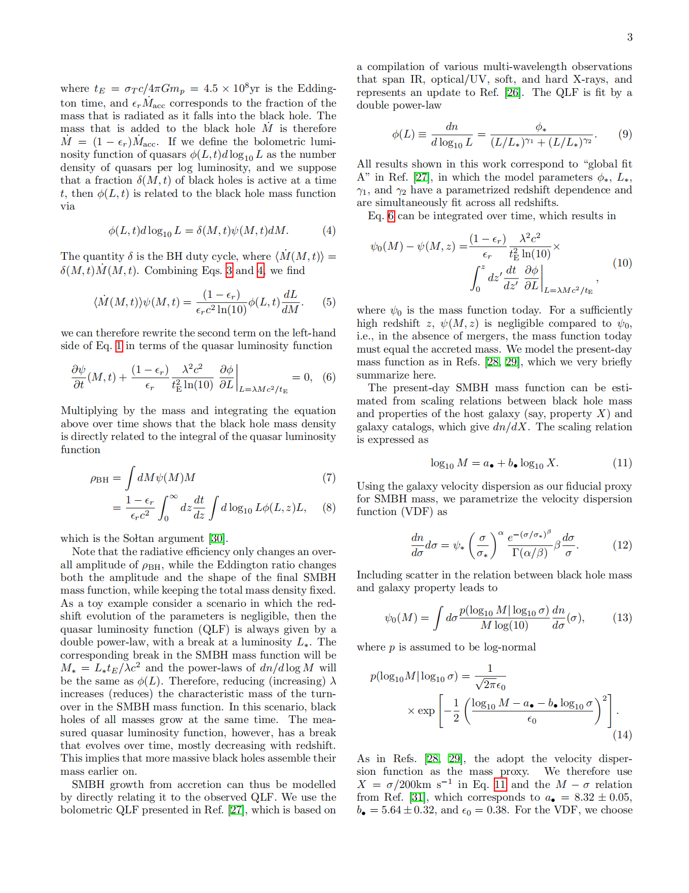 | 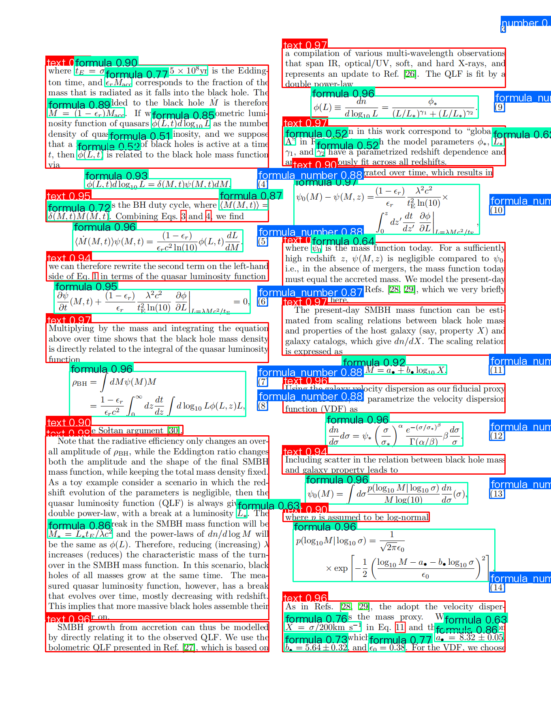 |

对应的公式会在json文件中存储。

#### 2.6.6、微调

由于公式识别产线包含若干模块，模型产线的效果如果不及预期，可能来自于其中任何一个模块。您可以对识别效果差的图片进行分析，进而确定是哪个模块存在问题，并参考以下表格中对应的微调教程链接进行模型微调。

| 情形             | 微调模块             | 微调参考链接                                                 |
| ---------------- | -------------------- | ------------------------------------------------------------ |
| 公式存在漏检     | 版面区域检测模块     | [链接](https://paddlepaddle.github.io/PaddleOCR/latest/version3.x/module_usage/layout_detection.html#_5) |
| 公式内容不准     | 公式识别模块         | [链接](https://paddlepaddle.github.io/PaddleOCR/latest/version3.x/module_usage/formula_recognition.html#_5) |
| 整图旋转矫正不准 | 文档图像方向分类模块 | [链接](https://paddlepaddle.github.io/PaddleOCR/latest/version3.x/module_usage/doc_img_orientation_classification.html#_5) |
| 图像扭曲矫正不准 | 文本图像矫正模块     | 暂不支持微调                                                 |


