## 1. 环境部署

### 1.1 项目安装

**需要说的一个地方是目前PaddleOCR的高性能推理仅仅支持`paddlepaddle-gpu==3.0.0`版本，所以需要安装该版本。**

**注意PaddleOCR想要使用TensorRT目前仅支持 TensorRT-8系列，所以需要安装cuda11.8版本**

**如果这种极端环境下无法解决，那就只能等官方或者是自己魔改**

使用uv安装（安装更快，管理更便捷）

```bash
# uv 安装
curl -LsSf https://astral.sh/uv/install.sh | sh
# 创建一个新的环境
uv venv .venv --python 3.10
source .venv/bin/activate
# 导入项目环境
export PYTHONPATH="$PWD:$PYTHONPATH"
 # 安装第三方库，https://www.paddlepaddle.org.cn/install/quick?docurl=/documentation/docs/zh/develop/install/pip/linux-pip.html 
##uv pip install paddlepaddle-gpu==3.2.2 -i https://www.paddlepaddle.org.cn/packages/stable/cu118/
uv pip install paddlepaddle-gpu==3.0.0 -i https://www.paddlepaddle.org.cn/packages/stable/cu118/
uv pip install paddlepaddle-gpu==3.0.0b1 -i https://www.paddlepaddle.org.cn/packages/stable/cu118/
uv pip install paddlepaddle-gpu==3.1.1 -i https://www.paddlepaddle.org.cn/packages/stable/cu118/
uv pip install "paddleocr[all]"
```

使用conda安装

```bash
# 创建一个新的环境
conda create  -n paddleocr3 pyhton=3.10 -y
# 导入项目环境
export PYTHONPATH="$PWD:$PYTHONPATH"
# 拉取
git clone https://github.com/gluver/PaddleOCR.git
 # 安装第三方库
pip install paddlepaddle-gpu==3.0.0 -i https://www.paddlepaddle.org.cn/packages/stable/cu118/
pip install paddleocr==3.0.1.0 paddlex==3.0.1.0 -i https://pypi.tuna.tsinghua.edu.cn/simple
# 后续其实只是去掉 命令中的uv
```

### 1.2 项目拉取

这里使用的是PaddleOCR 3.3的版本，支持PaddleOCR

```
# 最新版本
git clone -b release/3.3 https://github.com/PaddlePaddle/PaddleOCR.git

# 安装PaddleOCR所需支持，后面无需安装MCP Server
cd PaddleOCR
uv pip install -r requirements.txt
uv pip install -e .
```

### 1.3 TensorRT加速库

目前PaddleOCR仅支持TensorRT-8，那就意味着只能安装cu11.8, 所以项目搭建的时候要提供真实或者虚拟的cuda环境，下载路径：[NVIDIA TensorRT 8.x Download | NVIDIA Developer](https://developer.nvidia.com/nvidia-tensorrt-8x-download)。

建议安装已经build好环境的版本，运行更加轻便（tensorrt_lean）。

具体使用攻略：[PaddleOCR TensorRT加速：极致性能推理优化-CSDN博客](https://blog.csdn.net/gitblog_00488/article/details/151001341)

```bash
# linux下安装
wget https://developer.nvidia.com/downloads/compute/machine-learning/tensorrt/secure/8.6.1/tars/TensorRT-8.6.1.6.Linux.x86_64-gnu.cuda-11.8.tar.gz
# 解压
tar xvf TensorRT-8.6.1.6.Linux.x86_64-gnu.cuda-11.8.tar.gz
# 安装
cd TensorRT-8.6.1.6/python
uv pip install tensorrt-8.6.1-cp310-none-linux_x86_64.whl  # 这里的 cp310 等要根据你的 Python 版本调整
uv pip install tensorrt_lean-8.6.1-cp311-none-linux_x86_64.whl
# 设置环境变量
export LD_LIBRARY_PATH=$LD_LIBRARY_PATH:/root/projects/PaddleOCR/pkgs/TensorRT-8.6.1.6/lib
```

除此以外还需要设置如下环境变量：

```
export TENSORRT_ROOT=/root/projects/PaddleOCR/pkgs/TensorRT-8.6.1.6
export LD_LIBRARY_PATH=$TENSORRT_ROOT/lib:$LD_LIBRARY_PATH
export C_INCLUDE_PATH=$TENSORRT_ROOT/include:$C_INCLUDE_PATH
export CPLUS_INCLUDE_PATH=$TENSORRT_ROOT/include:$CPLUS_INCLUDE_PATH
```

每次运行其实都会重新编译一次模型（所以编译好直接部署比较好），想要加速的话，可以linux安装`ccache`进行二次编译加速：
```
sudo apt install ccache
```

### 1.4 高性能推理

#### 1.4.1 底层依赖

`enable_hpi=True`需要安装相应的依赖

```bash
paddlex --install hpi-gpu

# UV环境下需要额外安装pip
curl -sS https://bootstrap.pypa.io/get-pip.py | python
```

#### 1.4.2 支持系统

高性能加速目前支持的系统比较有限：

- `cpu`：仅使用 CPU 推理。目前支持 Linux 系统、x86-64 架构处理器、Python 3.8-3.12。
- `gpu`：使用 CPU 或 NVIDIA GPU 推理。目前支持 Linux 系统、x86-64 架构处理器、Python 3.8-3.12。

#### 1.4.3 可能（大概率）会遇到的报错

1. `UltraInfer initialized failed! Error: libnvjpeg.so.11: cannot open shared object file: No such file or directory`，使用如下方法解决：

   ```
   wget https://developer.download.nvidia.com/compute/cuda/11.8.0/local_installers/cuda-repo-ubuntu2204-11-8-local_11.8.0-520.61.05-1_amd64.deb
   sudo dpkg -i cuda-repo-ubuntu2204-11-8-local_11.8.0-520.61.05-1_amd64.deb
   sudo cp /var/cuda-repo-ubuntu2204-11-8-local/cuda-*-keyring.gpg /usr/share/keyrings/
   sudo apt-get update
   sudo apt-get install -y cuda-toolkit-11-8
   sudo ldconfig
   ldconfig -p | grep libnvjpeg.so.11
   ```

2. `ImportError: cannot import name 'fused_rms_norm_ext' from 'paddle.incubate.nn.functional' (/root/projects/PaddleOCR/.venv/lib/python3.10/site-packages/paddle/incubate/nn/functional/__init__.py)`
   我目前的解决办法是把相应的底层算子注释掉，这个问题很难解决，因为这取决于PaddlePaddle对于底层算子的编译，测试可以运行（不过背后应该是**fused_rms_norm**这个算子没有进行融合加速）

   ```
   # from .fused_rms_norm import fused_rms_norm
   fused_rms_norm_ext = None
   ```

   

## 2. PaddleOCR 模块测试

测试任务主要都在tests文件夹下，每个模块都有独立的代码和测试输入输出文件，这里只是展示测试结果

### 2.1 OCR文字识别测试

OCR模块是PaddleOCR的核心功能，用于识别图像中的文字内容。

| 测试项目 | 输入图片 | 输出结果 |
|---------|---------|---------|
| 文档页面识别 | 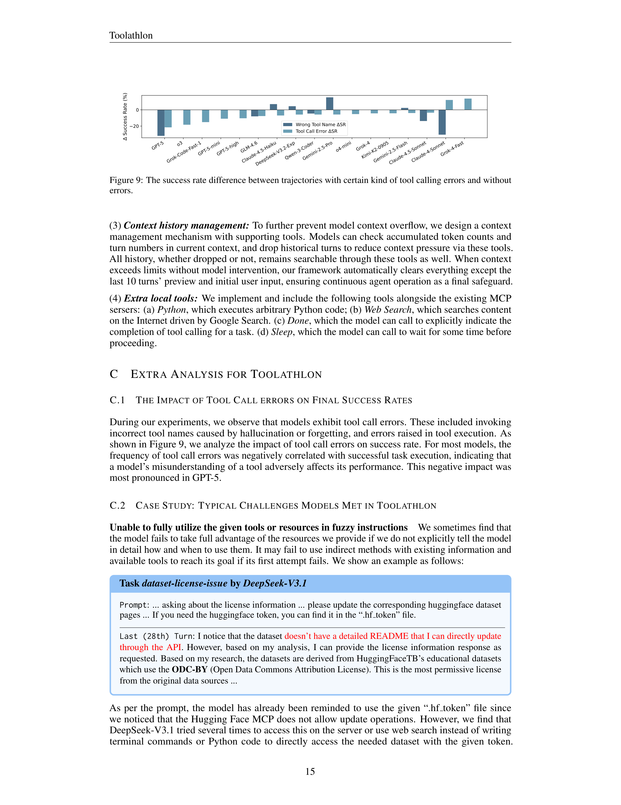 | 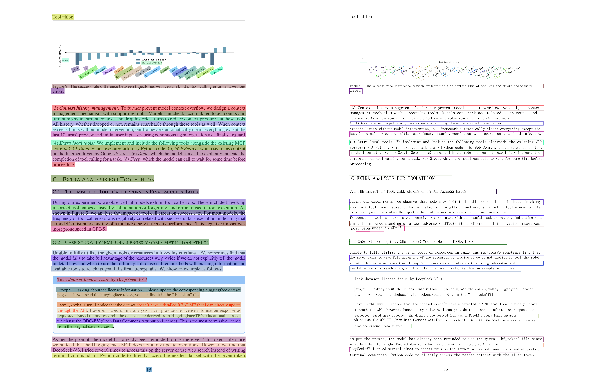 |
| 文档页面识别 |  | 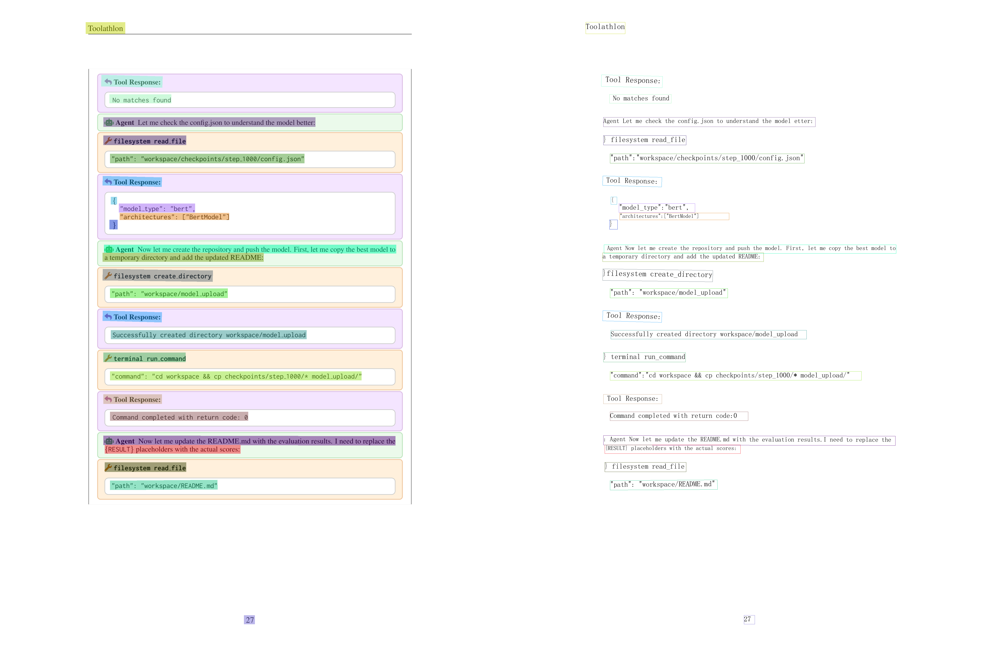 |

### 2.2 表格识别测试

Chart模块用于识别和解析表格结构，支持表格检测、单元格识别和结构化输出。

| 测试项目 | 输入图片 | 输出结果 |
|---------|---------|---------|
| 表格结构识别 | 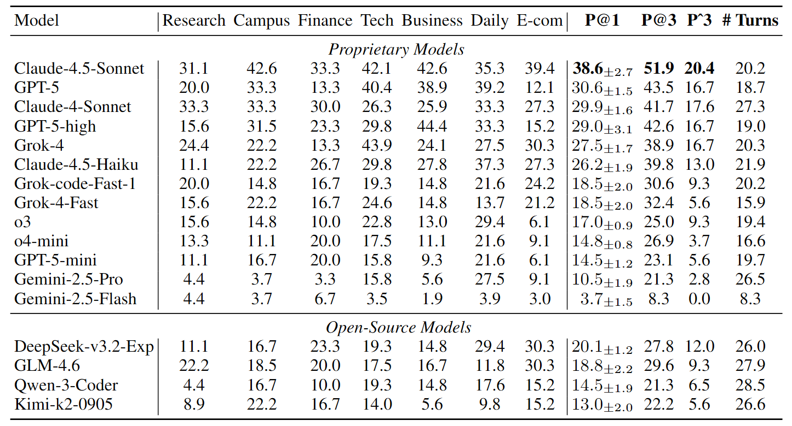 | 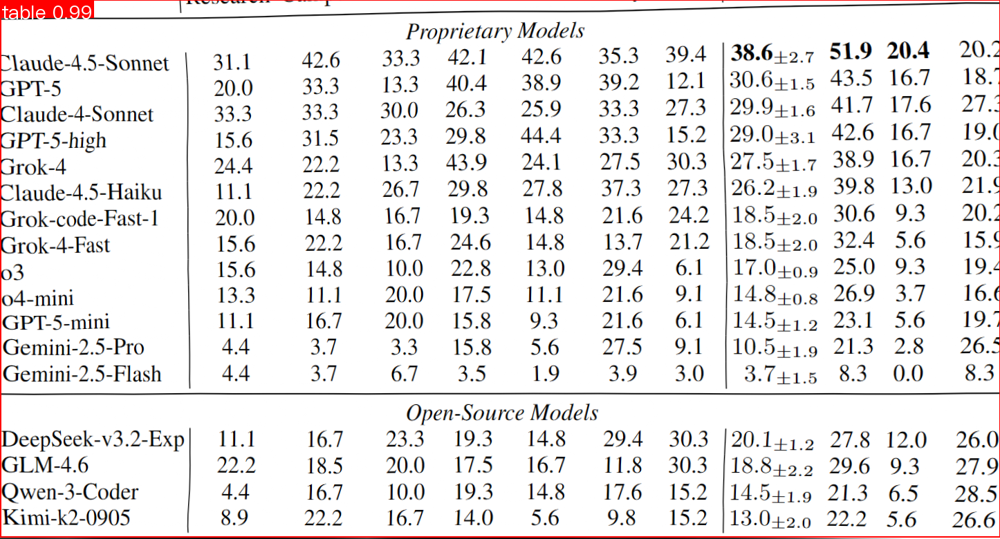 |
| 表格OCR识别 |  | 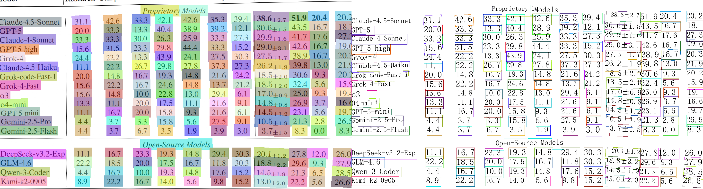 |
| 表格单元格检测 |  | 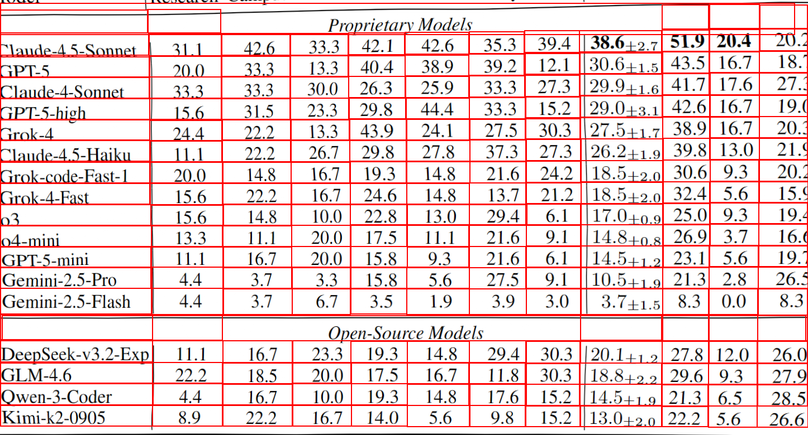 |
| 表格分类识别 |  | 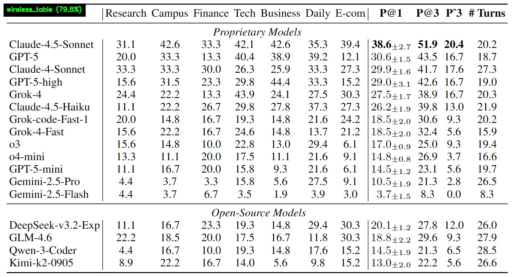 |
| 单元格详细标注 |  |  |

### 2.3 版面分析测试

Layout_Detection模块用于分析文档的版面结构，识别文档中的不同区域类型。

| 测试项目 | 输入图片 | 输出结果 |
|---------|---------|---------|
| 内容页版面分析 | 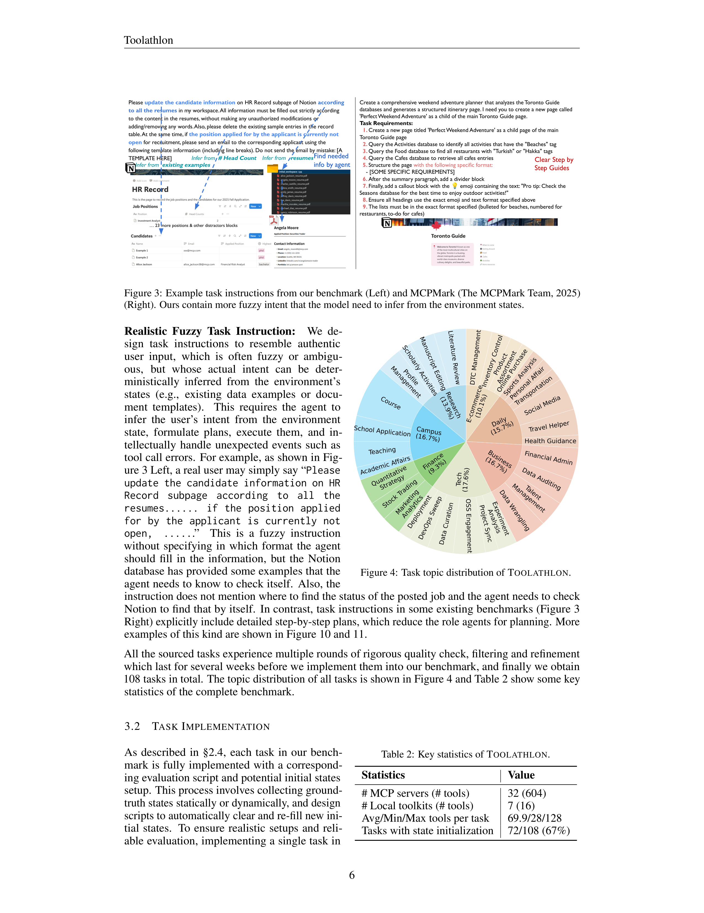 | 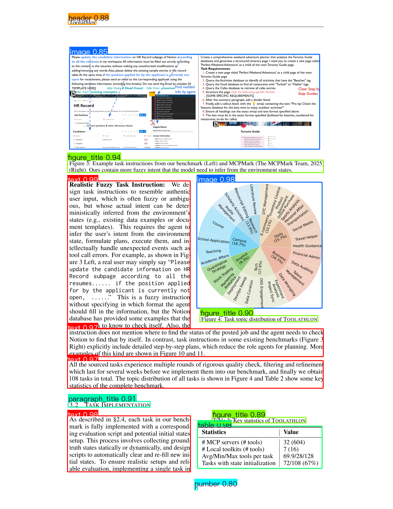 |
| 封面页版面分析 | 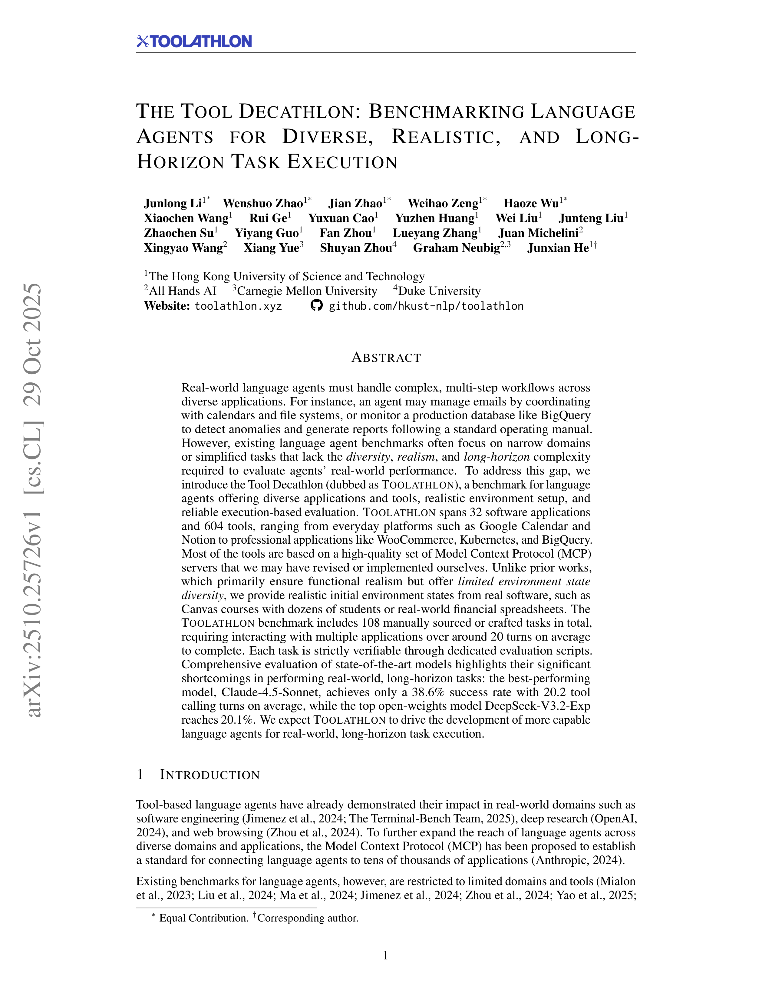 | 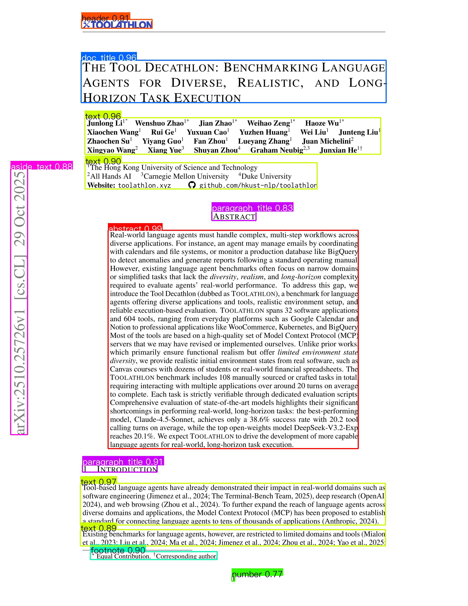 |

### 2.4 公式识别测试

Formula模块专门用于识别数学公式和科学符号。

| 测试项目 | 输入图片 | 输出结果 |
|---------|---------|---------|
| 公式识别 |  | 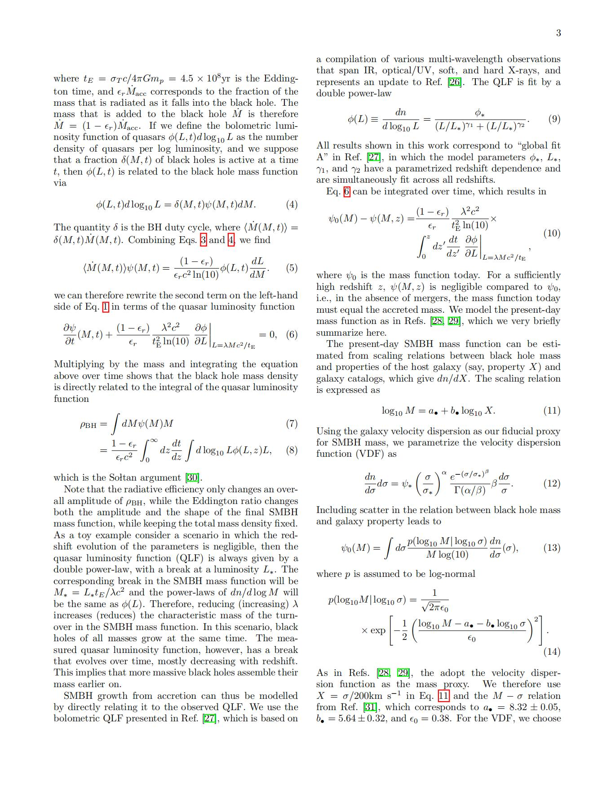 |
| 版面检测 |  | 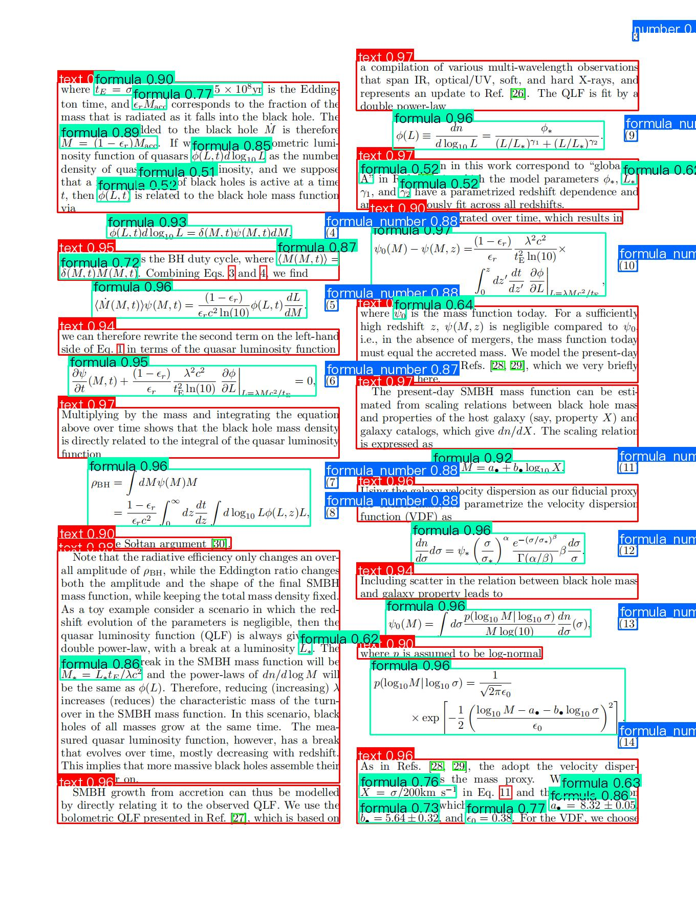 |

### 2.5 图像预处理测试

PreProcess模块提供图像预处理功能，包括图像校正和方向检测。

| 测试项目 | 输入图片 | 输出结果 |
|---------|---------|---------|
| 图像校正 |  |  |
| 方向检测 |  |  |
| 通用处理 |  | 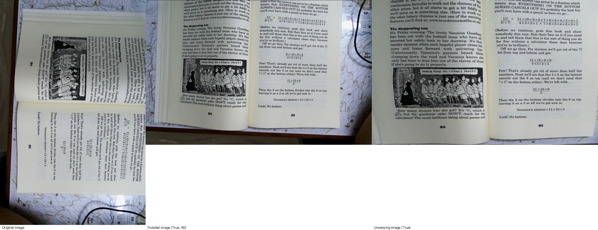 |

### 2.6 印章识别测试

Seal模块专门用于识别文档中的印章区域。

| 测试项目 | 输入图片 | 输出结果 |
|---------|---------|---------|
| 印章识别 |  |  |
| 印章区域提取 |  |  |


### 2.7 性能监测

用于统计启用和不启用高性能加速的区别

```
uv pip install prometheus-client 
```

具体测试代码在`main/monitor/test.py`中，通过**prometheus_client**进行封装运行代码即可

```python
from prometheus_client import Counter, Histogram, Gauge, start_http_server
from paddleocr import PaddleOCR

# ---------------- Prometheus 指标 ---------------- #
REQ_COUNT   = Counter('ocr_requests_total', 'Total OCR requests')
LATENCY     = Histogram('ocr_request_latency_seconds', 'End-to-end latency')
IMG_PER_SEC = Gauge('ocr_imgs_per_second', 'Throughput over last batch')
BOX_COUNT   = Gauge('ocr_boxes_total', 'Detected text boxes in last batch')
CHAR_COUNT  = Gauge('ocr_chars_total', 'Total characters in last batch')
GPU_MEM     = Gauge('ocr_gpu_mem_peak_mb', 'Peak GPU memory used during request')
CPU_PERCENT = Gauge('ocr_cpu_percent', 'CPU percent during request')
RSS_MEM     = Gauge('ocr_rss_peak_mb', 'Peak RSS during request') 

@REQUEST_LATENCY.time()
def process_with_monitoring(image_path):
    REQUEST_COUNT.inc()
    start_time = time.time()
    result = pipeline.predict(image_path)
    latency = time.time() - start_time
    return result, latency
```

除了脚本级别封装以外，也可以使用CLI在运行部署MCP Server或者运行PaddleOCR识别代码时加上相应接口

```bash
# 内存使用分析
uv pip install memory_profiler
python -m memory_profiler test/OCR/test_monitor.py
 
# 性能瓶颈分析
python -m cProfile -o profile.stats your_ocr_script.py
```

### 

## 3. 模型云端部署

### 3.1 服务化部署

#### 3.1.1 安装依赖

实际上之前安装PaddleOCR项目的时候，这些已经都安装上了

```bash
# 进行测试
paddleocr_mcp --help
```

#### 3.1.2 运行服务器

具体参数可以在`PaddleOCR/mcp_server/paddleocr_mcp/__main__.py`看到，这里面的pipeline就是需要运行的产品线只有两个选择：` OCR `或者是`PP-StructureV3`，然后还有产品线的yaml文件，这里面可以对不同模块设置细粒度的加速（见3.1.3）。

具体参数可以在`PaddleOCR/mcp_server/paddleocr_mcp/__main__.py`看到，在这里我使用的是项目第一级路径下的yaml文件，其中可以通过自定义设置那些模型进行高性能加速。

```bash
# 启动PaddleOCR OCR MCP Server
paddleocr_mcp --pipeline OCR --ppocr_source local --port 8090  --http
# 启动PaddleOCR PP-StructureV3 MCP Server
paddleocr_mcp --pipeline PP-StructureV3 --ppocr_source local --host 0.0.0.0 --port 8090  --http --pipeline_config PaddleOCR.yaml --device gpu
```

官方给出的参数解释

| 名称           | 说明                                                         |
| :------------- | :----------------------------------------------------------- |
| `--pipeline`   | PaddleX 产线注册名或产线配置文件路径。                       |
| `--device`     | 产线部署设备。默认情况下，当 GPU 可用时，将使用 GPU；否则使用 CPU。 |
| `--host`       | 服务器绑定的主机名或 IP 地址。默认为 `0.0.0.0`。             |
| `--port`       | 服务器监听的端口号。默认为 `8080`。                          |
| `--use_hpip`   | 如果指定，则使用高性能推理。请参考高性能推理文档了解更多信息。 |
| `--hpi_config` | 高性能推理配置。请参考高性能推理文档了解更多信息。           |

部署之后应该会显示：
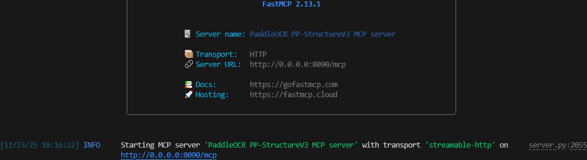


#### 3.1.3 运行参数

在模型下面设置,但是请注意并非所有模型都支持，所以建议在模型mcp部署的时候把相应的hpi_config加上（宏观的效果），在加速过程中Paddle能够自动配置是否对子模块加速。

```json
hpi_config:
  backened:tensorrt #或者是paddle， onnxruntime官方文档由相应介绍
# 或者是不加速
use_hpi=False
```

具体示例：

```json
SubModules:
  ChartRecognition:
    batch_size: 1
    model_dir: null
    model_name: PP-Chart2Table
    module_name: chart_recognition
    hpi_config:
      backend: tensorrt
  LayoutDetection:
    batch_size: 8
    ···
    hpi_config:
      backend: onnxruntime
```

### 3.3 Agent 调用

#### 3.3.1 mcp.json文件

这里"PADDLEOCR_MCP_PIPELINE"参数填写的是自己部署的流水线模型，例如刚才部署的是

```json
{
  "mcpServers": {
    "paddleocr-ocr": {
      "command": "paddleocr_mcp",
      "args": [],
      "env": {
        "PADDLEOCR_MCP_PIPELINE": "OCR",
        "PADDLEOCR_MCP_PPOCR_SOURCE": "local"
      }
    }
  }
}
```

#### 3.3.2 Agent接入

1. Claude Desktop
   可以直接在config.json文件中进行修改
2. chery studio
   具体可以参考这篇知乎


